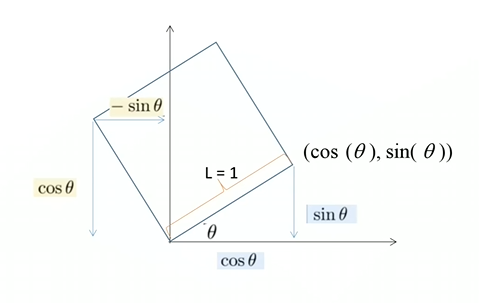
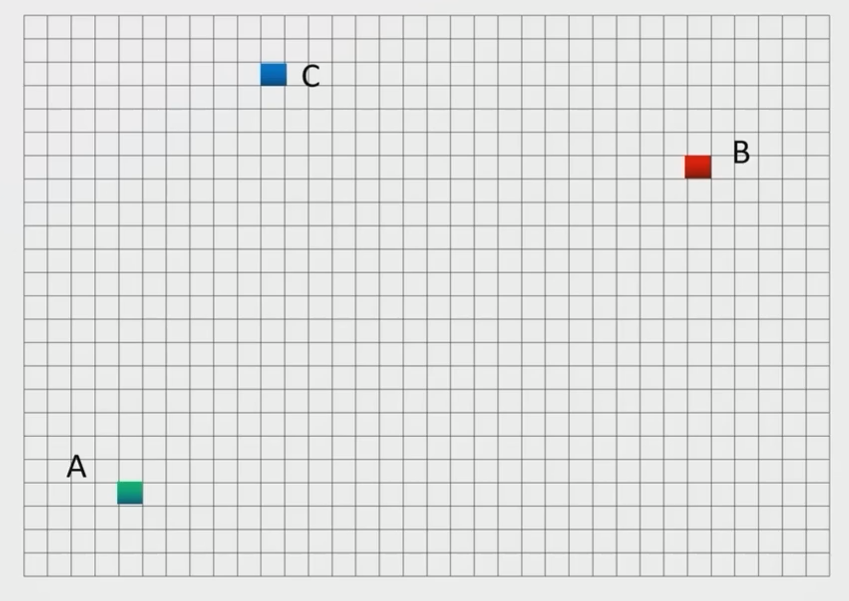
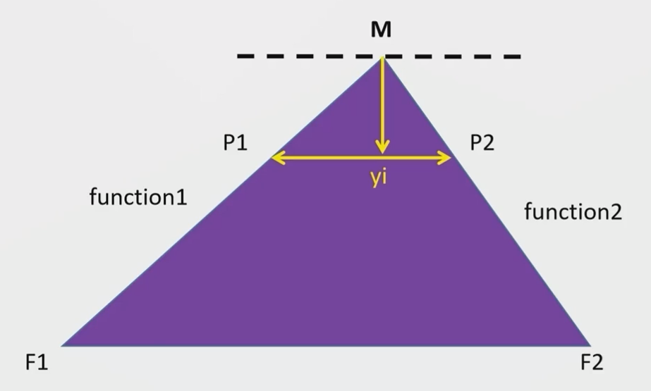
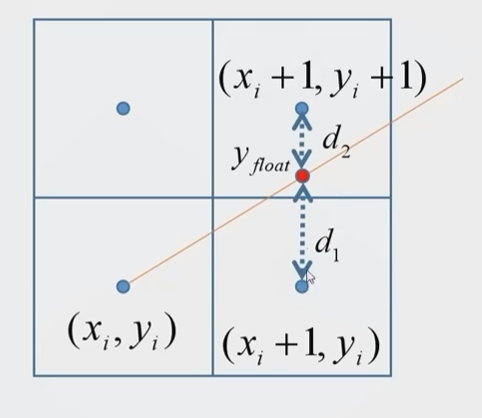
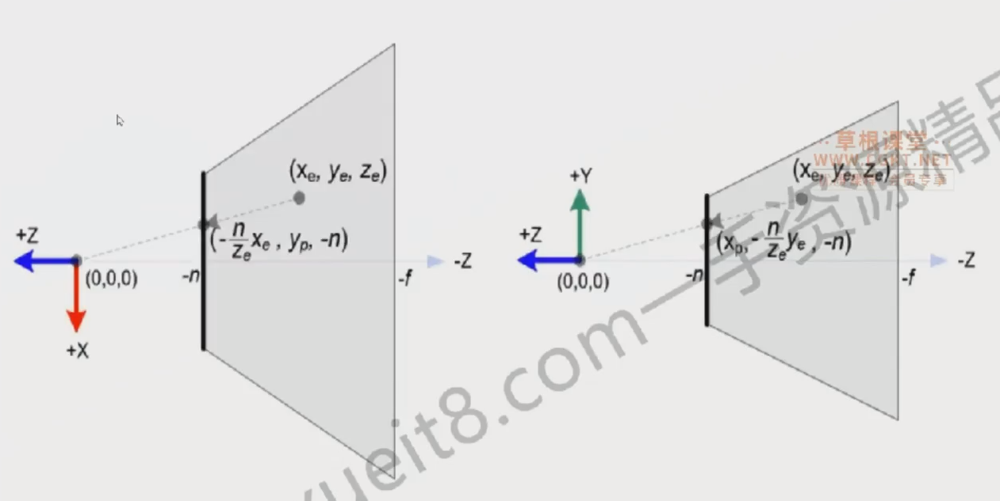
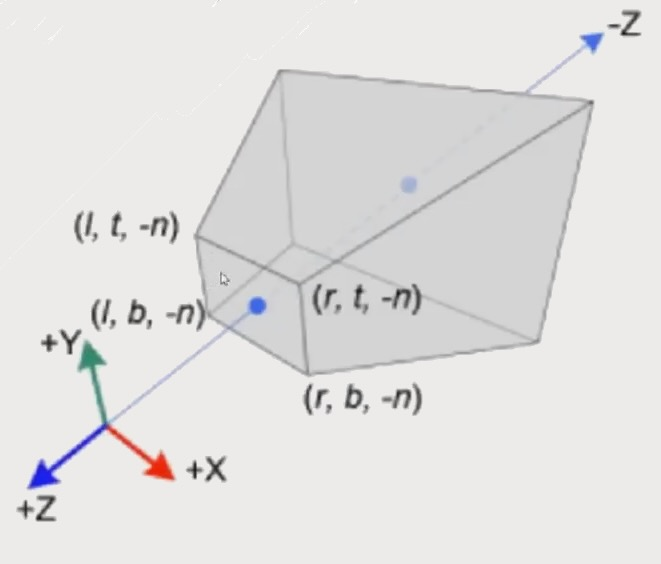

# 01-01导学

# 02-01初识渲染

## 如何理解渲染？

**渲染**：把计算机当中的模型数据，经过一系列称为"管线"的图形程序加工，最终呈现预想风格图片的过程。

**实时渲染**：通常用于游戏，讲究速度，兼顾画质，如35FPS，有利于交互性高的场景。

**离线渲染：**通常用于影片渲染，精美图片渲染等，讲究画质，算法复杂，比如迪士尼的电影。

##  渲染场景中的关键元素

**世界坐标：**3D世界当中，所有物体，光源，摄像机等，都需要放在这个坐标系中，拥有自己的世界坐标。

**物体：**场景当中，需要有一个模型物体。

**摄像机：**场景当中，还需要有一个摄像机，决定了我们观察者在场景中的方向，以及焦距，视场角大小等。

## 光栅化(Rasteriazation)

**理解屏幕：**其实我们的计算机的屏幕都是一堆发光点构成的，由于屏幕的分辨率越来越高，我们就看不出来这些栅格点了。发光原理各式各样， 总结来说就是红绿蓝(RGB)三色光混合成为了我们看到的大千世界。

**光栅化：**经过计算机对模型数据的处理之后，决定点亮屏幕上的哪些像素，具体到每个像素上的**红绿蓝**应该如何调配，并且按照其比例进行点亮的过程。所以这个步骤决定了**渲染哪些像素**以及**渲染什么颜色**。

## 渲染管线(Rendering Pipeline)

对于三角形数据的处理，会分为多个步骤，每个步骤都使用上一个步骤的输出，数据就好像是水流，流过每一个没步骤，最终呈现在屏幕上，所以被称为**管线**(或者流水线)。

渲染管线的大致流程如下，不同图形API的流程会略有差异：

* **顶点数据：**
  * 数据表达：所有的模型，都是以三角形为基本单位。每个三角形有三个顶点，每个顶点都有其属性(比如坐标)。
  * 三角形的表达：比如三个顶点(0:a,1:b,2:c)，**1、2、3**三个数字就是顶点的索引，或者说是**Key**。我们把**N个顶点数据**送入到渲染器当中。再告知哪三个顶点为一组就能表达一堆三角形了。

* **三维变换：**
  * 思考问题：我们知道了一个模型的顶点，接下来的目标就是把模型绘制在屏幕上，那应该怎么投影得到屏幕上？
  * 三维变换：通常指的是**MVP**变换
    * M：模型变换，模型在世界当中的位置变换。
    * V：视图变换，模型变换到摄像机的坐标。
    * P：投影变换，摄像机坐标系投影到二维像素的过程。

* **图元装配：**
  * 图元：在图形的世界中，一个三角形、一条直线，这种跟点有关的被称为图元。、
  * 图元的构成：如前面所说，三角形(三个索引)，直线(两个索引)，但是此时，都是变换完毕的点进行构成。
  * 图元装配：把变换后的顶点根据索引顺序组成三角形、直线等图元的过程。

* **剪裁剔除：**
  * 剪裁：把视口之外无法显示的图元都剪裁掉，加快后续步骤的渲染效率。
  * 剔除：将背面朝向我们的三角形剔除。通过顶点的连接顺序来判断是顺时针还是逆时针来判断是否背面，这一判断标准是可配置的。

* **片元着色：**
  * 片元：片元与像素不同，是以每个图元细分为单位，如果只有一个三角形，那图元=像素，如果有两个部分的重叠的三角形，并且有一个是透明的，那么重叠的部分通通过混合后的输出才是像素，而他们各自都拥有自己的**片元**。
  * 片元着色：针对每个片元，计算它的输出颜色的过程称为着色。

* **混合与测试：**
  * 混合：同一个像素，最终可能有多个物体占据，有的透明，有的不透明，最终混合成一个颜色，输出到此像素。
  * 测试：分为深度测试、模版测试等。比如A在B的前面，靠近摄影机，最终需要把A渲染出来，阻挡住B。

# 02-02学习向量

## 向量是什么？有什么用？

**向量：**

* 长度，通常在游戏中表示力的大小，速度等
* 方向，通常用来表示法线，光路方向，视角方向等
* 向量不关心开始位置，因为表示的是拥有方向的量

## 单位向量

**向量长度(向量的模)**：$$length = \sqrt{x^2+y^2+z^2}$$

**单位向量：**

* 长度为1
* 向量的归一化指的是在保证方向不变的情况下，将向量长度变为1
* 通常用于表示纯粹的方向计算

## 向量加法

**几何解释：**平行四边形法则或者三角形法则

**代数解释：**两个向量坐标相加

## 向量点乘

$$\vec{a} \cdot \vec{b} = \|\vec{a}\| \|\vec{b}\| \cos\theta $$，可以推出$$\cos\theta =\frac{\vec{a} \cdot \vec{b} } {\|\vec{a}\| \|\vec{b}\|}$$，也就是说，当前两向量都是单位向量时$$\cos\theta =\vec{a} \cdot \vec{b}$$

**代数解释：**$$x_1x_2+y_1y_2+z_1z_2$$（点乘的结果是一个标量）

**几何解释：**点乘结果反映了一个向量在另一个向量方向上的**投影长度**与另一个向量长度的乘积。

**性质：**

* 满足交换律：$$\vec{a} \cdot \vec{b} = \vec{b} \cdot \vec{a}$$
* 满足分配率：$$\vec{a} \cdot(\vec{b}+\vec{c}) = \vec{a} \cdot \vec{b}+\vec{a} \cdot \vec{c}$$
* $$(k\vec{a}) \cdot \vec{b} =\vec{a} \cdot (k\vec{b}) =k(\vec{a} \cdot \vec{b}) $$

**图形学上的应用**

* $$\vec{b}$$在$$\vec{a}$$向量上的投影向量
* 判断前后：正数同侧，负数反向

## 向量叉乘

$$|\vec a \times \vec b|=|\vec a|\cdot|\vec b|\sin \theta$$

**代数解释：**$$(x_a,y_a,z_a)\times(x_b,y_b,z_b)=\begin{matrix}y_az_b-y_bz_a  \\z_ax_b-x_az_b \\x_ay_b-y_bx_a  \end{matrix}$$（叉乘的结果是一个向量）

**几何解释：**伸出右手，从$$\vec a$$握向$$\vec b$$，大拇指的方向就是叉乘得到的向量的方向。

**图形学上的应用**

* 构建笛卡尔坐标系
* 判断点是否在三角形内

# 02-03学习矩阵

## 矩阵是什么？

**矩阵：**矩阵就是一堆排序好的数字，m行XN列
$$
\begin{pmatrix}12&43&1\\-1&3&0\\2&94&123\end{pmatrix}
$$
**元素：**矩阵当中的每一个数字

**元素表示：**$$a_{ij}$$表示第i行，第j列

**方阵：**当m等于n时，本矩阵为方阵

## 单位矩阵

$$
\begin{pmatrix}1&0&0\\0&1&0\\0&0&1\end{pmatrix}
$$

**单位矩阵：**记作$I_n$

* 必须为NxN矩阵
* 主对角线上的数字都是1，其余位置都是0

## 矩阵加法

$$
\begin{pmatrix}12&0&6\\3&1&0\\0&0&1\end{pmatrix}+\begin{pmatrix}33&1&2\\3&1&5\\0&8&1\end{pmatrix}=\begin{pmatrix}12+33&0+1&6+2\\3+3&1+1&0+5\\0+0&0+8&1+1\end{pmatrix}
$$

**可加规则：**两个可以相加的矩阵，必须行列数相等

**相加规则：**对应元素凉凉相加，放到同样的位置

## 矩阵乘法

$$
\begin{pmatrix}a_{00}&a_{01}&a_{02}\\a_{10}&a_{11}&a_{12}\\a_{20}&a_{21}&a_{22}\end{pmatrix}+\begin{pmatrix}b_{00}&b_{01}&b_{02}\\b_{10}&b_{11}&b_{12}\\b_{20}&b_{21}&b_{22}\end{pmatrix}=？
$$

**可乘规则：**两个可以相加的矩阵，第一个矩阵的列数等于第二个矩阵的行数

**相乘规则：**第一矩阵的行×第二矩阵的列，想成相加得到一个位置的值

**性质：**

* **不满足**交换律：$$A \cdot B = B \cdot A$$
* 满足分配率：$$A \cdot(B+C) = A \cdot B+A \cdot C$$或$$(A+B)\cdot C = A \cdot C+B \cdot C$$

## 矩阵转置

**定义：**设矩阵A为MxN的矩阵，则第i行第j列的元素为$a_{ij}$。它的转置为$a_{ij}=a_{ji}$ 记作$A^T$

**性质：**

* $(AB)^T=B^TA^T$
* $(I_n)^T=I_n$

## 矩阵的逆

**定义：**设矩阵A为N阶方阵，若存在一个N阶方阵B，使得$AB=BA=I_n$则称为B为A的逆矩阵，当然A也是B的逆矩阵。记作$A^{-1}=B$

**性质：**

* $AA^{-1}=A^{-1}A=I_n$
* $(AB)^{-1}=B^{-1}A^{-1}$
* $(A^T)^{-1}=(A^{-1})^T$

# 02-04二维坐标变换

## 矩阵与向量的乘法

**思维技巧：**比如一个三维向量，其实就相当于一个3行1列的矩阵，那如下的运算就是3x3矩阵与一个3x1矩阵的乘法计算。套用矩阵乘法。
$$
\begin{pmatrix}2&0&1\\-1&4&0\\2&0&5\end{pmatrix}\times\begin{pmatrix}1\\2\\3\end{pmatrix}=\begin{pmatrix}5\\7\\11\end{pmatrix}
$$
**观察矩阵与向量相乘：**
$$
M\times\vec{P}=\vec{P'}
$$
向量有自己的三维坐标(x,y,z)，可以理解为一个点的坐标位置。对于点P,与M相乘之后，**得到的新坐标是什么，代表了什么？**

## 坐标变换的通俗解释

**举例：**有一个点A(2,2)，如果我们给出一个矩阵乘法如下
$$
\begin{pmatrix}0.5&0\\0&0.5\end{pmatrix}\times\begin{pmatrix}2\\2\end{pmatrix}=\begin{pmatrix}1\\1\end{pmatrix}
$$
**结论：**用矩阵可以对坐标进行变换，从而实现缩放，那是否可以绕某个点旋转，又能否平移呢？

## 旋转变换

**提问：**如何对边长为1且左下角位于坐标原点的二维正方形进行矩阵运算，让它逆时针旋转45°呢？是不是对每个顶点都进行矩阵乘法就可以了呢？

**推导：**首先我们先做出旋转后的矩形的图像。

$$
\begin{pmatrix}new_x\\new_y\end{pmatrix}=\begin{pmatrix}A&B\\C&D\end{pmatrix}\times\begin{pmatrix}x\\y\end{pmatrix}
$$
原来的(1,0)点可以得到A C；原来的(0,1)点可以得到B D
$$
\cos \theta = A\times 1+B\times 0 =A\\
\sin \theta = C\times 1+D\times 0 =C
$$
从而我们得到
$$
R_{\theta} = \begin{bmatrix}\cos \theta & -\sin \theta \\\sin \theta & \cos \theta \end{bmatrix}
$$

## 平移变换

$$
x'=x+t_x\\
y'=y+t_y
$$

**提问：**如果写成了向量的计算形式，就会变成加法形式，并不是一个乘法形式，所以没办法写成矩阵与向量的相乘
$$
\begin{pmatrix}x'\\y'\end{pmatrix}=\begin{pmatrix}x\\y\end{pmatrix}\times\begin{pmatrix}t_x\\t_y\end{pmatrix}
$$
**诉求：**需要所有的基本变换通过矩阵的乘法运算来实现，因为需要引入其次坐标来解决这个问题。

## 齐次坐标

**齐次坐标：**为了在矩阵乘法中兼容平移变换，我们为每一个顶点或向量坐标加一个维度，让二维向量升为三维向量
$$
point = (x,y,1)^T
vector = (x,y,0)^T
$$
事情就变成了下面的样子

对于位置点：
$$
\begin{pmatrix}x'\\y'\\w'\end{pmatrix}=\begin{pmatrix}1&0&t_x\\0&1&t_y\\0&0&1\end{pmatrix}\times\begin{pmatrix}x\\y\\1\end{pmatrix}=\begin{pmatrix}x+t_x\\y+t_y\\1\end{pmatrix}
$$
对于向量：
$$
\begin{pmatrix}x'\\y'\\w'\end{pmatrix}=\begin{pmatrix}1&0&t_x\\0&1&t_y\\0&0&1\end{pmatrix}\times\begin{pmatrix}x\\y\\0\end{pmatrix}=\begin{pmatrix}x+t_x\\y+t_y\\0\end{pmatrix}
$$

## 二维矩阵变换总结

**缩放矩阵：**
$$
\begin{pmatrix}s_x&0&0\\0&s_y&0\\0&0&1\end{pmatrix}
$$

**旋转矩阵：**
$$
\begin{pmatrix}\cos \theta & -\sin \theta & 0\\\sin \theta & \cos \theta  & 0\\0&0&1\end{pmatrix}
$$

**平移矩阵：**
$$
\begin{pmatrix}1&0&t_x\\0&1&t_y\\0&0&1\end{pmatrix}
$$

## 变换的应用顺序

多个矩阵变换表示的复合的应用顺序遵循“就近原则”，也就是说，离变换目标最近的变换会最先起作用。需要注意的是，由于矩阵的表示方式不同（**行主序** 或 **列主序**），变换对应的乘法参数的位置也不同，可能需要写在目标的左侧或者右侧。这主要取决于开发时使用的矩阵计算库是第三方库还是自行实现的矩阵运算。

下面举一个使用GLM库(从右向左)，将矩阵表示的变换应用到一个向量上：
$$
\begin{pmatrix}x'\\y'\\z'\end{pmatrix}=A_nA_{n-1}...A_2A1\begin{pmatrix}x'\\y'\\z'\end{pmatrix}=\begin{pmatrix}x\\y\\z\end{pmatrix}
$$

# 02-05三维坐标变换

## 矩阵扩展到三维

**三维变换：**在xyz三个轴的情况下实现缩放、旋转、平移，形式如下：
$$
\begin{pmatrix}x'\\y'\\z'\\w'\end{pmatrix}=\begin{pmatrix}1&0&0&t_x\\0&1&0&t_y\\0&0&1&t_z\\0&0&0&1\end{pmatrix}\times\begin{pmatrix}x\\y\\z\\w\end{pmatrix}
$$

## 缩放、平移矩阵

**缩放、平移：**与二维相差不多
$$
\begin{pmatrix}s_x&0&0&0\\0&s_y&0&0\\0&0&s_z&0\\0&0&0&1\end{pmatrix}
$$

$$
\begin{pmatrix}1&0&0&t_x\\0&1&0&t_y\\0&0&1&t_z\\0&0&0&1\end{pmatrix}
$$

## 右手坐标系

**摄像机方向：**默认朝向Z轴的负方向

### 研究旋转矩阵类型

**三维世界的旋转：**一定要考虑旋转轴，分为x,y,z三个方向的旋转，分别对应**Pitch**、**Yaw**、**Roll**。符合变换时先做旋转再平移比较容易获得预期效果

## 万向锁问题

万向锁问题的成因：因为欧拉角变换是从**级联**的三个轴依次进行变换，当第二个旋转轴旋转到±90度时，第一个和第三个旋转轴会重合。因为级联的原因导致三轴退化为两轴旋转。这是使用表示欧拉角的缺陷。工程实践上我们使用四元数表示旋转，而且四元数也能简单的实现差值。

## 研究旋转矩阵类型

具体推导过程[参考](https://www.bilibili.com/video/BV1B4411c7Vi)
$$
R_x(\alpha)=\begin{pmatrix}1&0&0&0\\0&\cos \alpha&-\sin \alpha&0\\0&\sin \alpha&\cos \alpha&0\\0&0&0&1\end{pmatrix}
$$

$$
R_y(\alpha)=\begin{pmatrix}\cos \alpha&0&\sin \alpha&0\\0&1&0&0\\-\sin \alpha&0&\cos \alpha&0\\0&0&0&1\end{pmatrix}
$$

$$
R_z(\alpha)=\begin{pmatrix}\cos \alpha&-\sin \alpha&0&0\\\sin \alpha&\cos \alpha&0&0\\0&0&1&0\\0&0&0&1\end{pmatrix}
$$

# 02-06光栅化三角形算法

## 给出三个点，如何绘制三角形

### 适用GPU的方法一：

找到ABC三点的Left，Right，Top，Bottom各个点的坐标，包围的举行进行扫描，判断每个点是否在三角形内；选择两个顶点，用向量叉乘进行判断。

如果向量AB与AP的叉乘与AP与AC的符号相同，则说明P在AB、AC两向量夹角的范围内。如果要判断三角形内的话就需要再找另一个三角形的顶点再做一次同样的判断。如果两次符号都相同，则说明P在三角形内。

### 适用CPU的方法二：

我们一般只处理平顶或平底三角形，而普通三角形可分为平顶和平底三角形。

**对于平底三角形：**

**绘制步骤：**

1. 找到最大的y值点M
2. 计算M与三角两条斜边的F1,F2的直线方程
3. 以M的y值为起点，以-1为步长，向下步进
4. 计算y=$y_i$时与左右两条边的交点坐标$P_1$与$P_2$
5. 以$P_1$为起点，向$P_2$画直线，循环往复指导$y_i$与平底的y值相等为止

**平顶三角形的操作类似，普通三角形则进行一次平底一次平顶**

# 02-07光栅化直线算法

## 如何在离散的网格中绘制两端点确定的线段？

在屏幕坐标系下的二维平面中，其实是一堆离散的像素点，如果给定了一条线的起点和终点，如何绘制一条直线呢。

## 斜截式方程法

我们知道直线可用方程$y=kx+b$来表示，其中$k=\frac{y_1-y_2}{x_1-x_2}$；以$x_1$为起点，向$x_2$步进，每次x增加一个单位，计算得到y值。在映射到屏幕坐标的时候需要进行取整。

**但是，这期间涉及到太多浮点型的乘除计算，性能低下，我们能否只使用整数计算？**

## Brensenham算法

**算法步骤：**

1. 求$x_{i+1}$位置的浮点型y值
1. 将离y更近的$(x_{i+1},y_{i+i})$着色

**算法预设前提：**

* 直线斜率在0°到45°之间
* $p_1$的x,y值均小于$p_2$

**算法推导：**

$x_{i+1}$点的y值：$y=kx_{i+1}+b$

$y_i$到 y的距离：$d_1=kx_{i+1}+b-y$

$y_{i+1}$到 y的距离：$d_2=y_{i+1}-kx_{i+1}+b$

两点的差值：$d_1-d_2=2kx_{i+1}+b-2y-1$

**此处公式中，只剩下$k$值可能为浮点型**

考查$k$的值：$k=\frac{dy}{dx}$，其中$dy$与$dy$均为整数，即两点坐标之前见的差值，距离差值的公式两边各自乘以$dx$就可以消灭浮点型，得到：
$$
p_i=dx(d_1-d_2)=2dyx_i-2dxy_i+(2bdx+2dy-dx)
$$
由于假设，$dx$一定是整数，则$p_i$的正负数即可表示选择那个y值。**所以如何求取每次的$p$值呢?**

选择$p_{i+1}$与$p_{i}$进行相减，从而尝试构造一个递归的求职方法：
$$
p_i=2dyx_i-2dxy_i+(2bdx+2dy-dx)\\
p_{i+1}=2dy(x_i+1)-2dxy_{y+1}+(2bdx+2dy-dx)\\
p_{i+1}=p_i+2dy-2dx(y_{i+1}-y_i)
$$
**梳理：**$p_i$用来决定当$x=x_i+1$时，y应该取$y_i$还是$y_i+1$，只要知道了$p_i$就可以$y_2$取哪个值，之后递归推导$p_2$
$$
p_1=2dyx_1-2dxy_1+(2bdx+2dy-dx)\\
b=y_1-\frac{dy}{dx}x_1
$$
把b带入上式中，得：
$$
p_1=2dyx_1-2dy_1+(2(y_1-\frac{dy}{dx}x_1)dx+2dy-dx)\\
p_1=2dyx_1-2dxy_1+(2dxy_1-2dyx_1+2dy-dx)\\
p_1=2dy-dx
$$

## 总结：算法伪代码

~~~ c++
//使用Latex语法表示
p_1 = 2 * dy - dx;
if(p_i >= 0){
    y_{i+1} = y_i + 1;
    x_{i+1} = x_i + 1;
    p_{i+i} = p_i +2 * (dy - dx);
}else{
    y_{i+1} = y_i;
    x_{i+1} = x_i + 1;
    p_{i+1} = p_i + 2 * dy
}
~~~

# 02-08光栅化视图矩阵推导

## 摄像机坐标系

**问题：**如果给定一个空间中的三角形中每个顶点的坐标，如何最终呈现到一个二维屏幕平面上？

**摄像机坐标系：**使用右手坐标系，以摄像机朝向的方向为Z轴的负方向，进行构建坐标系。

**问题：**为什么要构建摄像机自己的坐标系统呢？

**答：**

1. 最终的投影平面就是虚拟摄像机的镜头画布，摄像机朝向什么方向，摆放的位置，这块画布就会同步移动到哪里。
2. 可以把物体的坐标从世界坐标系变换到摄像机坐标系中。
3. 摄像机坐标系当中的物体，每个顶点直接向Z轴投影即可

**小目标：**给定一个直接坐标系中的一个点，推导一个矩阵，求出该点在摄像机坐标系中的坐标位置。

## 图形学中的相对论

摄像机坐标系位置($t_x,0,t_z$)

物体在世界坐标系位置($s_x,s_y,s_z$)

**思考：**其实物体在摄像机坐标系中的坐标就是($s_x-t_x,s_y,s_z-t_z$)，即减去摄像机坐标系相对于世界坐标系的位移量就可以。

**深入思考：**物体在摄像机坐标系的坐标，其实就是相对于其远点的xyz位移。那保持相对位置不变，把摄像机坐标系直接与世界坐标系重合会怎样？

1. 此时世界坐标系与摄像机坐标系重合
2. 物体与摄像机相对位置没有改变
3. 由于两个坐标系重合，物体在世界坐标系的坐标，就是摄像机坐标系的坐标。

**结论：**我们需要找到一个矩阵，完成两个目标：平移摄像机到世界坐标系的原点；旋转摄像机与世界坐标系的各种轴重合。这个矩阵同样用在物体上，就能求得其在摄像机坐标系中的坐标。

## 构建摄像机坐标系轴

**已知条件:**

* 摄像机的位置
* 摄像机朝向的方向$\vec{g}$
* 摄像机上方趋势向量$\vec{t}$

**构建方案：**

1. $\vec{g}$与$\vec{t}$叉乘并归一化，得到$c_x$轴
2. $\vec{c_x}$与$\vec{g}$叉乘并归一化，得到$c_y$轴
3. $c_z$轴不需要构建，只需要把$\vec{g}$反向即可

## 构建平移矩阵

先构建平移矩阵，将两个坐标轴原点重合
$$
TransformMatrix = \begin{pmatrix}1&0&0&-ex\\0&1&0&-ey\\0&0&1&-ez\\0&0&0&1\\\end{pmatrix}
$$

## 构建旋转矩阵

**目标：**找到一个旋转矩阵使得：1.$\vec{c_x}$与x轴重合，2.$\vec{c_y}$与y轴重合，1.$\vec{g}$与z轴负方向重合

**思路：**目前这个矩阵的求法不直观，我们可以先求它的逆矩阵，即将世界坐标的三个轴旋转到与摄像机的坐标轴重合的矩阵。
$$
RotateMatrix^{-1} = \begin{pmatrix}\vec{c_x}x&\vec{c_y}x&-\vec gx&0\\\vec{c_x}y&\vec{c_y}y&-\vec gy&0\\\vec{c_x}z&\vec{c_y}z&-\vec gz&0\\0&0&0&1\\\end{pmatrix}
$$
**结论：**$ViewMarix=RotateMatrix·TransformMatrix$

# 02-09光栅化投影矩阵推导

**问题：**当变换世界坐标系中顶点使其处于摄像机坐标系中，现在需要把点投影在画布上，形成二维的坐标点，那么可否找出一个矩阵完成这个任务？

## NDC坐标

由于显示屏幕的长宽比各不相同，所以我们无法统一投影画布的长款。但是我们可以将其x，y坐标抽象为比例，就是NDC(Normallize Device Coordinate)坐标。统一到(-1,1)区间内。

## 摄像机的两种投影方式

* 透视投影：符合现实规律的近大远小
* 正交投影：远近大小一致

## 正交投影推导

首先规定命名视椎体的六个面：

* 顶部面：top，简称t
* 底部面：bottom，简称b
* 左侧面：left，简称l
* 右侧面：right，简称r
* 近平面：near，简称n
* 远平面：far，简称f

正交投影需要**平移和缩放**两个步骤。
$$
M_{ortha}=\begin{pmatrix}\frac{2}{r-l}&0&0&0 \\ 0&\frac{2}{t-b}&0&0 \\ 0&0&\frac{2}{n-f}&0 \\ 0&0&0&1\end{pmatrix}\times\begin{pmatrix}1&0&0&-\frac{r+l}{2} \\ 0&1&0&-\frac{t+b}{2} \\ 0&0&1&-\frac{n+f}{2} \\ 0&0&0&1\end{pmatrix}
$$
**裁剪：**变换后顶点不在(-1,1)区间内的就可以丢弃了

## 透视投影

**输入参数：**需要注意的是因为视椎体一直在z轴的负方向，所以我们输入的n和f都是坐标值的负值。

**问题：**齐次坐标下，如果w不为0或者1，那到底有什么用呢？

**定义：**当其次坐标w值不为0或1时，那么如下坐标表示的是空间中同一个点
$$
(x,y,z,w)\ (\frac{x}{w},\frac{y}{w},\frac{z}{w},1)
$$

## 透视投影推导

$$
\frac{x_p}{x_e}=\frac{-n}{z_e}\\
x_p=\frac{-nx_e}{z_e}=\frac{-nx_e}{-z_e}\\
\frac{y_p}{y_e}=\frac{-n}{z_e}\\
y_p=\frac{-ny_e}{z_e}=\frac{-ny_e}{-z_e}
$$
1. 映射公式：
   $$y_n = \frac{1 - (-1)}{t - b} \cdot y_p + \beta \quad \text{(substitute } (t, 1) \text{ for } (y_p, y_n) \text{)}$$
   
2. 计算 \(\beta\) 的公式：
   $$1 = \frac{2t}{t - b} + \beta$$
   $$\beta = 1 - \frac{2t}{t - b} = \frac{t - b - 2t}{t - b} = \frac{-t - b}{t - b} = -\frac{t + b}{t - b}$$
   
3. 最终的 \(y_n\) 公式：
   $$y_n = \frac{2y_p}{t - b} - \frac{t + b}{t - b}$$

图中包含的LaTeX公式如下：

左侧公式（关于 \(x_n\)）：

$$
x_n = \frac{2x_p}{r - l} - \frac{r + l}{r - l}\\

   = \frac{2 \cdot \frac{n \cdot x_e}{-z_e}}{r - l} - \frac{r + l}{r - l}\\

   = \frac{2n \cdot x_e}{(r - l)(-z_e)} - \frac{r + l}{r - l}\\

   = \frac{2n}{r - l} \cdot \frac{x_e}{-z_e} - \frac{r + l}{r - l}\\

   = \frac{2n}{r - l} \cdot \frac{x_e}{-z_e} + \frac{r + l}{r - l} \cdot \frac{-z_e}{-z_e}\\

   = \left( \frac{2n}{r - l} \cdot \frac{x_e}{-z_e} + \frac{r + l}{r - l} \cdot \frac{-z_e}{-z_e} \right) / -z_e\\
   = \frac{x_c}{-z_e}
$$

右侧公式（关于 \(y_n\)）：

$$
y_n = \frac{2y_p}{t - b} - \frac{t + b}{t - b}\\

   = \frac{2 \cdot \frac{n \cdot y_e}{-z_e}}{t - b} - \frac{t + b}{t - b}\\

= \frac{2n \cdot y_e}{(t - b)(-z_e)} - \frac{t + b}{t - b}\\

   = \frac{2n}{t - b} \cdot \frac{y_e}{-z_e} - \frac{t + b}{t - b}\\

   = \frac{2n}{t - b} \cdot \frac{y_e}{-z_e} + \frac{t + b}{t - b} \cdot \frac{-z_e}{-z_e}\\

   = \left( \frac{2n}{t - b} \cdot \frac{y_e}{-z_e} + \frac{t + b}{t - b} \cdot \frac{-z_e}{-z_e} \right) \\

   = \frac{y_c}{-z_e}
$$

$$
\begin{align*}
x_n &= x_c / -z_e \\
y_n &= y_c / -z_e
\end{align*}
$$

我们不妨大胆假设一下：

对于z坐标，二者依然满足本关系

$$
\begin{pmatrix}
x_n \\
y_n \\
z_n \\
1
\end{pmatrix}
=
\begin{pmatrix}
x_c \\
y_c \\
z_c \\
w_c
\end{pmatrix}
\cdot
\frac{1}{-z_e}
$$

目标转换：

如果我们令c坐标的w值为 \(-z_e\)，不就可以代表NDC坐标了么

问题转化为，求c坐标

**转换问题**

$$
\begin{pmatrix}
x_c \\
y_c \\
z_c \\
w_c
\end{pmatrix}
=
\begin{pmatrix}
\cdots & \cdots & \cdots & \cdots \\
\cdots & \cdots & \cdots & \cdots \\
\cdots & \cdots & \cdots & \cdots \\
0 & 0 & -1 & 0
\end{pmatrix}
\begin{pmatrix}
x_e \\
y_e \\
z_e \\
w_e
\end{pmatrix}
$$

首先确定 -1 这个元素值，只有这样，才能得到 \( w_c = -z_e \)

推导矩阵

$$
x_c = \frac{2n}{r-l} \cdot x_e + \frac{r+l}{r-l} \cdot z_e
$$

$$
y_c = \frac{2n}{t-b} \cdot y_e + \frac{t+b}{t-b} \cdot z_e
$$

$$
\begin{pmatrix}
x_c \\
y_c \\
z_c \\
w_c
\end{pmatrix}
=
\begin{pmatrix}
\frac{2n}{r-l} & 0 & \frac{r+l}{r-l} & 0 \\
0 & \frac{2n}{t-b} & \frac{t+b}{t-b} & 0 \\
0 & 0 & -1 & 0 \\
0 & 0 & 0 & 1
\end{pmatrix}
\begin{pmatrix}
x_e \\
y_e \\
z_e \\
w_e
\end{pmatrix}
$$

推导矩阵

直接考察近平面，x，y无论如何变动，z都不会改变

$$
\begin{pmatrix}
x_c \\
y_c \\
z_c \\
w_c
\end{pmatrix}
=
\begin{pmatrix}
\frac{2n}{r-l} & 0 & \frac{r+l}{r-l} & 0 \\
0 & \frac{2n}{t-b} & \frac{t+b}{t-b} & 0 \\
0 & 0 & A & B \\
0 & 0 & 0 & 1
\end{pmatrix}
\begin{pmatrix}
x_e \\
y_e \\
z_e \\
w_e
\end{pmatrix}
$$

$$
z_n=\frac{z_c}{w_c}=\frac{Az_e+Bw_e}{-z_e}
$$
取近平面上的点：$z_n=-1,z_e=-n$
$$
\begin{cases}\frac{-An+B}{n}=-1\\\frac{-Af+B}{f}=1\end{cases}\rightarrow\begin{cases}-An+B=-n\\-Af+B=f\end{cases}
$$
取远平面上的点：$z_n=1,z_e=-f$

$$
\begin{pmatrix}\frac {2n}{r-l}&0&\frac{r+l}{r-l}&0 \\ 0&\frac {2n}{t-b}&\frac{r+b}{r-b}&0 \\ 0&0&\frac{-(f+n)}{f-n}&\frac{-2fn}{f-n} \\ 0&0&-1&0\end{pmatrix}
$$

### 考虑对称性

$$
\begin{cases}r+l=0\\r-l=2r\end{cases}\ \begin{cases}t+b=0\\t-b=2t\end{cases}
$$

$$
\begin{pmatrix}\frac nr&0&0&0 \\ 0&\frac nt&0&0 \\ 0&0&\frac{-(f+n)}{f-n}&\frac{-2fn}{f-n} \\ 0&0&-1&0\end{pmatrix}
$$

**考虑**：

1. 左右对称，得到r、l的关系
2. 上下对称，得到t、b的关系
3. 将关系带入矩阵，得到最后的矩阵

### 结论

**考虑：**摄像机坐标系的坐标，与投影矩阵相乘后，得到的并不是NDC，而是如下：
$$
(x_c,y_c,z_c,w_c)\\
w_c=-z_e
$$
所以如果需要得到NDC坐标，就需要把三个坐标分量都除以$w_c$

也就是我们看到的近大远小是真的将远方的顶点进行放远扩宽(相对论，很合理)