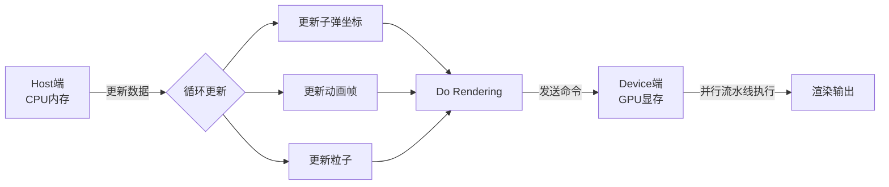
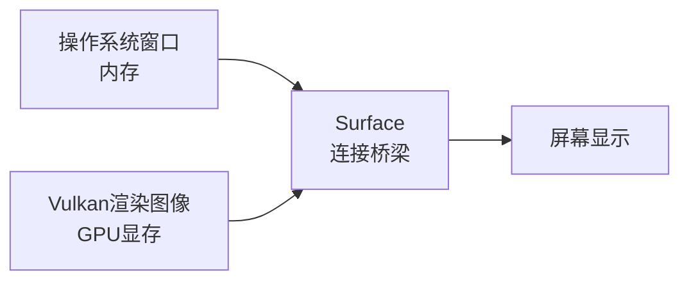
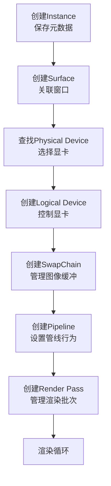
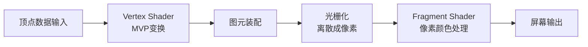
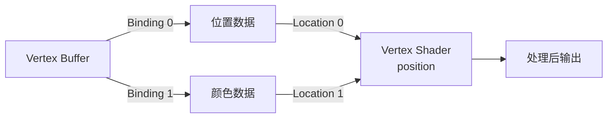

# 01 Vulkan接口理论

## 1. Host与Device架构

### 1.1 概念理解

Vulkan采用客户端-服务端架构设计：

- **Host（客户端/逻辑端/CPU端）**：一切以CPU与内存为基础的操作
- **Device（服务端/渲染端/GPU端）**：一切以GPU与显存为基础的图形渲染后处理工作

### 1.2 职责划分

| 端 | 主要操作 |
|---|---|
| **Host** | 模型读取、鼠标键盘事件响应、游戏碰撞逻辑、定时事件、更新数据到内存 |
| **Device** | 图形渲染、后处理（模糊、风格化等PS功能）、并行流水线执行 |

### 1.3 工作流程



## 2. Vulkan核心对象体系

### 2.1 Instance（实例）

**作用**：保存渲染程序的元数据信息

**包含内容**：
- Vulkan版本
- 引擎版本
- 是否启用Debug（Layer概念）
- 启用的扩展

**理解**：类似于全局变量表或全局配置表，存储程序运行过程中需要随时使用的上下文信息

### 2.2 Surface（表面）

**作用**：连接操作系统相关窗口与Vulkan渲染图像组件

**工作原理**：
- 操作系统窗口存在于内存中
- Vulkan渲染到GPU显存中的图像数据
- Surface负责将GPU渲染的图像连通到当前窗口
- 实现跨平台显示（Windows/Linux/Android等）



### 2.3 Physical Device与Logical Device

**Physical Device（物理设备）**：
- 实际的显卡硬件
- 通过Instance作为索引在系统中查找
- 根据性能和特性选择合适的显卡

**Logical Device（逻辑设备）**：
- 远程控制Physical Device的接口
- 封装了与显卡交互的API
- 可以理解为一个控制器或句柄

### 2.4 SwapChain（交换链）

**作用**：管理渲染的图像缓冲

**特性**：
- 兼容Surface的表面结构和格栅特性
- 兼容Logical Device背后的显卡特性
- 创建时会自动生成n个image buffer（具体数量由设备特性决定）

**工作原理**：交换链负责在多个图像缓冲之间切换，实现流畅的渲染显示

### 2.5 Pipeline（渲染管线）

**理解**：
- 可以理解为一种模板或函数
- 任何模型都可以调用它
- 设置管线内的所有行为信息

**包含内容**：
- 图元拓扑类型（三角形、线、点等）
- 着色器使用
- 透明度设置
- 深度测试启用
- 混合模式等

### 2.6 Render Pass（渲染通道）

**作用**：规定渲染的批次管理

**功能**：
- 决定渲染分几个批次
- 每个批次的结果是否输入到下一个批次
- 最终经过几次渲染叠加呈现到屏幕上
- 与Pipeline关联，作为参数传入

## 3. 完整对象创建流程



## 4. Shader着色器系统

### 4.1 概念

**Shader**：控制GPU端顶点和片元处理行为的GPU编程语言

**分类**：
- **Vertex Shader**（顶点着色器）
- **Fragment Shader**（片元着色器）
- **Tessellation Shader**（曲面细分着色器）
- **Geometry Shader**（几何着色器）
- **Compute Shader**（计算着色器）

### 4.2 Vertex Shader

**作用**：处理顶点数据的空间变换

**主要工作**：
- 从三维坐标系变换到摄像机坐标系
- 从摄像机坐标系投影到屏幕平面
- 可以添加特效（顶点位置扰动等）

**输入**：顶点的位置、颜色等属性，MVP变换矩阵
**输出**：变换后的顶点位置、颜色等

**GLSL示例**：
```glsl
#version 450
layout(location = 0) in vec4 position;
layout(location = 1) in vec4 color;
layout(binding = 0) uniform UBO {
    mat4 model;
    mat4 view;
    mat4 proj;
} ubo;

layout(location = 0) out vec4 fragColor;

void main() {
    gl_Position = ubo.proj * ubo.view * ubo.model * position;
    fragColor = color;
}
```

**关键概念**：
- `in`：输入变量
- `out`：输出变量
- `uniform`：通过C++语言直接设置到Shader中的全局变量
- `gl_Position`：内置变量，存储顶点变换后的结果

### 4.3 Fragment Shader

**作用**：处理片元（像素）的颜色输出

**工作过程**：
- 顶点被离散成像素点
- 顶点的颜色经过插值分配到每个像素
- Fragment Shader决定最终输出颜色

### 4.4 渲染管线流程



## 5. 顶点数据描述

### 5.1 Vertex Buffer

**作用**：在GPU端开辟显存，存储顶点数据

**特点**：
- 在GPU端存续，直到显式删除
- 存储顶点数组（整个拷贝到buffer）

### 5.2 Binding Description（绑定描述）

**为什么需要Binding**：
- 顶点属性可以拆分存储
- 例如：位置存储在一个buffer，颜色存储在另一个buffer
- 多个buffer可以合并成一个数组送入管线

**Binding概念**：
- 对每个buffer进行编号（索引）
- 索引对应数组中的位置（0号、1号等）

**示例**：
```cpp
// 顶点数据拆分存储
Buffer0: 存储所有顶点的位置
Buffer1: 存储所有顶点的颜色
```

### 5.3 Attribute Description（属性描述）

**作用**：描述顶点属性在buffer中的布局

**功能**：
- 完全与binding独立
- 描述每个属性（位置、颜色等）在内存中的格式
- 指定属性从哪个binding获取
- 指定属性在buffer中的偏移量

## 6. Shader与顶点数据的关联

### 6.1 Input Location

在GLSL中通过`layout(location = N)`指定顶点属性的位置：
```glsl
layout(location = 0) in vec4 position;
layout(location = 1) in vec4 color;
```

### 6.2 数据流向



## 7. 总结

Vulkan接口理论的核心在于：

1. **分层架构**：Host与Device分离，职责明确
2. **对象管理**：通过一系列对象（Instance、Surface、Device等）构建渲染环境
3. **管线设计**：Pipeline作为渲染模板，可复用
4. **数据流向**：从CPU内存到GPU显存，通过管线处理
5. **灵活性**：支持多种数据组织方式和着色器编程

Vulkan的设计哲学是"零抽象"——每个对象都有明确的用途，开发者需要完全掌控每个环节，这虽然增加了复杂度，但也带来了极致的性能和控制力。
