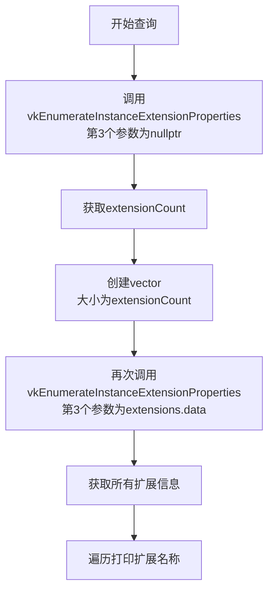
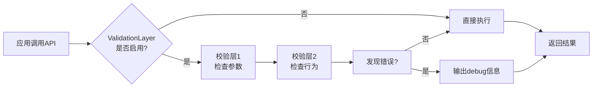
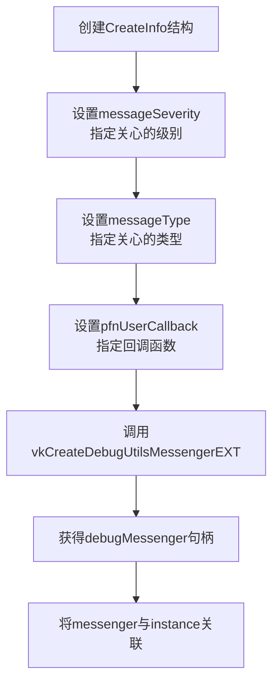
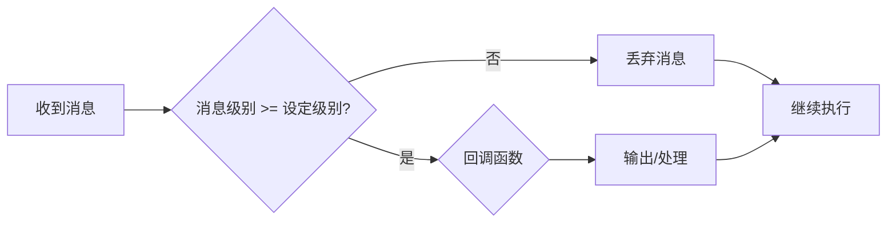
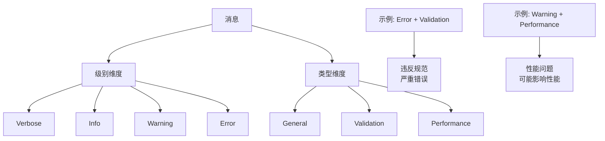
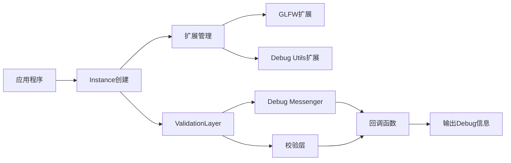

# 92 辅助工具

## 1. Vulkan扩展详解

### 1.1 扩展的概念

**设计理念**：
- Vulkan是一个**最小驱动上层API**
- 不是所有功能都需要，功能按需加载
- 不同应用需要不同的功能集合
- 这些按需功能被封装为**扩展**

**优势**：
- 核心API保持精简和高效
- 不需要的功能不加载，减少开销
- 灵活支持不同平台和硬件特性

### 1.2 获取可用扩展

#### 步骤1：获取扩展数量

```cpp
uint32_t extensionCount = 0;
vkEnumerateInstanceExtensionProperties(nullptr, &extensionCount, nullptr);
```

**参数说明**：
- 第1个参数：layer名称，查询实例扩展传nullptr
- 第2个参数：输出扩展数量的变量地址
- 第3个参数：nullptr，先不获取扩展信息

#### 步骤2：分配存储空间

```cpp
std::vector<VkExtensionProperties> extensions(extensionCount);
```

#### 步骤3：获取扩展信息

```cpp
vkEnumerateInstanceExtensionProperties(nullptr, &extensionCount, extensions.data());
```

**完整流程**：



#### 示例代码

```cpp
void printAvailableExtensions() {
    uint32_t extensionCount = 0;
    vkEnumerateInstanceExtensionProperties(nullptr, &extensionCount, nullptr);
    
    std::vector<VkExtensionProperties> extensions(extensionCount);
    vkEnumerateInstanceExtensionProperties(nullptr, &extensionCount, extensions.data());
    
    std::cout << "Available Extensions:\n";
    for (const auto& extension : extensions) {
        std::cout << "\t" << extension.extensionName << "\n";
    }
}
```

### 1.3 获取必需扩展

#### GLFW所需的扩展

GLFW窗口系统需要Vulkan支持一些扩展才能正常工作。

```cpp
std::vector<const char*> getRequiredExtensions() {
    uint32_t glfwExtensionCount = 0;
    const char** glfwExtensions = 
        glfwGetRequiredInstanceExtensions(&glfwExtensionCount);
    
    std::vector<const char*> extensions(
        glfwExtensions, 
        glfwExtensions + glfwExtensionCount
    );
    
    if (enableValidationLayers) {
        extensions.push_back(VK_EXT_DEBUG_UTILS_EXTENSION_NAME);
    }
    
    return extensions;
}
```

**说明**：
- 使用`glfwGetRequiredInstanceExtensions`获取GLFW需要的扩展
- 如果启用validation layers，需要额外添加`VK_EXT_DEBUG_UTILS_EXTENSION_NAME`
- 返回所有需要启用的扩展名称数组

### 1.4 启用扩展

在创建Instance时指定要启用的扩展：

```cpp
VkInstanceCreateInfo createInfo{};
createInfo.enabledExtensionCount = static_cast<uint32_t>(extensions.size());
createInfo.ppEnabledExtensionNames = extensions.data();
```

## 2. ValidationLayer（验证层）

### 2.1 为什么需要ValidationLayer

**Vulkan的设计目标**：
- 追求极致性能
- 快速运转，减少不必要的开销

**开发与发布的矛盾**：
- **开发期间**：需要debug信息、参数校验、行为检查
- **发布期间**：需要关闭所有检查，达到最快速度

**解决方案**：将debug和校验功能独立为可开关的**验证层**

### 2.2 验证层的工作原理

#### Layer概念

验证层通过在函数调用中间"插层"的方式工作：

**不启用ValidationLayer**：
```
函数调用 → 执行工作 → 继续调用 → ...
```

**启用ValidationLayer**：
```
函数调用 → [校验层1] → 执行工作 → [校验层2] → 继续调用 → ...
```

#### 工作方式



#### 校验内容

- **参数检查**：检查传入参数是否合法
- **行为检查**：检查调用是否符合规范
- **内存检查**：检查内存是否为空或已释放
- **状态检查**：检查对象状态是否正确

### 2.3 启用ValidationLayer

#### 在Instance中启用

```cpp
VkInstanceCreateInfo createInfo{};

// 启用ValidationLayer
createInfo.enabledLayerCount = static_cast<uint32_t>(validationLayers.size());
createInfo.ppEnabledLayerNames = validationLayers.data();

// 启用扩展（Debug Messenger需要的扩展）
createInfo.enabledExtensionCount = static_cast<uint32_t>(extensions.size());
createInfo.ppEnabledExtensionNames = extensions.data();
```

#### 检查ValidationLayer是否可用

```cpp
bool checkValidationLayerSupport() {
    uint32_t layerCount;
    vkEnumerateInstanceLayerProperties(&layerCount, nullptr);
    
    std::vector<VkLayerProperties> availableLayers(layerCount);
    vkEnumerateInstanceLayerProperties(&layerCount, availableLayers.data());
    
    for (const char* layerName : validationLayers) {
        bool layerFound = false;
        for (const auto& layerProperties : availableLayers) {
            if (strcmp(layerName, layerProperties.layerName) == 0) {
                layerFound = true;
                break;
            }
        }
        if (!layerFound) {
            return false;
        }
    }
    return true;
}
```

### 2.4 Debug Messenger（调试消息传递器）

#### 回调函数机制

**目的**：ValidationLayer检测到问题后，通过回调函数通知应用程序

```cpp
VKAPI_ATTR VkBool32 VKAPI_CALL debugCallback(
    VkDebugUtilsMessageSeverityFlagBitsEXT messageSeverity,
    VkDebugUtilsMessageTypeFlagsEXT messageType,
    const VkDebugUtilsMessengerCallbackDataEXT* pCallbackData,
    void* pUserData
) {
    std::cerr << "Validation Layer: " << pCallbackData->pMessage << std::endl;
    return VK_FALSE;
}
```

**参数说明**：
- `messageSeverity`：消息严重级别
- `messageType`：消息类型
- `pCallbackData`：包含详细消息数据的结构体
- `pUserData`：用户自定义数据

#### 创建Debug Messenger

```cpp
VkDebugUtilsMessengerEXT debugMessenger;

VkDebugUtilsMessengerCreateInfoEXT createInfo{};
createInfo.sType = VK_STRUCTURE_TYPE_DEBUG_UTILS_MESSENGER_CREATE_INFO_EXT;
createInfo.messageSeverity = 
    VK_DEBUG_UTILS_MESSAGE_SEVERITY_VERBOSE_BIT_EXT |
    VK_DEBUG_UTILS_MESSAGE_SEVERITY_WARNING_BIT_EXT |
    VK_DEBUG_UTILS_MESSAGE_SEVERITY_ERROR_BIT_EXT;
createInfo.messageType = 
    VK_DEBUG_UTILS_MESSAGE_TYPE_GENERAL_BIT_EXT |
    VK_DEBUG_UTILS_MESSAGE_TYPE_VALIDATION_BIT_EXT |
    VK_DEBUG_UTILS_MESSAGE_TYPE_PERFORMANCE_BIT_EXT;
createInfo.pfnUserCallback = debugCallback;

VkResult result = vkCreateDebugUtilsMessengerEXT(instance, &createInfo, nullptr, &debugMessenger);
```

**流程**：



#### Debug Messenger的作用

- **全局状态符**：存储所有validation layer的设置
- **与Instance关联**：messenger创建后需要与instance绑定
- **消息路由**：将验证层的消息路由到回调函数

### 2.5 消息级别

#### 级别分类

| 级别 | 说明 | 严重程度 |
|------|------|---------|
| **Verbose** | 详细信息，所有操作都打印 | 最低 |
| **Info** | 一般信息，如资源创建 | 低 |
| **Warning** | 警告信息，可能造成bug | 中 |
| **Error** | 错误信息，不合法操作，可能崩溃 | 高 |

#### 过滤机制



**示例**：如果设定级别为Warning，则：
- Verbose和Info：不打印
- Warning和Error：打印

### 2.6 消息类型分类

| 类型 | 说明 |
|------|------|
| **General** | 与规范和性能无关的通用事件 |
| **Validation** | 违反规范或发生可能的错误 |
| **Performance** | 影响Vulkan性能的问题 |

#### 二维分类体系

消息由**级别**和**类型**两个维度组成：



### 2.7 开发与发布配置

#### 开发配置

```cpp
const bool enableValidationLayers = true;

// 启用所有validation layer
// 启用debug messenger扩展
// 启用所有消息级别
// 启用所有消息类型
```

#### 发布配置

```cpp
const bool enableValidationLayers = false;

// 禁用validation layer
// 禁用debug messenger扩展
// 无任何校验和日志输出
```

**性能对比**：

| 配置 | 校验开销 | IO开销 | 性能 |
|------|---------|--------|------|
| 开发 | 高 | 高 | 低 |
| 发布 | 无 | 无 | 最高 |

## 3. 完整工具链



## 4. 最佳实践

### 4.1 使用建议

1. **开发阶段**：
   - 始终启用ValidationLayer
   - 使用详细的消息级别
   - 及时修复所有Error和Warning

2. **测试阶段**：
   - 可以适当降低消息级别（仅Error）
   - 确保所有严重错误都已修复

3. **发布阶段**：
   - 完全禁用ValidationLayer
   - 移除所有debug扩展
   - 获得最佳性能

### 4.2 常见问题

#### 问题1：ValidationLayer不可用

**原因**：某些平台或驱动不支持validation layer

**解决**：
```cpp
if (!checkValidationLayerSupport()) {
    throw std::runtime_error("Validation layers requested, but not available!");
}
```

#### 问题2：扩展版本不匹配

**原因**：使用的扩展版本与驱动不兼容

**解决**：查询扩展版本并检查兼容性

#### 问题3：回调函数性能影响

**原因**：大量消息输出到控制台影响性能

**解决**：
- 使用文件日志替代控制台输出
- 根据需求调整消息级别
- 生产环境完全禁用

## 5. 总结

Vulkan辅助工具包含两个重要部分：

### 扩展系统
- 按需加载功能
- 核心API保持精简
- 灵活支持不同需求
- GLFW等库需要特定扩展

### ValidationLayer
- 开发时启用，发布时关闭
- 通过插层方式进行校验
- 提供详细的debug信息
- 支持多级别、多类型分类
- 通过Debug Messenger回调处理

这两大工具是Vulkan开发的基础，帮助开发者：
- 在开发时快速定位问题
- 在发布时获得最佳性能
- 理解Vulkan的内部工作机制
- 编写高质量的Vulkan应用程序
