# 03 基础设施

## 1. 物理设备创建

### 1.1 Physical Device概念

**定义**：Physical Device代表系统中的物理显卡硬件

**特性**：
- 每个Physical Device对应一张显卡
- 可以是独立显卡、集成显卡或多个显卡
- 由Instance通过API查询获得
- 不需要创建，只需要选择

### 1.2 设备评估

#### 评分标准

| 特性 | 说明 |
|------|------|
| **设备类型** | 独立显卡 > 集成显卡 > 虚拟设备 |
| **纹理尺寸** | 支持的最大纹理尺寸 |
| **几何着色器** | 是否支持几何着色器 |
| **性能指标** | 显存大小、计算单元数量等 |

#### 设备类型枚举

```cpp
VkPhysicalDeviceType枚举值：
- VK_PHYSICAL_DEVICE_TYPE_OTHER: 其他类型
- VK_PHYSICAL_DEVICE_TYPE_INTEGRATED_GPU: 集成显卡
- VK_PHYSICAL_DEVICE_TYPE_DISCRETE_GPU: 独立显卡
- VK_PHYSICAL_DEVICE_TYPE_VIRTUAL_GPU: 虚拟GPU
- VK_PHYSICAL_DEVICE_TYPE_CPU: CPU渲染
```

#### 评分函数示例

```cpp
int rateDeviceSuitability(VkPhysicalDevice device) {
    VkPhysicalDeviceProperties deviceProperties;
    VkPhysicalDeviceFeatures deviceFeatures;
    vkGetPhysicalDeviceProperties(device, &deviceProperties);
    vkGetPhysicalDeviceFeatures(device, &deviceFeatures);

    int score = 0;

    // 独立显卡加分
    if (deviceProperties.deviceType == VK_PHYSICAL_DEVICE_TYPE_DISCRETE_GPU) {
        score += 1000;
    }

    // 最大纹理尺寸越大越好
    score += deviceProperties.limits.maxImageDimension2D;

    // 必须支持几何着色器
    if (!deviceFeatures.geometryShader) {
        return 0;
    }

    return score;
}
```

### 1.3 选择物理设备

**流程**：

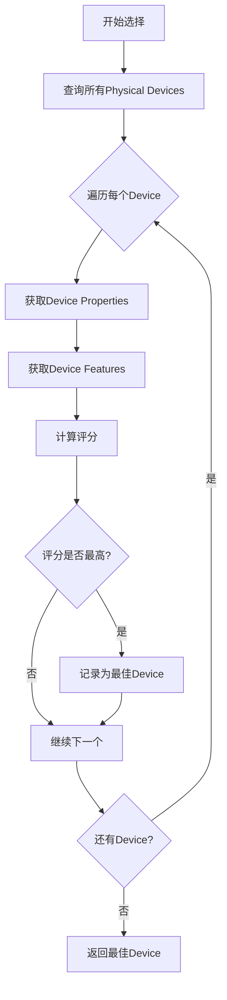

### 1.4 Device包装类设计

```cpp
class Device {
public:
    using ptr = std::shared_ptr<Device>;
    
    static ptr create(Instance::ptr instance) {
        return std::make_shared<Device>(instance);
    }
    
    Device(Instance::ptr instance) : m_instance(instance) {}
    ~Device();
    
    void create(const std::vector<const char*>& extensions);
    
private:
    Instance::ptr m_instance;
    VkPhysicalDevice m_physicalDevice = VK_NULL_HANDLE;
    VkDevice m_logicalDevice = VK_NULL_HANDLE;
};
```

**成员变量**：
- `m_instance`: 指向Instance的智能指针
- `m_physicalDevice`: 物理设备句柄（初始化为VK_NULL_HANDLE）
- `m_logicalDevice`: 逻辑设备句柄（初始化为VK_NULL_HANDLE）

## 2. 逻辑设备与队列族

### 2.1 队列概念

#### 什么是队列

队列是Vulkan中提交命令的方式，GPU通过队列执行渲染、计算等任务。

#### 队列族概念

**定义**：队列族是队列的类型，类似于C++中的class概念

**特点**：
- 代表一种队列类型，不代表具体队列
- 规定了本类型队列应满足的功能
- 每个队列族可以创建少量队列实例

### 2.2 队列族类型

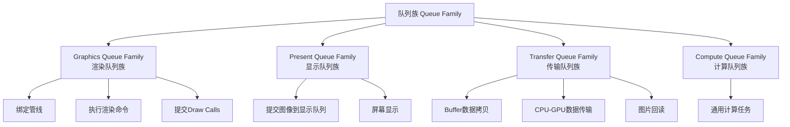

#### Graphics Queue（渲染队列）

**功能**：
- 绑定渲染管线
- 执行渲染通道
- 提交Draw Calls
- 所有渲染相关操作

#### Present Queue（显示队列）

**功能**：
- 将渲染完成的图像提交到显示队列
- 连接到屏幕显示
- 与窗口系统交互

#### Transfer Queue（传输队列）

**功能**：
- Buffer之间的数据拷贝
- 将图片拷贝到GPU显存
- CPU与GPU之间的数据传输
- 从GPU读取渲染结果（保存图片/视频）

#### Compute Queue（计算队列）

**功能**：
- 执行通用计算任务
- GPGPU计算
- 物理模拟等

### 2.3 队列族特性

#### 多功能队列族

一个队列族可以拥有多种功能：
- Graphics + Transfer：渲染和传输在同一个队列族
- Graphics + Present：渲染和显示在同一个队列族
- 独立队列族：每种功能都有独立队列族

#### 队列族查询

```cpp
// 获取队列族数量
uint32_t queueFamilyCount = 0;
vkGetPhysicalDeviceQueueFamilyProperties(device, &queueFamilyCount, nullptr);

// 获取队列族属性
std::vector<VkQueueFamilyProperties> queueFamilies(queueFamilyCount);
vkGetPhysicalDeviceQueueFamilyProperties(device, &queueFamilyCount, queueFamilies.data());

// 查找Graphics队列族
int graphicsQueueFamilyIndex = -1;
for (uint32_t i = 0; i < queueFamilies.size(); i++) {
    if (queueFamilies[i].queueFlags & VK_QUEUE_GRAPHICS_BIT) {
        graphicsQueueFamilyIndex = i;
        break;
    }
}
```

**队列属性**：
- `queueFlags`: 位掩码，表示队列支持的功能
- `queueCount`: 该队列族支持的队列数量
- `timestampValidBits`: 时间戳有效位数
- `minImageTransferGranularity`: 最小图像传输粒度

### 2.4 逻辑设备创建

**流程**：

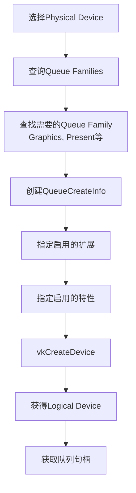

#### 队列创建信息

```cpp
VkDeviceQueueCreateInfo queueCreateInfo{};
queueCreateInfo.sType = VK_STRUCTURE_TYPE_DEVICE_QUEUE_CREATE_INFO;
queueCreateInfo.queueFamilyIndex = queueFamilyIndex;
queueCreateInfo.queueCount = 1;
float queuePriority = 1.0f;
queueCreateInfo.pQueuePriorities = &queuePriority;
```

**说明**：
- `queueFamilyIndex`: 要创建的队列族索引
- `queueCount`: 创建的队列数量（通常为1）
- `queuePriority`: 队列优先级（0.0-1.0）

#### 设备创建信息

```cpp
VkDeviceCreateInfo createInfo{};
createInfo.sType = VK_STRUCTURE_TYPE_DEVICE_CREATE_INFO;
createInfo.queueCreateInfoCount = 1;
createInfo.pQueueCreateInfos = &queueCreateInfo;
createInfo.enabledExtensionCount = static_cast<uint32_t>(deviceExtensions.size());
createInfo.ppEnabledExtensionNames = deviceExtensions.data();
createInfo.pEnabledFeatures = &deviceFeatures;
```

### 2.5 多线程渲染

**原理**：

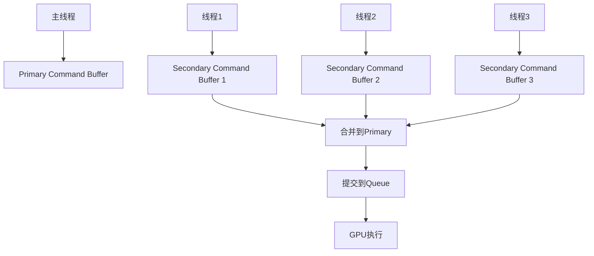

**优势**：
- 多个二级命令缓冲可以在不同线程并行录制
- 最后合并到主命令缓冲提交
- 只需要一个队列即可执行多个物体的渲染
- 充分利用多核CPU性能

## 3. Surface概念与封装

### 3.1 Surface的作用

**定义**：Surface连接操作系统窗口与Vulkan渲染图像

**职责**：
- 将Vulkan渲染的图像连通到当前窗口
- 实现跨平台显示（Windows/Linux/Android等）
- 抽象不同操作系统的窗口系统

### 3.2 Window类封装

```cpp
class Window {
public:
    using ptr = std::shared_ptr<Window>;
    
    static ptr create(int width, int height, const std::string& title) {
        return std::make_shared<Window>(width, height, title);
    }
    
    Window(int width, int height, const std::string& title)
        : m_width(width), m_height(height), m_title(title) {
        initWindow();
    }
    
    ~Window() {
        cleanup();
    }
    
    bool shouldClose() const {
        return glfwWindowShouldClose(m_window);
    }
    
    void pollEvents() {
        glfwPollEvents();
    }
    
    GLFWwindow* getGLFWWindow() const { return m_window; }
    
private:
    void initWindow();
    void cleanup();
    
    int m_width;
    int m_height;
    std::string m_title;
    GLFWwindow* m_window = nullptr;
};
```

#### 初始化

```cpp
void Window::initWindow() {
    glfwInit();
    glfwWindowHint(GLFW_CLIENT_API, GLFW_NO_API); // 不创建OpenGL上下文
    glfwWindowHint(GLFW_RESIZABLE, GLFW_FALSE);
    
    m_window = glfwCreateWindow(
        m_width, m_height, 
        m_title.c_str(), 
        nullptr, nullptr
    );
}
```

#### 清理

```cpp
void Window::cleanup() {
    glfwDestroyWindow(m_window);
    glfwTerminate();
}
```

### 3.3 Surface创建

#### 创建流程

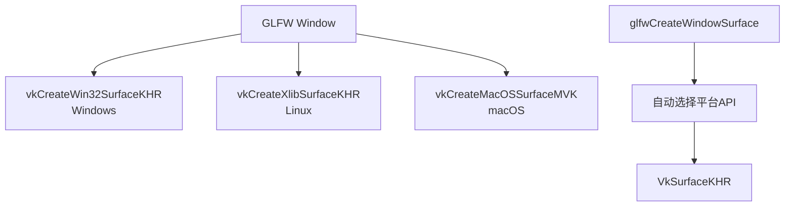

#### 使用GLFW创建Surface

```cpp
VkSurfaceKHR surface;

if (glfwCreateWindowSurface(instance, window->getGLFWWindow(), 
                           nullptr, &surface) != VK_SUCCESS) {
    throw std::runtime_error("Failed to create window surface!");
}
```

#### 手动创建（不使用GLFW）

```cpp
// Windows平台
VkWin32SurfaceCreateInfoKHR createInfo{};
createInfo.sType = VK_STRUCTURE_TYPE_WIN32_SURFACE_CREATE_INFO_KHR;
createInfo.hinstance = GetModuleHandle(nullptr);
createInfo.hwnd = glfwGetWin32Window(window);

if (vkCreateWin32SurfaceKHR(instance, &createInfo, nullptr, &surface) != VK_SUCCESS) {
    throw std::runtime_error("Failed to create window surface!");
}
```

## 4. 显示队列族与显示队列

### 4.1 Present Queue的概念

**作用**：将渲染完成的图像提交到屏幕显示

**特点**：
- 与窗口系统交互
- 需要Surface作为参数
- 可能与Graphics Queue在同一个队列族

### 4.2 查找Present Queue Family

#### 查询函数

```cpp
VkBool32 presentSupport = false;
vkGetPhysicalDeviceSurfaceSupportKHR(
    physicalDevice, 
    queueFamilyIndex, 
    surface, 
    &presentSupport
);
```

**参数说明**：
- `physicalDevice`: 物理设备
- `queueFamilyIndex`: 队列族索引
- `surface`: 表面句柄
- `presentSupport`: 输出，是否支持显示

#### 完整查找逻辑

```cpp
struct QueueFamilyIndices {
    std::optional<uint32_t> graphicsFamily;
    std::optional<uint32_t> presentFamily;
    
    bool isComplete() const {
        return graphicsFamily.has_value() && presentFamily.has_value();
    }
};

QueueFamilyIndices findQueueFamilies(VkPhysicalDevice device, VkSurfaceKHR surface) {
    QueueFamilyIndices indices;
    
    uint32_t queueFamilyCount = 0;
    vkGetPhysicalDeviceQueueFamilyProperties(device, &queueFamilyCount, nullptr);
    
    std::vector<VkQueueFamilyProperties> queueFamilies(queueFamilyCount);
    vkGetPhysicalDeviceQueueFamilyProperties(device, &queueFamilyCount, queueFamilies.data());
    
    for (uint32_t i = 0; i < queueFamilies.size(); i++) {
        // 查找Graphics队列族
        if (queueFamilies[i].queueFlags & VK_QUEUE_GRAPHICS_BIT) {
            indices.graphicsFamily = i;
        }
        
        // 查找Present队列族
        VkBool32 presentSupport = false;
        vkGetPhysicalDeviceSurfaceSupportKHR(device, i, surface, &presentSupport);
        if (presentSupport) {
            indices.presentFamily = i;
        }
        
        if (indices.isComplete()) {
            break;
        }
    }
    
    return indices;
}
```

### 4.3 创建Present Queue

#### 多队列族情况

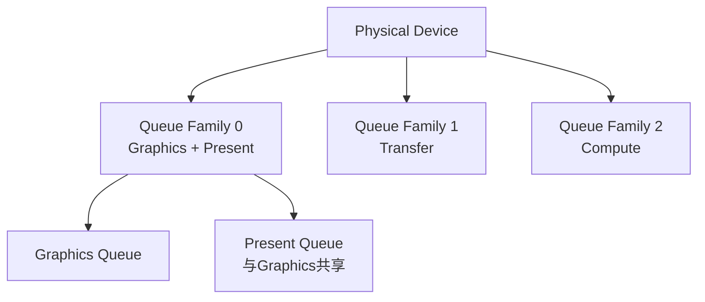

#### 单一队列族情况

如果Graphics和Present在同一个队列族：

```cpp
// 使用同一个队列族创建队列
VkDeviceQueueCreateInfo queueCreateInfo{};
queueCreateInfo.queueFamilyIndex = indices.graphicsFamily.value();
queueCreateInfo.queueCount = 1; // 创建一个队列
queueCreateInfo.pQueuePriorities = &queuePriority;

// 获取队列句柄（Graphics和Present是同一个）
vkGetDeviceQueue(device, indices.graphicsFamily.value(), 0, &graphicsQueue);
presentQueue = graphicsQueue; // 共享
```

#### 不同队列族情况

如果Graphics和Present在不同队列族：

```cpp
std::vector<VkDeviceQueueCreateInfo> queueCreateInfos;
std::set<uint32_t> uniqueQueueFamilies = {
    indices.graphicsFamily.value(),
    indices.presentFamily.value()
};

float queuePriority = 1.0f;
for (uint32_t queueFamily : uniqueQueueFamilies) {
    VkDeviceQueueCreateInfo queueCreateInfo{};
    queueCreateInfo.sType = VK_STRUCTURE_TYPE_DEVICE_QUEUE_CREATE_INFO;
    queueCreateInfo.queueFamilyIndex = queueFamily;
    queueCreateInfo.queueCount = 1;
    queueCreateInfo.pQueuePriorities = &queuePriority;
    queueCreateInfos.push_back(queueCreateInfo);
}

// 创建逻辑设备
VkDeviceCreateInfo createInfo{};
createInfo.queueCreateInfoCount = static_cast<uint32_t>(queueCreateInfos.size());
createInfo.pQueueCreateInfos = queueCreateInfos.data();

// 获取队列
vkGetDeviceQueue(device, indices.graphicsFamily.value(), 0, &graphicsQueue);
vkGetDeviceQueue(device, indices.presentFamily.value(), 0, &presentQueue);
```

### 4.4 Device类更新

```cpp
class Device {
public:
    void create(const std::vector<const char*>& extensions, VkSurfaceKHR surface) {
        m_surface = surface;
        pickPhysicalDevice();
        createLogicalDevice();
    }
    
    VkQueue getGraphicsQueue() const { return m_graphicsQueue; }
    VkQueue getPresentQueue() const { return m_presentQueue; }
    
private:
    void pickPhysicalDevice();
    void createLogicalDevice();
    QueueFamilyIndices findQueueFamilies(VkPhysicalDevice device);
    bool isDeviceSuitable(VkPhysicalDevice device);
    
    Instance::ptr m_instance;
    VkSurfaceKHR m_surface = VK_NULL_HANDLE;
    
    VkPhysicalDevice m_physicalDevice = VK_NULL_HANDLE;
    VkDevice m_logicalDevice = VK_NULL_HANDLE;
    
    VkQueue m_graphicsQueue = VK_NULL_HANDLE;
    VkQueue m_presentQueue = VK_NULL_HANDLE;
};
```

## 5. 交换链基础理论

### 5.1 为什么需要SwapChain

#### 单Buffer渲染的问题

**撕裂现象**：
- 屏幕刷新和GPU渲染不同步
- 屏幕正在显示时，GPU更新图像
- 导致屏幕上一帧显示一部分，下一帧显示另一部分

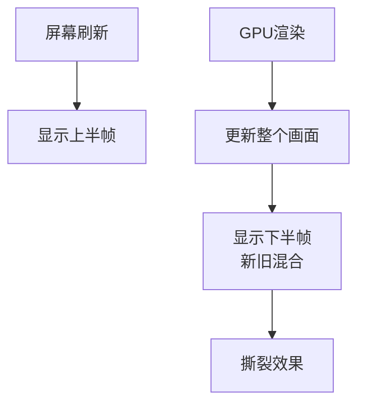

#### 多Buffer渲染

**SwapChain解决方案**：
- 使用多个图像缓冲轮换显示
- GPU渲染到一个缓冲时，屏幕显示另一个
- 渲染完成后交换，避免撕裂

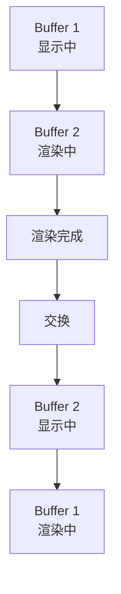

### 5.2 SwapChain作为扩展

**原因**：
- 云渲染设备不需要显示到屏幕
- 渲染农场离线渲染输出影片
- 不是所有设备都需要SwapChain

**扩展名称**：`VK_KHR_swapchain`

**创建位置**：在Logical Device创建时启用

```cpp
const std::vector<const char*> deviceExtensions = {
    VK_KHR_SWAPCHAIN_EXTENSION_NAME
};

VkDeviceCreateInfo createInfo{};
createInfo.enabledExtensionCount = static_cast<uint32_t>(deviceExtensions.size());
createInfo.ppEnabledExtensionNames = deviceExtensions.data();
```

### 5.3 SwapChain关心的三个问题

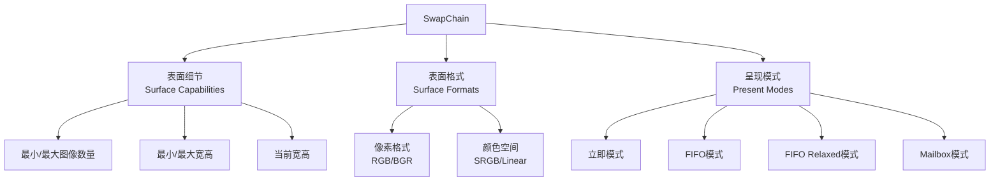

### 5.4 表面细节

#### 查询Surface Capabilities

```cpp
VkSurfaceCapabilitiesKHR surfaceCapabilities;
vkGetPhysicalDeviceSurfaceCapabilitiesKHR(
    physicalDevice, 
    surface, 
    &surfaceCapabilities
);
```

**包含信息**：
- `minImageCount`: 最小图像数量
- `maxImageCount`: 最大图像数量（0表示无限制）
- `currentExtent`: 当前窗口大小
- `minImageExtent`: 最小图像尺寸
- `maxImageExtent`: 最大图像尺寸
- `maxImageArrayLayers`: 最大图像层数
- `supportedTransforms`: 支持的变换
- `currentTransform`: 当前变换
- `supportedCompositeAlpha`: 支持的混合模式
- `supportedUsageFlags`: 支持的用途

### 5.5 表面格式

#### 查询Surface Formats

```cpp
uint32_t formatCount;
vkGetPhysicalDeviceSurfaceFormatsKHR(physicalDevice, surface, &formatCount, nullptr);

std::vector<VkSurfaceFormatKHR> surfaceFormats(formatCount);
vkGetPhysicalDeviceSurfaceFormatsKHR(physicalDevice, surface, &formatCount, surfaceFormats.data());
```

#### VkSurfaceFormatKHR结构

```cpp
struct VkSurfaceFormatKHR {
    VkFormat format;           // 像素格式
    VkColorSpaceKHR colorSpace; // 颜色空间
};
```

**常见像素格式**：
- `VK_FORMAT_B8G8R8A8_SRGB`: 8-bit BGR with Alpha, SRGB
- `VK_FORMAT_R8G8B8A8_SRGB`: 8-bit RGBA with Alpha, SRGB
- `VK_FORMAT_B8G8R8A8_UNORM`: 8-bit BGR with Alpha, Linear
- `VK_FORMAT_R32G32B32A32_SFLOAT`: 32-bit RGBA, HDR

### 5.6 颜色空间与Gamma校正

#### 问题起源

**线性颜色 vs 显示器特性**：
- 我们希望：颜色值翻倍，亮度也翻倍
- CRT显示器：非线性响应（2.2次幂）
- LCD显示器：模拟CRT特性

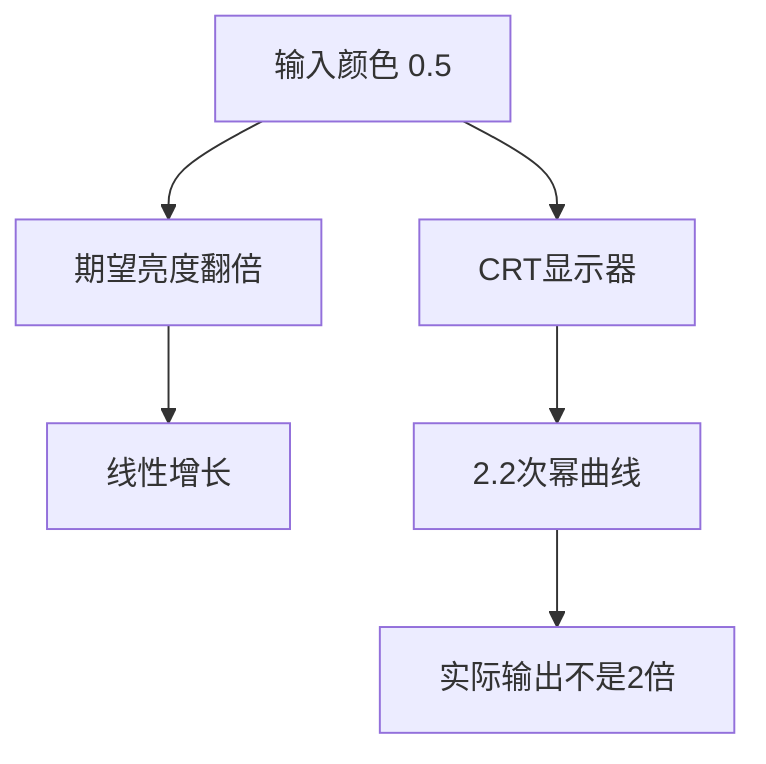

#### Gamma校正

**解决方案**：在输出前进行反Gamma校正

```cpp
// 输入颜色值（0.0-1.0）
float inputColor = 0.3f;

// 应用Gamma校正（2.2的1/2.2次幂 = 0.4545次幂）
float correctedColor = pow(inputColor, 1.0f / 2.2f);

// 显示器应用2.2次幂
// pow(pow(inputColor, 1.0/2.2), 2.2) = inputColor
// 最终效果：线性响应
```

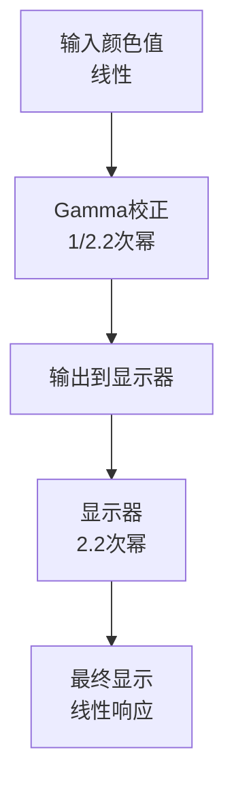

#### SRGB颜色空间

**定义**：应用了Gamma校正的颜色空间

**特点**：
- 视觉感知均匀
- 人眼对暗部更敏感，SRGB在暗部精度更高
- 标准显示颜色空间

**使用场景**：
- 所有显示的图像
- UI渲染
- 交换链图像

#### Linear颜色空间

**定义**：线性颜色空间，无Gamma校正

**特点**：
- 数值与亮度线性对应
- 用于光照计算

**使用场景**：
- 光照计算
- 后处理
- 帧缓冲

#### Vulkan中的颜色空间

```cpp
// SRGB颜色空间
VK_COLOR_SPACE_SRGB_NONLINEAR_KHR

// Linear颜色空间
VK_COLOR_SPACE_PASS_THROUGH_EXT
```

**选择策略**：
- 通常选择`VK_FORMAT_B8G8R8A8_SRGB`和`VK_COLOR_SPACE_SRGB_NONLINEAR_KHR`
- 用于直接显示的图像

### 5.7 呈现模式

#### 查询Present Modes

```cpp
uint32_t presentModeCount;
vkGetPhysicalDeviceSurfacePresentModesKHR(physicalDevice, surface, 
                                           &presentModeCount, nullptr);

std::vector<VkPresentModeKHR> presentModes(presentModeCount);
vkGetPhysicalDeviceSurfacePresentModesKHR(physicalDevice, surface, 
                                           &presentModeCount, presentModes.data());
```

#### Present Mode类型

| 模式 | 说明 | 垂直同步 | 应用场景 |
|------|------|---------|---------|
| **VK_PRESENT_MODE_IMMEDIATE_KHR** | 立即替换当前显示图像 | 否 | 需要最低延迟 |
| **VK_PRESENT_MODE_FIFO_KHR** | 先进先出，队列式 | 是 | 默认模式 |
| **VK_PRESENT_MODE_FIFO_RELAXED_KHR** | FIFO，但队列空闲时可立即 | 可能 | 减少延迟 |
| **VK_PRESENT_MODE_MAILBOX_KHR** | 队列满时替换最旧的图像 | 是 | 低延迟+三重缓冲 |

#### 模式对比

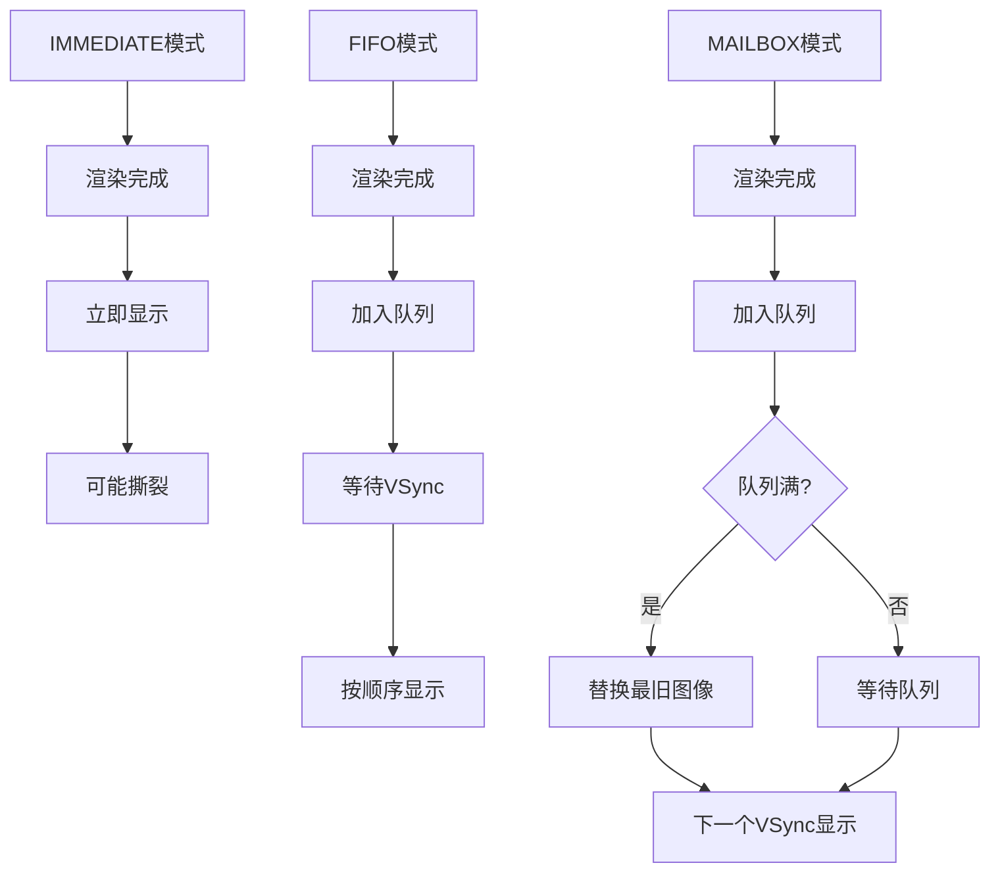

### 5.8 完整SwapChain创建流程

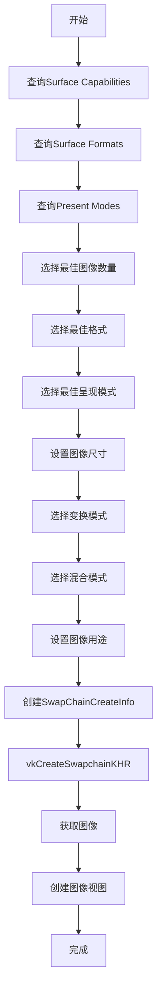

#### 创建SwapChain

```cpp
VkSwapchainCreateInfoKHR createInfo{};
createInfo.sType = VK_STRUCTURE_TYPE_SWAPCHAIN_CREATE_INFO_KHR;
createInfo.surface = surface;
createInfo.minImageCount = imageCount;
createInfo.imageFormat = surfaceFormat.format;
createInfo.imageColorSpace = surfaceFormat.colorSpace;
createInfo.imageExtent = extent;
createInfo.imageArrayLayers = 1;
createInfo.imageUsage = VK_IMAGE_USAGE_COLOR_ATTACHMENT_BIT;
createInfo.imageSharingMode = VK_SHARING_MODE_EXCLUSIVE;
createInfo.preTransform = surfaceCapabilities.currentTransform;
createInfo.compositeAlpha = VK_COMPOSITE_ALPHA_OPAQUE_BIT_KHR;
createInfo.presentMode = presentMode;
createInfo.clipped = VK_TRUE;
createInfo.oldSwapchain = VK_NULL_HANDLE;

VkSwapchainKHR swapChain;
if (vkCreateSwapchainKHR(device, &createInfo, nullptr, &swapChain) != VK_SUCCESS) {
    throw std::runtime_error("Failed to create swap chain!");
}
```

## 6. 完整基础设施架构

### 6.1 对象关系图

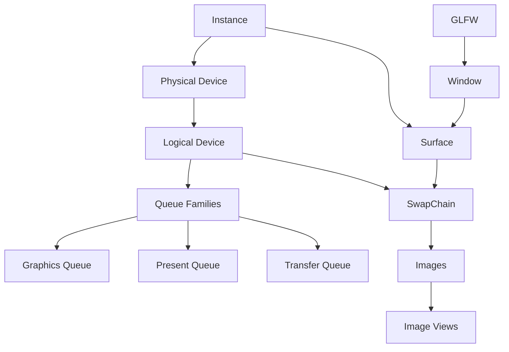

### 6.2 初始化顺序

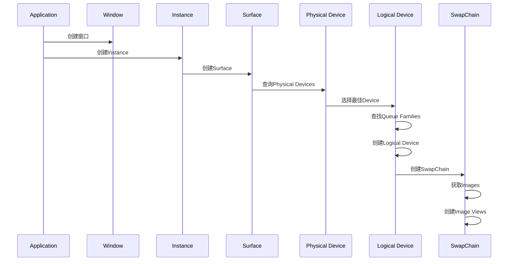

### 6.3 Device包装类完整示例

```cpp
class Device {
public:
    using ptr = std::shared_ptr<Device>;
    
    static ptr create(Instance::ptr instance) {
        return std::make_shared<Device>(instance);
    }
    
    Device(Instance::ptr instance) : m_instance(instance) {}
    ~Device();
    
    void create(const std::vector<const char*>& extensions, VkSurfaceKHR surface);
    
    VkPhysicalDevice getPhysicalDevice() const { return m_physicalDevice; }
    VkDevice getLogicalDevice() const { return m_logicalDevice; }
    VkQueue getGraphicsQueue() const { return m_graphicsQueue; }
    VkQueue getPresentQueue() const { return m_presentQueue; }
    
private:
    void pickPhysicalDevice();
    void createLogicalDevice();
    
    QueueFamilyIndices findQueueFamilies(VkPhysicalDevice device);
    bool isDeviceSuitable(VkPhysicalDevice device);
    int rateDeviceSuitability(VkPhysicalDevice device);
    bool checkDeviceExtensionSupport(VkPhysicalDevice device);
    
    Instance::ptr m_instance;
    VkSurfaceKHR m_surface = VK_NULL_HANDLE;
    
    VkPhysicalDevice m_physicalDevice = VK_NULL_HANDLE;
    VkDevice m_logicalDevice = VK_NULL_HANDLE;
    
    VkQueue m_graphicsQueue = VK_NULL_HANDLE;
    VkQueue m_presentQueue = VK_NULL_HANDLE;
    
    const std::vector<const char*> m_deviceExtensions = {
        VK_KHR_SWAPCHAIN_EXTENSION_NAME
    };
};
```

## 7. 总结

### 核心概念

1. **Physical Device**：物理显卡硬件，通过评估选择最佳设备
2. **Logical Device**：逻辑设备，作为Physical Device的控制器
3. **Queue Family**：队列族，定义队列的功能类型
4. **Queue**：队列，提交命令到GPU执行
5. **Surface**：表面，连接窗口与Vulkan渲染
6. **SwapChain**：交换链，管理多个图像缓冲避免撕裂

### 关键关系

- Instance → Surface → Physical Device → Logical Device → Queues
- Logical Device → SwapChain → Images → Image Views
- Graphics Queue和Present Queue可能共享或独立

### 最佳实践

1. **设备选择**：优先选择独立显卡，考虑性能评分
2. **队列查找**：同时查找Graphics和Present队列族
3. **颜色空间**：通常使用SRGB非线性颜色空间
4. **呈现模式**：根据应用需求选择（IMMEDIATE/FIFO/MAILBOX）
5. **资源管理**：使用RAII和智能指针自动管理生命周期

这些基础设施构成了Vulkan渲染的核心框架，后续的Pipeline、RenderPass等都将在此基础上构建。
