# 04 渲染流水线

## 1. Pipeline概念概述

### 1.1 什么是Pipeline

**定义**：Pipeline（渲染管线）规定了模型数据如何从输入到输出的完整处理流程

**位置**：在Vulkan对象关系图中，Pipeline位于核心位置，连接着之前的条件设置和后续的RenderPass

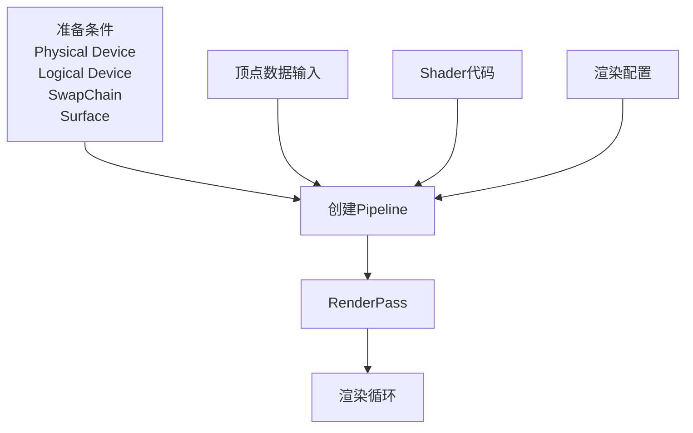

### 1.2 Pipeline的作用

Pipeline告诉Vulkan如何处理模型数据：

| 方面 | 说明 |
|------|------|
| **数据理解** | 顶点是三角形还是直线？ |
| **渲染方式** | 使用哪些Shader？什么渲染技术？ |
| **颜色混合** | 透明半透明物体如何混合？ |
| **深度关系** | 不同物体的深度遮挡关系 |
| **变量传递** | 如何从C++向Shader传递变量（如时间、变换矩阵等） |

### 1.3 Pipeline与材质的关系

**概念**：
- **材质**：规定物体与环境交互的属性
  - 反光强度
  - 散射特性
  - 透明度
  - 纹理

- **渲染管线**：属于材质的一部分，规定如何对模型数据进行绘制

**关系图**：

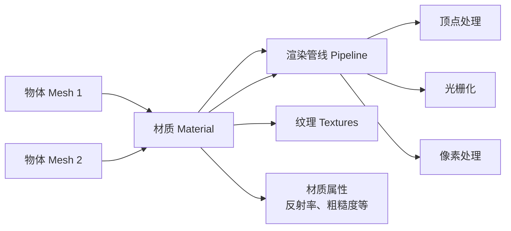

**实践**：
- 每个Mesh绑定自己的渲染管线
- 共用材质的Mesh共用同一个Pipeline
- 可以创建一个Material类，包含Pipeline
- 对材质的设置 = 对Pipeline的设置

### 1.4 Pipeline的特性

- **独立对象**：Pipeline在Vulkan中是一个句柄类型
- **可详细设置**：可以精细配置每个阶段的参数
- **渲染模板**：可以理解为一种渲染模板
- **可复用**：多个物体可以共用同一个Pipeline

## 2. Pipeline的模块组成

Pipeline由多个可配置的模块组成，每个模块控制渲染流程的一个方面：

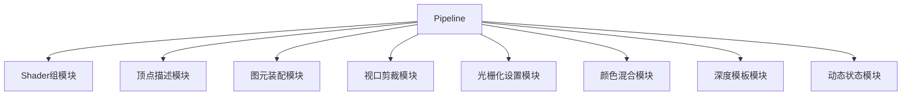

## 3. Shader组模块

### 3.1 Shader概念

**Shader**：运行在GPU上的小程序，处理顶点或像素

**Shader流水线**：
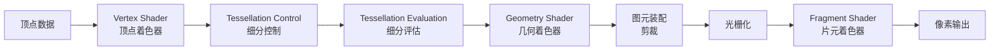

### 3.2 Shader类型

| Shader | 作用 | 阶段 |
|--------|------|------|
| **Vertex Shader** | 顶点变换、位置计算 | 顶点处理 |
| **Tessellation Control** | 控制曲面细分程度 | 曲面细分 |
| **Tessellation Evaluation** | 生成细分后的顶点 | 曲面细分 |
| **Geometry Shader** | 动态生成/修改图元 | 图元处理 |
| **Fragment Shader** | 像素颜色计算 | 像素处理 |
| **Compute Shader** | 通用计算任务 | 独立于图形管线 |

### 3.3 Shader组

**定义**：Pipeline中用到的所有Shader的集合

**特点**：
- 每个阶段可以设置不同的Shader
- 将不同阶段的Shader组合在一起
- 管线按顺序执行这些Shader
- 对输入的顶点/片元进行流水线式处理

**配置示例**：

```cpp
// 创建Shader模块
VkShaderModule vertShaderModule = createShaderModule(vertShaderCode);
VkShaderModule fragShaderModule = createShaderModule(fragShaderCode);

// 配置Vertex Shader
VkPipelineShaderStageCreateInfo vertShaderStageInfo{};
vertShaderStageInfo.sType = VK_STRUCTURE_TYPE_PIPELINE_SHADER_STAGE_CREATE_INFO;
vertShaderStageInfo.stage = VK_SHADER_STAGE_VERTEX_BIT;
vertShaderStageInfo.module = vertShaderModule;
vertShaderStageInfo.pName = "main"; // 入口函数名

// 配置Fragment Shader
VkPipelineShaderStageCreateInfo fragShaderStageInfo{};
fragShaderStageInfo.sType = VK_STRUCTURE_TYPE_PIPELINE_SHADER_STAGE_CREATE_INFO;
fragShaderStageInfo.stage = VK_SHADER_STAGE_FRAGMENT_BIT;
fragShaderStageInfo.module = fragShaderModule;
fragShaderStageInfo.pName = "main";

// Shader组
VkPipelineShaderStageCreateInfo shaderStages[] = {
    vertShaderStageInfo,
    fragShaderStageInfo
};
```

## 4. 顶点描述模块

### 4.1 顶点数据的两种组织方式

#### 方式一：Interleaved Data（交错数据）

```cpp
struct Vertex {
    glm::vec3 position;  // 位置
    glm::vec3 normal;    // 法线
    glm::vec2 texCoord;  // 纹理坐标
};

std::vector<Vertex> vertices = {
    {{0.0f, 0.0f, 0.0f}, {0.0f, 0.0f, 1.0f}, {0.0f, 0.0f}},
    {{1.0f, 0.0f, 0.0f}, {0.0f, 0.0f, 1.0f}, {1.0f, 0.0f}},
    {{0.0f, 1.0f, 0.0f}, {0.0f, 0.0f, 1.0f}, {0.0f, 1.0f}}
};
```

**内存布局**：
```
[Pos0][Norm0][UV0][Pos1][Norm1][UV1][Pos2][Norm2][UV2]...
```

#### 方式二：Separated Data（分离数据）

```cpp
std::vector<glm::vec3> positions = {
    {0.0f, 0.0f, 0.0f},
    {1.0f, 0.0f, 0.0f},
    {0.0f, 1.0f, 0.0f}
};

std::vector<glm::vec3> normals = {
    {0.0f, 0.0f, 1.0f},
    {0.0f, 0.0f, 1.0f},
    {0.0f, 0.0f, 1.0f}
};

std::vector<glm::vec2> texCoords = {
    {0.0f, 0.0f},
    {1.0f, 0.0f},
    {0.0f, 1.0f}
};
```

**内存布局**：
```
Buffer 0: [Pos0][Pos1][Pos2]...
Buffer 1: [Norm0][Norm1][Norm2]...
Buffer 2: [UV0][UV1][UV2]...
```

### 4.2 Binding Description（绑定描述）

**作用**：描述每个Buffer如何绑定到Pipeline

**VkVertexInputBindingDescription结构**：

```cpp
struct VkVertexInputBindingDescription {
    uint32_t binding;        // Binding编号
    uint32_t stride;         // 每个顶点的字节大小
    VkVertexInputRate inputRate;  // 输入速率
};
```

**参数说明**：
- **binding**: Buffer的索引编号
  - 0号Buffer
  - 1号Buffer
  - 等等

- **stride**: 从一个顶点到下一个顶点的字节距离
  - Interleaved: sizeof(Vertex)
  - Separated: sizeof(单个属性)

- **inputRate**: 顶点输入速率
  - `VK_VERTEX_INPUT_RATE_VERTEX`: 每个顶点读取一次（默认）
  - `VK_VERTEX_INPUT_RATE_INSTANCE`: 每个实例读取一次（实例化渲染）

**示例**：

```cpp
// Interleaved方式
VkVertexInputBindingDescription bindingDescription{};
bindingDescription.binding = 0;
bindingDescription.stride = sizeof(Vertex);
bindingDescription.inputRate = VK_VERTEX_INPUT_RATE_VERTEX;

// Separated方式
VkVertexInputBindingDescription bindingDescriptions[3];
bindingDescriptions[0].binding = 0;
bindingDescriptions[0].stride = sizeof(glm::vec3);
bindingDescriptions[0].inputRate = VK_VERTEX_INPUT_RATE_VERTEX;

bindingDescriptions[1].binding = 1;
bindingDescriptions[1].stride = sizeof(glm::vec3);
bindingDescriptions[1].inputRate = VK_VERTEX_INPUT_RATE_VERTEX;

bindingDescriptions[2].binding = 2;
bindingDescriptions[2].stride = sizeof(glm::vec2);
bindingDescriptions[2].inputRate = VK_VERTEX_INPUT_RATE_VERTEX;
```

### 4.3 Attribute Description（属性描述）

**作用**：描述每个顶点属性的格式和位置

**VkVertexInputAttributeDescription结构**：

```cpp
struct VkVertexInputAttributeDescription {
    uint32_t location;    // Location编号（对应Shader中的layout(location=X)）
    uint32_t binding;     // 从哪个Binding获取
    VkFormat format;      // 数据格式
    uint32_t offset;      // 在顶点数据中的字节偏移
};
```

**数据类型到VkFormat映射**：

| C++类型 | VkFormat | 说明 |
|---------|---------|------|
| `float` | `VK_FORMAT_R32_SFLOAT` | 单个浮点数 |
| `glm::vec2` | `VK_FORMAT_R32G32_SFLOAT` | 2D向量 |
| `glm::vec3` | `VK_FORMAT_R32G32B32_SFLOAT` | 3D向量 |
| `glm::vec4` | `VK_FORMAT_R32G32B32A32_SFLOAT` | 4D向量 |
| `int` | `VK_FORMAT_R32_SINT` | 单个整数 |
| `glm::ivec2` | `VK_FORMAT_R32G32_SINT` | 2D整数向量 |
| `glm::ivec3` | `VK_FORMAT_R32G32B32_SINT` | 3D整数向量 |
| `glm::ivec4` | `VK_FORMAT_R32G32B32A32_SINT` | 4D整数向量 |

**示例**：

```cpp
std::vector<VkVertexInputAttributeDescription> attributeDescriptions;

// Position属性
VkVertexInputAttributeDescription posAttribute{};
posAttribute.binding = 0;
posAttribute.location = 0;  // 对应Shader中的location=0
posAttribute.format = VK_FORMAT_R32G32B32_SFLOAT;
posAttribute.offset = offsetof(Vertex, position);
attributeDescriptions.push_back(posAttribute);

// Normal属性
VkVertexInputAttributeDescription normalAttribute{};
normalAttribute.binding = 0;
normalAttribute.location = 1;  // 对应Shader中的location=1
normalAttribute.format = VK_FORMAT_R32G32B32_SFLOAT;
normalAttribute.offset = offsetof(Vertex, normal);
attributeDescriptions.push_back(normalAttribute);

// TexCoord属性
VkVertexInputAttributeDescription texCoordAttribute{};
texCoordAttribute.binding = 0;
texCoordAttribute.location = 2;  // 对应Shader中的location=2
texCoordAttribute.format = VK_FORMAT_R32G32_SFLOAT;
texCoordAttribute.offset = offsetof(Vertex, texCoord);
attributeDescriptions.push_back(texCoordAttribute);
```

### 4.4 顶点输入状态

```cpp
VkPipelineVertexInputStateCreateInfo vertexInputInfo{};
vertexInputInfo.sType = VK_STRUCTURE_TYPE_PIPELINE_VERTEX_INPUT_STATE_CREATE_INFO;
vertexInputInfo.vertexBindingDescriptionCount = 1;
vertexInputInfo.pVertexBindingDescriptions = &bindingDescription;
vertexInputInfo.vertexAttributeDescriptionCount = static_cast<uint32_t>(attributeDescriptions.size());
vertexInputInfo.pVertexAttributeDescriptions = attributeDescriptions.data();
```

## 5. 图元装配模块

### 5.1 拓扑类型（Topology）

**作用**：规定顶点如何组成图元

**VkPrimitiveTopology类型**：

| 类型 | 说明 | 顶点使用 | 复用 |
|------|------|---------|------|
| `VK_PRIMITIVE_TOPOLOGY_POINT_LIST` | 点集 | 每个顶点是一个点 | 无 |
| `VK_PRIMITIVE_TOPOLOGY_LINE_LIST` | 线列表 | 每2个顶点成一条线 | 无 |
| `VK_PRIMITIVE_TOPOLOGY_LINE_STRIP` | 连续线 | 顶点1-2, 2-3, 3-4... | 复用上一个顶点 |
| `VK_PRIMITIVE_TOPOLOGY_TRIANGLE_LIST` | 三角形列表 | 每3个顶点成一个三角形 | 无 |
| `VK_PRIMITIVE_TOPOLOGY_TRIANGLE_STRIP` | 连续三角形 | 顶点0-1-2, 1-2-3, 2-3-4... | 复用最后2个顶点 |

### 5.2 图元示意图

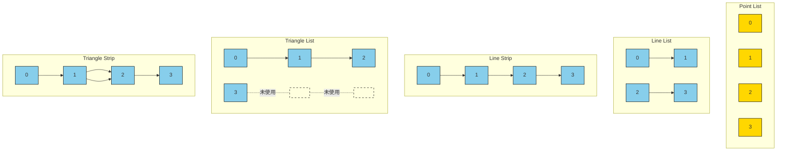

### 5.3 图元装配说明

#### Line List vs Line Strip

**Line List**（4个顶点）：
- 顶点0-1：直线1
- 顶点2-3：直线2
- 共2条直线，无复用

**Line Strip**（4个顶点）：
- 顶点0-1：直线1
- 顶点1-2：直线2（复用顶点1）
- 顶点2-3：直线3（复用顶点2）
- 共3条直线，复用上一个顶点

#### Triangle List vs Triangle Strip

**Triangle List**（4个顶点）：
- 顶点0-1-2：三角形1
- 顶点3：未使用（缺少2个顶点）
- 共1个三角形，无复用

**Triangle Strip**（4个顶点）：
- 顶点0-1-2：三角形1
- 顶点1-2-3：三角形2（复用顶点1、2）
- 共2个三角形，复用最后2个顶点

**优势**：
- Triangle Strip显著减少顶点传输量
- 适合连续的三角形网格（如地形、模型表面）

### 5.4 图元装配状态

```cpp
VkPipelineInputAssemblyStateCreateInfo inputAssembly{};
inputAssembly.sType = VK_STRUCTURE_TYPE_PIPELINE_INPUT_ASSEMBLY_STATE_CREATE_INFO;
inputAssembly.topology = VK_PRIMITIVE_TOPOLOGY_TRIANGLE_LIST;
inputAssembly.primitiveRestartEnable = VK_FALSE;
```

**primitiveRestartEnable**：
- `VK_FALSE`：禁用，顶点按顺序使用
- `VK_TRUE`：启用，使用特殊索引值（0xFFFF或0xFFFFFFFF）重启图元

## 6. 视口剪裁模块

### 6.1 Viewport（视口）

**定义**：窗口中画布的大小区域

**作用**：
- 定义渲染输出的目标区域
- 通过拉伸/缩放适应窗口大小
- 通常设置为窗口完整大小

**VkViewport结构**：

```cpp
struct VkViewport {
    float x;           // 视口左上角X坐标
    float y;           // 视口左上角Y坐标
    float width;       // 视口宽度
    float height;      // 视口高度
    float minDepth;    // 最小深度值（通常0.0）
    float maxDepth;    // 最大深度值（通常1.0）
};
```

### 6.2 Viewport效果

#### 场景1：视口与窗口相同

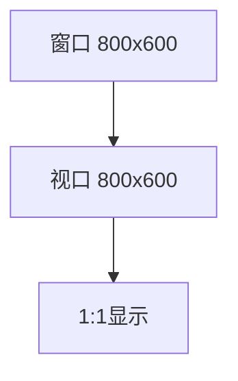

#### 场景2：视口宽度减半

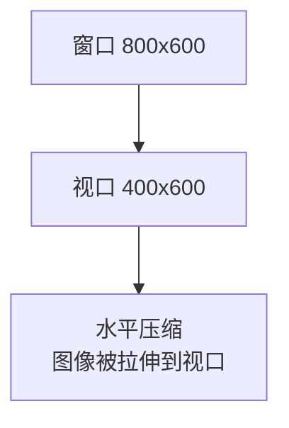

**效果**：渲染内容被水平拉伸到更小的视口

#### 场景3：视口居中偏移

```mermaid
graph TD
    A[窗口 800x600] --> B[视口 400x400<br/>位置(200, 100)]
    B --> C[只显示视口区域内容]
```

**效果**：只显示视口区域内的内容

### 6.3 Scissor（剪裁）

**定义**：定义一个矩形区域，只绘制区域内的像素

**作用**：
- 硬剪裁：区域外的像素不绘制
- 性能优化：避免绘制不需要的区域
- UI分层：局部更新屏幕区域

**VkRect2D结构**：

```cpp
struct VkRect2D {
    VkOffset2D offset;   // 剪裁区域偏移
    VkExtent2D extent;   // 剪裁区域大小
};
```

### 6.4 Viewport vs Scissor

| 特性 | Viewport | Scissor |
|------|----------|---------|
| **作用** | 缩放和定位 | 剪裁区域 |
| **处理方式** | 拉伸/缩放适应 | 硬剪裁 |
| **区域外内容** | 显示（被缩放） | 不显示 |
| **主要用途** | 控制显示区域 | 性能优化、局部更新 |

**示例**：

```cpp
// Viewport设置
VkViewport viewport{};
viewport.x = 0.0f;
viewport.y = 0.0f;
viewport.width = (float)swapChainExtent.width;
viewport.height = (float)swapChainExtent.height;
viewport.minDepth = 0.0f;
viewport.maxDepth = 1.0f;

// Scissor设置
VkRect2D scissor{};
scissor.offset = {0, 0};
scissor.extent = swapChainExtent;

// Viewport和Scissor状态
VkPipelineViewportStateCreateInfo viewportState{};
viewportState.sType = VK_STRUCTURE_TYPE_PIPELINE_VIEWPORT_STATE_CREATE_INFO;
viewportState.viewportCount = 1;
viewportState.pViewports = &viewport;
viewportState.scissorCount = 1;
viewportState.pScissors = &scissor;
```

## 7. 光栅化设置模块

### 7.1 光栅化

**定义**：将图元离散化为像素的过程

**过程**：

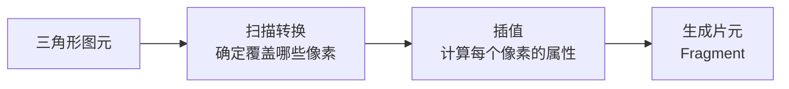

### 7.2 光栅化状态

**VkPipelineRasterizationStateCreateInfo**：

```cpp
struct VkPipelineRasterizationStateCreateInfo {
    VkStructureType sType;
    VkCullModeFlags cullMode;           // 剔除模式
    VkFrontFace frontFace;              // 正面定义
    VkPolygonMode polygonMode;          // 多边形模式
    float lineWidth;                    // 线宽
    VkBool32 depthClampEnable;           // 深度夹紧
    VkBool32 rasterizerDiscardEnable;   // 丢弃光栅化
    VkBool32 depthBiasEnable;           // 深度偏差
    float depthBiasConstantFactor;
    float depthBiasClamp;
    float depthBiasSlopeFactor;
};
```

### 7.3 Culling（剔除）

**作用**：剔除不需要渲染的图元，提高性能

**CullMode（剔除模式）**：

| 模式 | 说明 |
|------|------|
| `VK_CULL_MODE_NONE` | 不剔除，所有面都渲染 |
| `VK_CULL_MODE_FRONT_BIT` | 剔除正面 |
| `VK_CULL_MODE_BACK_BIT` | 剔除背面 |
| `VK_CULL_MODE_FRONT_AND_BACK` | 剔除正面和背面（什么也不渲染） |

**FrontFace（正面定义）**：

| 模式 | 说明 |
|------|------|
| `VK_FRONT_FACE_COUNTER_CLOCKWISE` | 逆时针连接的三角形为正面 |
| `VK_FRONT_FACE_CLOCKWISE` | 顺时针连接的三角形为正面 |

#### 剔除示例

**场景**：设置顺时针为正面，剔除背面

```cpp
rasterizer.cullMode = VK_CULL_MODE_BACK_BIT;
rasterizer.frontFace = VK_FRONT_FACE_CLOCKWISE;
```

**效果**：

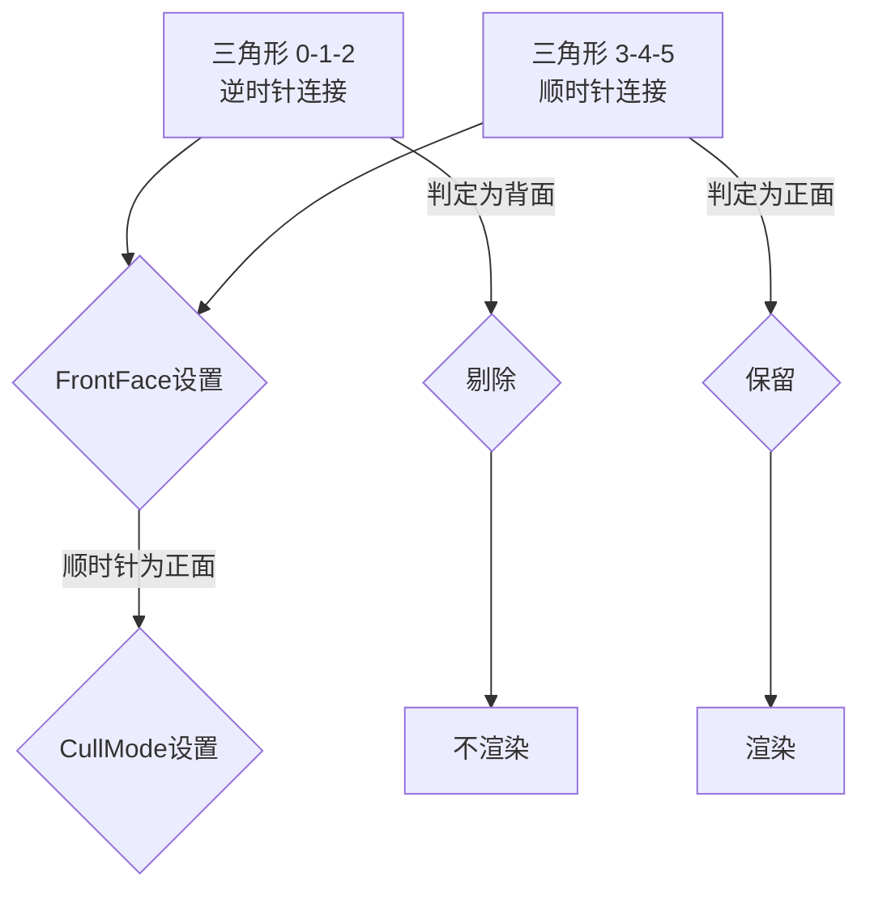

**判定逻辑**：
- 计算三角形的顶点顺序
- 对比FrontFace设置
- 根据CullMode决定是否剔除

### 7.4 PolygonMode（多边形模式）

| 模式 | 说明 |
|------|------|
| `VK_POLYGON_MODE_FILL` | 填充模式（默认） |
| `VK_POLYGON_MODE_LINE` | 线框模式 |
| `VK_POLYGON_MODE_POINT` | 点模式 |

**效果示意**：

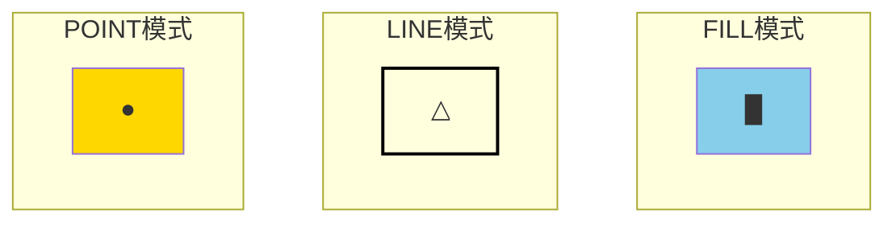

### 7.5 完整光栅化配置

```cpp
VkPipelineRasterizationStateCreateInfo rasterizer{};
rasterizer.sType = VK_STRUCTURE_TYPE_PIPELINE_RASTERIZATION_STATE_CREATE_INFO;
rasterizer.depthClampEnable = VK_FALSE;  // 不夹紧深度
rasterizer.rasterizerDiscardEnable = VK_FALSE;  // 不丢弃光栅化
rasterizer.polygonMode = VK_POLYGON_MODE_FILL;  // 填充模式
rasterizer.lineWidth = 1.0f;  // 线宽
rasterizer.cullMode = VK_CULL_MODE_BACK_BIT;  // 剔除背面
rasterizer.frontFace = VK_FRONT_FACE_CLOCKWISE;  // 顺时针为正面
rasterizer.depthBiasEnable = VK_FALSE;  // 不启用深度偏差
```

## 8. 颜色混合模块

### 8.1 Blending（颜色混合）

**定义**：将多个图元在同一个像素点的颜色混合成最终像素颜色

**场景**：
```
背景：山
中间层：人
前景：狗
```

**重叠像素**：
- 包含3个图元（山、人、狗）
- 每个图元输出一个颜色
- 需要混合成最终像素颜色

### 8.2 颜色混合原理

#### RGBA颜色空间

- **R**：红色分量（0-255或0.0-1.0）
- **G**：绿色分量（0-255或0.0-1.0）
- **B**：蓝色分量（0-255或0.0-1.0）
- **A**：Alpha分量（透明度，0=完全透明，1=完全不透明）

#### 混合公式

```glsl
finalColor = sourceColor * sourceFactor + destinationColor * destinationFactor
```

其中：
- `sourceColor`：新图元的颜色（即将绘制的）
- `destinationColor`：已有颜色（已经在帧缓冲中的）
- `sourceFactor`：源混合因子
- `destinationFactor`：目标混合因子

### 8.3 混合因子类型

**VkBlendFactor枚举**：

| 因子 | 说明 |
|------|------|
| `VK_BLEND_FACTOR_ZERO` | 因子为0 |
| `VK_BLEND_FACTOR_ONE` | 因子为1 |
| `VK_BLEND_FACTOR_SRC_COLOR` | 使用源的RGB |
| `VK_BLEND_FACTOR_ONE_MINUS_SRC_COLOR` | 使用1-源的RGB |
| `VK_BLEND_FACTOR_DST_COLOR` | 使用目标的RGB |
| `VK_BLEND_FACTOR_ONE_MINUS_DST_COLOR` | 使用1-目标的RGB |
| `VK_BLEND_FACTOR_SRC_ALPHA` | 使用源的Alpha |
| `VK_BLEND_FACTOR_ONE_MINUS_SRC_ALPHA` | 使用1-源的Alpha |
| `VK_BLEND_FACTOR_DST_ALPHA` | |使用目标的Alpha |
| `VK_BLEND_FACTOR_ONE_MINUS_DST_ALPHA` | 使用1-目标的Alpha |

### 8.4 常用混合模式

#### 标准透明度混合

```cpp
blendState.srcColorBlendFactor = VK_BLEND_FACTOR_SRC_ALPHA;
blendState.dstColorBlendFactor = VK_BLEND_FACTOR_ONE_MINUS_SRC_ALPHA;
```

**效果**：
- 半透明物体按照Alpha值与背景混合
- Alpha=1：完全不透明，完全显示源颜色
- Alpha=0：完全透明，完全显示目标颜色
- Alpha=0.5：50%源颜色 + 50%目标颜色

#### 加法混合（发光效果）

```cpp
blendState.srcColorBlendFactor = VK_BLEND_FACTOR_ONE;
blendState.dstColorBlendFactor = VK_BLEND_FACTOR_ONE;
```

**效果**：
- 源颜色和目标颜色相加
- 用于粒子、光效等叠加效果
- `finalColor = sourceColor + destinationColor`

#### 乘法混合（纹理染色）

```cpp
blendState.srcColorBlendFactor = VK_BLEND_FACTOR_DST_COLOR;
blendState.dstColorBlendFactor = VK_BLEND_FACTOR_ZERO;
```

**效果**：
- 源颜色与目标颜色相乘
- 用于纹理染色、变暗效果
- `finalColor = sourceColor * destinationColor`

### 8.5 颜色混合操作

**VkBlendOp枚举**：

| 操作 | 说明 | 公式 |
|------|------|------|
| `VK_BLEND_OP_ADD` | 加法 | `src * srcFactor + dst * dstFactor` |
| `VK_BLEND_OP_SUBTRACT` | 减法 | `src * srcFactor - dst * dstFactor` |
| `VK_BLEND_OP_REVERSE_SUBTRACT` | 反向减法 | `dst * dstFactor - src * srcFactor` |
| `VK_BLEND_OP_MIN` | 最小值 | `min(src, dst)` |
| `VK_BLEND_OP_MAX` | 最大值 | `max(src, dst)` |

### 8.6 颜色通道掩码

**VkColorComponentFlags**：

| 标志 | 说明 |
|------|------|
| `VK_COLOR_COMPONENT_R_BIT` | 红色通道 |
| `VK_COLOR_COMPONENT_G_BIT` | 绿色通道 |
| `VK_COLOR_COMPONENT_B_BIT` | 蓝色通道 |
| `VK_COLOR_COMPONENT_A_BIT` | Alpha通道 |

**应用**：可以禁用某些通道的混合

```cpp
colorWriteMask = VK_COLOR_COMPONENT_R_BIT | 
                 VK_COLOR_COMPONENT_G_BIT | 
                 VK_COLOR_COMPONENT_B_BIT | 
                 VK_COLOR_COMPONENT_A_BIT;
```

### 8.7 颜色混合状态配置

```cpp
// 颜色混合附件状态
VkPipelineColorBlendAttachmentState colorBlendAttachment{};
colorBlendAttachment.colorWriteMask = 
    VK_COLOR_COMPONENT_R_BIT | 
    VK_COLOR_COMPONENT_G_BIT | 
    VK_COLOR_COMPONENT_B_BIT | 
    VK_COLOR_COMPONENT_A_BIT;
colorBlendAttachment.blendEnable = VK_TRUE;  // 启用混合
colorBlendAttachment.srcColorBlendFactor = VK_BLEND_FACTOR_SRC_ALPHA;
colorBlendAttachment.dstColorBlendFactor = VK_BLEND_FACTOR_ONE_MINUS_SRC_ALPHA;
colorBlendAttachment.colorBlendOp = VK_BLEND_OP_ADD;
colorBlendAttachment.srcAlphaBlendFactor = VK_BLEND_FACTOR_ONE;
colorBlendAttachment.dstAlphaBlendFactor = VK_BLEND_FACTOR_ZERO;
colorBlendAttachment.alphaBlendOp = VK_BLEND_OP_ADD;

// 全局颜色混合状态
VkPipelineColorBlendStateCreateInfo colorBlending{};
colorBlending.sType = VK_STRUCTURE_TYPE_PIPELINE_COLOR_BLEND_STATE_CREATE_INFO;
colorBlending.logicOpEnable = VK_FALSE;
colorBlending.attachmentCount = 1;
colorBlending.pAttachments = &colorBlendAttachment;
colorBlending.blendConstants[0] = 0.0f;  // R
colorBlending.blendConstants[1] = 0.0f;  // G
colorBlending.blendConstants[2] = 0.0f;  // B
colorBlending.blendConstants[3] = 0.0f;  // A
```

## 9. 深度模板模块

### 9.1 深度测试（Depth Testing）

**作用**：处理物体之间的遮挡关系

**原理**：
- 每个像素都有一个深度值（Z值）
- 比较新像素的深度与已有像素的深度
- 根据比较结果决定是否绘制

**VkCompareOp枚举**：

| 操作 | 说明 |
|------|------|
| `VK_COMPARE_OP_NEVER` | 永不通过 |
| `VK_COMPARE_OP_LESS` | 小于通过（标准深度测试） |
| `VK_COMPARE_OP_EQUAL` | 等于通过 |
| `VK_COMPARE_OP_LESS_OR_EQUAL` | 小于等于通过 |
| `VK_COMPARE_OP_GREATER` | 大于通过 |
| `VK_COMPARE_OP_NOT_EQUAL` | 不等于通过 |
| `VK_COMPARE_OP_GREATER_OR_EQUAL` | 大于等于通过 |
| `VK_COMPARE_OP_ALWAYS` | 总是通过（禁用深度测试） |

### 9.2 模板测试（Stencil Testing）

**作用**：
- 控制哪些像素可以被渲染
- 常用于镜面反射、阴影贴图等高级效果

**VkStencilOpState结构**：

```cpp
struct VkStencilOpState {
    VkStencilOp failOp;         // 模板测试失败时的操作
    VkStencilOp passOp;         // 模板测试通过且深度测试通过时的操作
    VkStencilOp depthFailOp;    // 模板测试通过但深度测试失败时的操作
    VkCompareOp compareOp;       // 模板测试比较操作
    uint32_t compareMask;       // 比较掩码
    uint32_t writeMask;         // 写入掩码
    uint32_t reference;         // 参考值
};
```

### 9.3 深度模板状态配置

```cpp
VkPipelineDepthStencilStateCreateInfo depthStencil{};
depthStencil.sType = VK_STRUCTURE_TYPE_PIPELINE_DEPTH_STENCIL_STATE_CREATE_INFO;
depthStencil.depthTestEnable = VK_TRUE;           // 启用深度测试
depthStencil.depthWriteEnable = VK_TRUE;          // 启用深度写入
depthStencil.depthCompareOp = VK_COMPARE_OP_LESS; // 深度比较操作
depthStencil.depthBoundsTestEnable = VK_FALSE;     // 不启用深度边界测试
depthStencil.stencilTestEnable = VK_FALSE;         // 不启用模板测试
depthStencil.minDepthBounds = 0.0f;
depthStencil.maxDepthBounds = 1.0f;
```

## 10. 动态状态模块

### 10.1 静态与动态状态

**静态状态**：
- 在Pipeline创建时固定
- 修改需要重新创建Pipeline
- 性能更好（驱动可以优化）

**动态状态**：
- 可以在录制命令时动态修改
- 不需要重新创建Pipeline
- 灵活性更高

### 10.2 可动态修改的状态

**VkDynamicState枚举**：

| 状态 | 说明 |
|------|------|
| `VK_DYNAMIC_STATE_VIEWPORT` | 视口 |
| `VK_DYNAMIC_STATE_SCISSOR` | 剪裁 |
| `VK_DYNAMIC_STATE_LINE_WIDTH` | 线宽 |
| `VK_DYNAMIC_STATE_DEPTH_BIAS` | 深度偏差 |
| `VK_DYNAMIC_STATE_BLEND_CONSTANTS` | 混合常量 |
| `VK_DYNAMIC_STATE_DEPTH_BOUNDS` | 深度边界 |
| `VK_DYNAMIC_STATE_STENCIL_COMPARE_MASK` | 模板比较掩码 |
| `VK_DYNAMIC_STATE_STENCIL_WRITE_MASK` | 模板写入掩码 |
| `VK_DYNAMIC_STATE_STENCIL_REFERENCE` | 模板参考值 |

### 10.3 动态状态配置

```cpp
// 指定动态状态
std::vector<VkDynamicState> dynamicStates = {
    VK_DYNAMIC_STATE_VIEWPORT,
    VK_DYNAMIC_STATE_SCISSOR
};

VkPipelineDynamicStateCreateInfo dynamicState{};
dynamicState.sType = VK_STRUCTURE_TYPE_PIPELINE_DYNAMIC_STATE_CREATE_INFO;
dynamicState.dynamicStateCount = static_cast<uint32_t>(dynamicStates.size());
dynamicState.pDynamicStates = dynamicStates.data();
```

### 10.4 动态设置示例

```cpp
// 在命令缓冲中动态设置Viewport
vkCmdSetViewport(commandBuffer, 0, 1, &viewport);

// 在命令缓冲中动态设置Scissor
vkCmdSetScissor(commandBuffer, 0, 1, &scissor);
```

## 11. 完整Pipeline创建流程

### 11.1 Pipeline架构图

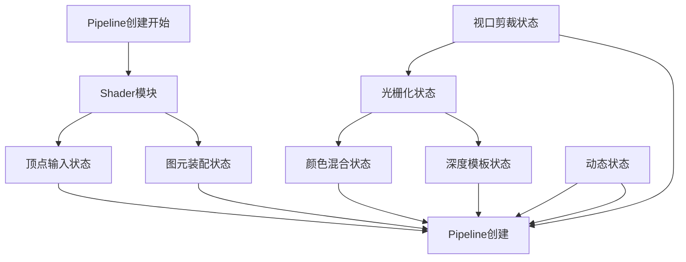

### 11.2 完整配置代码

```cpp
// 1. Shader模块
VkPipelineShaderStageCreateInfo shaderStages[] = {vertShaderStageInfo, fragShaderStageInfo};

// 2. 顶点输入状态
VkPipelineVertexInputStateCreateInfo vertexInputInfo{...};

// 3. 图元装配状态
VkPipelineInputAssemblyStateCreateInfo inputAssembly{...};

// 4. 视口剪裁状态
VkPipelineViewportStateCreateInfo viewportState{...};

// 5. 光栅化状态
VkPipelineRasterizationStateCreateInfo rasterizer{...};

// 6. 多重采样状态（抗锯齿）
VkPipelineMultisampleStateCreateInfo multisampling{...};

// 7. 深度模板状态
VkPipelineDepthStencilStateCreateInfo depthStencil{...};

// 8. 颜色混合状态
VkPipelineColorBlendStateCreateInfo colorBlending{...};

// 9. 动态状态
VkPipelineDynamicStateCreateInfo dynamicState{...};

// 10. Pipeline布局（Uniform描述符等）
VkPipelineLayout pipelineLayout;
VkPipelineLayoutCreateInfo pipelineLayoutInfo{...};
vkCreatePipelineLayout(device, &pipelineLayoutInfo, nullptr, &pipelineLayout);

// 11. 创建Pipeline
VkGraphicsPipelineCreateInfo pipelineInfo{};
pipelineInfo.sType = VK_STRUCTURE_TYPE_GRAPHICS_PIPELINE_CREATE_INFO;
pipelineInfo.stageCount = 2;
pipelineInfo.pStages = shaderStages;
pipelineInfo.pVertexInputState = &vertexInputInfo;
pipelineInfo.pInputAssemblyState = &inputAssembly;
pipelineInfo.pViewportState = &viewportState;
pipelineInfo.pRasterizationState = &rasterizer;
pipelineInfo.pMultisampleState = &multisampling;
pipelineInfo.pDepthStencilState = &depthStencil;
pipelineInfo.pColorBlendState = &colorBlending;
pipelineInfo.pDynamicState = &dynamicState;
pipelineInfo.layout = pipelineLayout;
pipelineInfo.renderPass = renderPass;
pipelineInfo.subpass = 0;

VkPipeline graphicsPipeline;
if (vkCreateGraphicsPipelines(device, VK_NULL_HANDLE, 1, &pipelineInfo, nullptr, &graphicsPipeline) != VK_SUCCESS) {
    throw std::runtime_error("Failed to create graphics pipeline!");
}
```

### 11.3 Pipeline创建时序

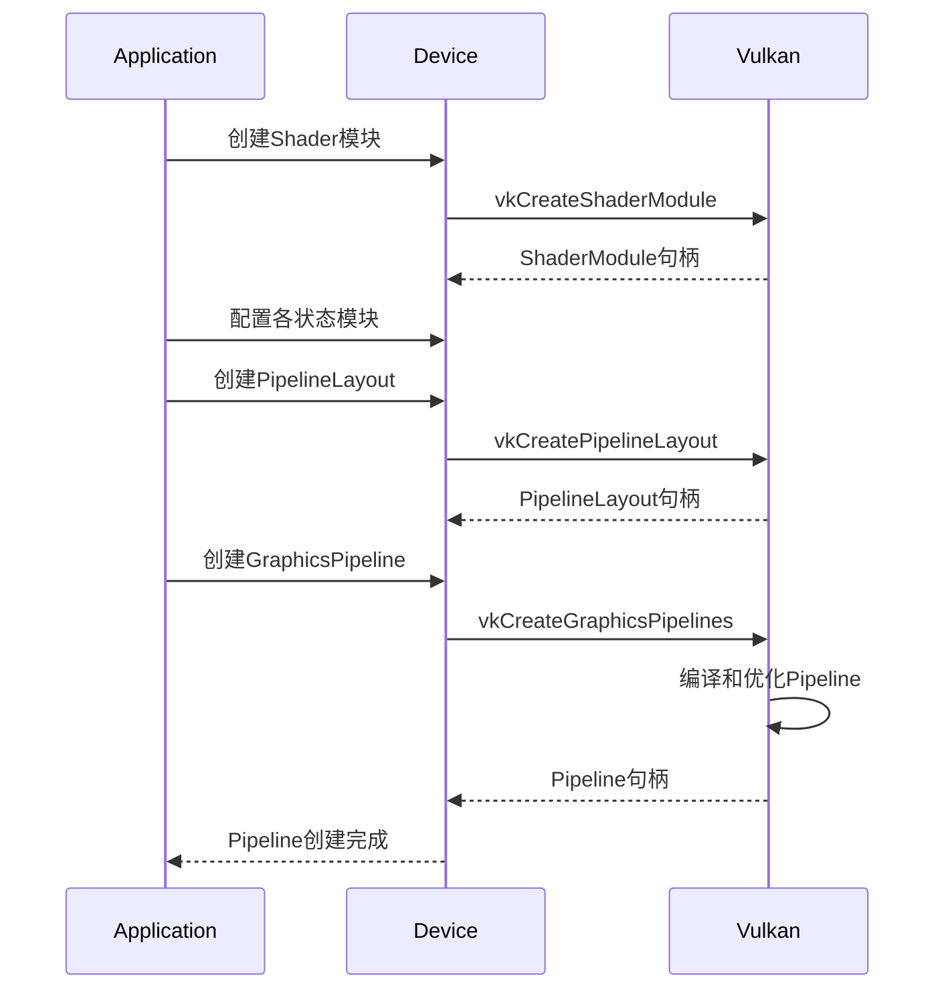

## 12. Pipeline缓存

### 12.1 为什么需要Pipeline缓存

**问题**：
- Pipeline创建非常耗时（编译Shader、生成机器码等）
- 每次启动程序都重新创建Pipeline效率低

**解决方案**：使用Pipeline缓存

### 12.2 Pipeline缓存流程

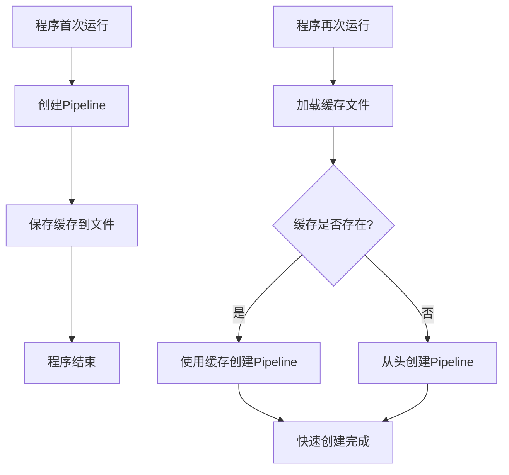

### 12.3 Pipeline缓存配置

```cpp
// 创建Pipeline缓存
VkPipelineCache pipelineCache;

VkPipelineCacheCreateInfo cacheInfo{};
cacheInfo.sType = VK_STRUCTURE_TYPE_PIPELINE_CACHE_CREATE_INFO;

// 尝试从文件加载缓存数据
std::vector<char> cacheData = loadPipelineCache();
if (!cacheData.empty()) {
    cacheInfo.initialDataSize = cacheData.size();
    cacheInfo.pInitialData = cacheData.data();
}

vkCreatePipelineCache(device, &cacheInfo, nullptr, &pipelineCache);

// 使用缓存创建Pipeline
vkCreateGraphicsPipelines(device, pipelineCache, 1, &pipelineInfo, nullptr, &pipeline);

// 保存缓存到文件
size_t cacheSize;
vkGetPipelineCacheData(device, pipelineCache, &cacheSize, nullptr);
std::vector<char> newCacheData(cacheSize);
vkGetPipelineCacheData(device, pipelineCache, &cacheSize, newCacheData.data());
savePipelineCache(newCacheData);
```

## 13. 总结

### 核心概念

1. **Pipeline**：完整的渲染流程描述，规定了从顶点到像素的所有处理方式
2. **材质关系**：Pipeline属于材质的一部分，每个Mesh绑定自己的Pipeline
3. **模块化设计**：Pipeline由多个可配置模块组成，每个模块控制渲染的一个方面

### 关键模块

| 模块 | 作用 |
|------|------|
| **Shader组** | 顶点/片元的处理逻辑 |
| **顶点描述** | 如何解释顶点数据 |
| **图元装配** | 顶点如何组成图元 |
| **视口剪裁** | 渲染区域控制 |
| **光栅化** | 图元到像素的转换 |
| **颜色混合** | 多图元的颜色合成 |
| **深度模板** | 遮挡关系控制 |
| **动态状态** | 可动态修改的参数 |

### 最佳实践

1. **Pipeline复用**：相同材质的物体共用Pipeline
2. **Pipeline缓存**：加速Pipeline创建，减少启动时间
3. **静态vs动态**：频繁变化的参数使用动态状态，固定的使用静态状态
4. **剔除优化**：合理使用背面剔除提高性能
5. **混合模式**：根据效果选择合适的混合模式

Pipeline是Vulkan渲染的核心，理解了Pipeline就理解了Vulkan的渲染机制。每个模块都可以精细控制，这给了开发者极大的自由度，但也需要更多的理解和配置工作。
