# 05 渲染过程以及子过程

## 1. RenderPass基础概念

### 1.1 什么是RenderPass

**定义**：RenderPass描述了一次完整渲染过程的输入和输出信息

**作用**：
- 定义渲染的输入（Input Attachment）
- 定义渲染的输出（Color Attachment、Depth/Stencil Attachment）
- 管理渲染过程中的中间结果

**在渲染流程中的位置**：

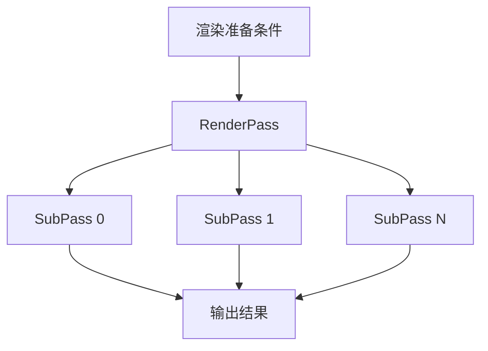

### 1.2 RenderPass示例

#### 简单渲染流程

**场景1：基础渲染**
```
输入：顶点数据
过程：渲染三角形/模型
输出：一张颜色图片
```

#### 复杂渲染流程

**场景2：边缘高光效果（多Pass渲染）**

```
Pass 0：
- 输入：顶点数据
- 过程：正常渲染场景
- 输出：场景图片（作为纹理）

Pass 1：
- 输入：Pass 0的输出图片
- 过程：卷积运算，边缘检测
- 输出：边缘高光图片
```

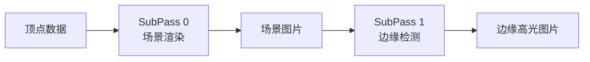

## 2. SubPass（子过程）

### 2.1 什么是SubPass

**定义**：SubPass是RenderPass中的一个子渲染阶段

**为什么需要SubPass**：
- 复杂渲染需要多个Pass才能完成
- 每个Pass处理不同的效果
- 后续Pass可以使用前面Pass的结果

**示例**：
- Pass 0：渲染场景
- Pass 1：后处理（模糊、色彩调整）
- Pass 2：后期特效（光晕、景深）

### 2.2 SubPass在RenderPass中的结构

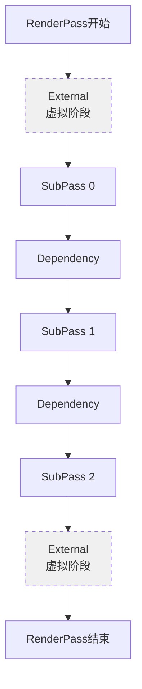

**说明**：
- RenderPass可以包含多个SubPass
- External是虚拟阶段，不执行实际操作
- 每两个SubPass之间有Dependency（依赖关系）

## 3. Attachment（附着）

### 3.1 什么是Attachment

**定义**：Attachment是RenderPass中用于承载渲染结果的画布

**分类**：

| 类型 | 说明 | 数量限制 |
|------|------|---------|
| **Color Attachment** | 承载颜色输出 | 每个Pass可以有多个 |
| **Depth/Stencil Attachment** | 承载深度模板信息 | 每个Pass只能有一个 |

### 3.2 Color Attachment（颜色附着）

**作用**：存储渲染输出的颜色信息

**示例**：
```
Attachment 0：输出RGB颜色（正常渲染）
Attachment 1：输出法线信息（用于后续计算）
Attachment 2：输出材质属性（用于延迟渲染）
```

**为什么法线可以输出到Color Attachment**：
- 法线是XYZ三维向量
- RGB也是三维分量
- 可以把法线的XYZ映射到RGB
- 都是浮点数据，可以存储

### 3.3 Depth/Stencil Attachment（深度模板附着）

**作用**：处理物体的遮挡关系

#### 深度信息（Depth）

**问题场景**：
```
绘制顺序：
1. 先画背景
2. 再画人
3. 最后画狗

如果按照绘制顺序，后面的会覆盖前面的
需要深度信息来判断谁在前谁在后
```

**深度值的范围**：
- 通常归一化为0.0到1.0
- 0.0：离观察者最近
- 1.0：离观察者最远

**深度测试流程**：

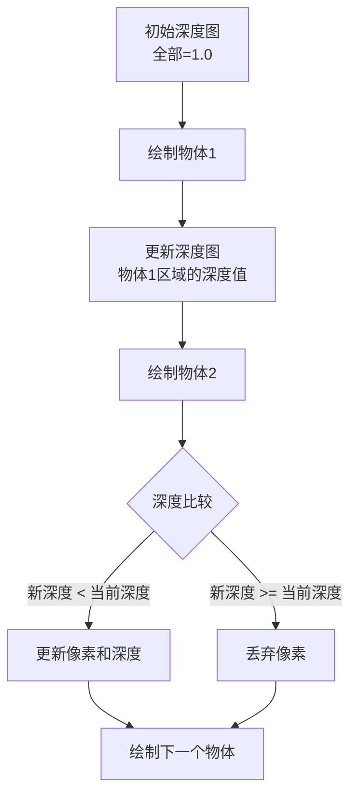

**深度测试示例**：

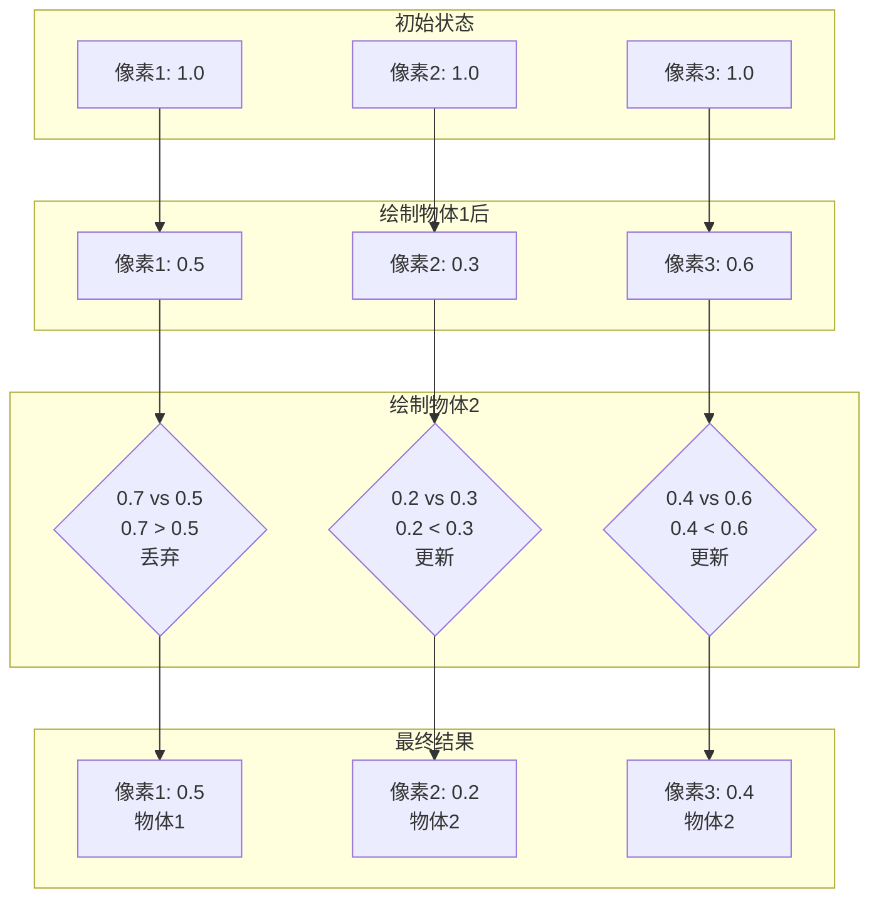

#### 模板信息（Stencil）

**作用**：
- 控制哪些像素可以被渲染
- 常用于镜面反射、阴影贴图、镂空效果等

**示例应用**：
- 镜面反射：只渲染镜子区域的像素
- 阴影贴图：标记阴影区域
- 镂空效果：物体内部的透明部分

### 3.4 Attachment在RenderPass中的配置

#### Attachment Description

**作用**：描述Attachment的属性信息

**关键属性**：

```cpp
struct VkAttachmentDescription {
    VkFormat format;              // 格式（颜色格式或深度格式）
    VkSampleCountFlagBits samples; // 采样数（抗锯齿）
    VkAttachmentLoadOp loadOp;     // 加载操作（开始时的处理）
    VkAttachmentStoreOp storeOp;   // 存储操作（结束时的处理）
    VkAttachmentLoadOp stencilLoadOp;   // 模板加载操作
    VkAttachmentStoreOp stencilStoreOp; // 模板存储操作
    VkImageLayout initialLayout;    // 初始布局
    VkImageLayout finalLayout;      // 最终布局
};
```

#### 加载/存储操作

**LoadOp（加载操作）**：

| 操作 | 说明 |
|------|------|
| `VK_ATTACHMENT_LOAD_OP_LOAD` | 加载之前的内容 |
| `VK_ATTACHMENT_LOAD_OP_CLEAR` | 清除为指定值 |
| `VK_ATTACHMENT_LOAD_OP_DONT_CARE` | 不关心之前的内容（性能最优） |

**StoreOp（存储操作）**：

| 操作 | 说明 |
|------|------|
| `VK_ATTACHMENT_STORE_OP_STORE` | 存储结果供后续使用 |
| `VK_ATTACHMENT_STORE_OP_DONT_CARE` | 不存储结果（性能最优） |

#### 图像布局

**常见布局**：

| 布局 | 说明 |
|------|------|
| `VK_IMAGE_LAYOUT_UNDEFINED` | 未定义，第一次使用 |
| `VK_IMAGE_LAYOUT_COLOR_ATTACHMENT_OPTIMAL` | 颜色附着最优布局 |
| `VK_IMAGE_LAYOUT_DEPTH_STENCIL_ATTACHMENT_OPTIMAL` | 深度模板附着最优布局 |
| `VK_IMAGE_LAYOUT_SHADER_READ_ONLY_OPTIMAL` | Shader只读最优布局 |
| `VK_IMAGE_LAYOUT_PRESENT_SRC_KHR` | 呈现到屏幕的布局 |

## 4. Attachment Reference（附着引用）

### 4.1 为什么需要Attachment Reference

**问题**：
- RenderPass中定义了多个Attachment
- 每个SubPass需要使用哪些Attachment？
- 每个SubPass中Attachment的作用是什么？

**解决方案**：Attachment Reference

### 4.2 Attachment Reference的结构

```cpp
struct VkAttachmentReference {
    uint32_t attachment;          // Attachment索引
    VkImageLayout layout;        // 使用时的布局
};
```

### 4.3 Attachment引用示例

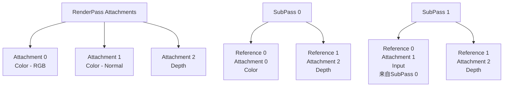

**说明**：
- SubPass 0：
  - 颜色输出到Attachment 0
  - 深度输出到Attachment 2
  
- SubPass 1：
  - 读取Attachment 0（SubPass 0的颜色输出）作为输入
  - 输出到Attachment 1（法线信息）
  - 深度使用Attachment 2

## 5. SubPass之间的依赖关系

### 5.1 为什么需要依赖关系

**问题场景**：
```
SubPass 0输出一张图片
SubPass 1需要使用SubPass 0的输出作为输入纹理

如果SubPass 1在SubPass 0完成之前开始，会读取到错误的数据
```

### 5.2 串行执行 vs 并行执行

#### 串行执行（低效）

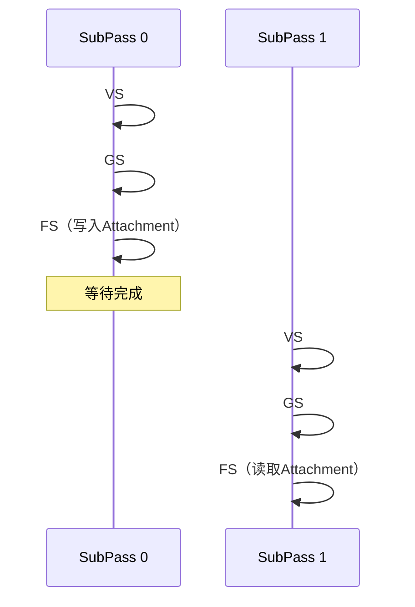

**问题**：GPU是并行硬件，串行执行效率低

#### 并行执行（高效）

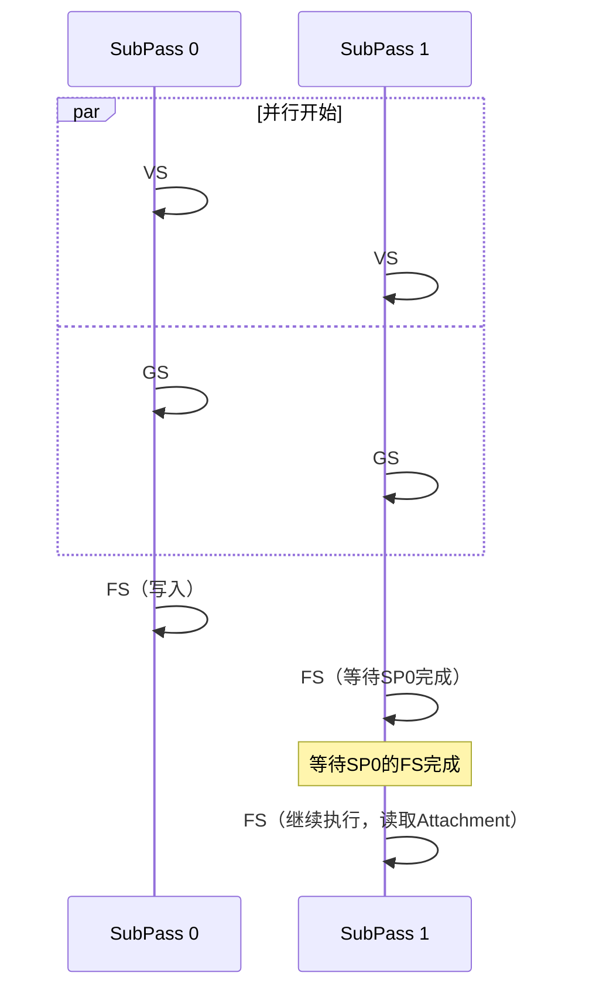

**优势**：
- VS和GS阶段可以并行执行（不依赖Attachment）
- FS阶段需要等待Attachment写入完成
- 充分利用GPU并行能力

### 5.3 管线同步机制

**Vulkan的同步粒度**：
- 不是简单的"SubPass A完成后SubPass B开始"
- 需要精确控制哪个阶段的哪个操作完成

**为什么需要细粒度控制**：
- 每个Shader Stage包含多种操作：
  - 读取操作：读取纹理、Buffer等资源
  - 写入操作：写入Color Attachment、Depth Attachment等
- 需要明确等待哪种操作完成

### 5.4 SubPass依赖的四个关键要素

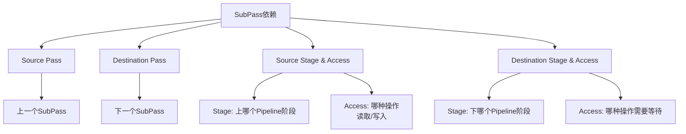

#### 要素1：Source SubPass

**含义**：被依赖的SubPass（上一个SubPass）

#### 要素2：Destination SubPass

**含义**：依赖其他SubPass的SubPass（下一个SubPass）

#### 要素3：Source Stage和Source Access

**Source Stage**：
- 上一个SubPass的哪个Pipeline阶段
- 取值：`VK_PIPELINE_STAGE_VERTEX_SHADER_BIT`、`VK_PIPELINE_STAGE_FRAGMENT_SHADER_BIT`等

**Source Access**：
- 上个Stage的哪种操作完成
- 取值：读取操作、写入操作
- 示例：
  - `VK_ACCESS_COLOR_ATTACHMENT_WRITE_BIT`：颜色写入完成
  - `VK_ACCESS_DEPTH_STENCIL_ATTACHMENT_WRITE_BIT`：深度写入完成
  - `VK_ACCESS_SHADER_READ_BIT`：Shader读取完成

#### 要素4：Destination Stage和Destination Access

**Destination Stage**：
- 下一个SubPass的哪个Pipeline阶段需要等待
- 取值：`VK_PIPELINE_STAGE_FRAGMENT_SHADER_BIT`等

**Destination Access**：
- 下个Stage的哪种操作需要等待
- 示例：
  - `VK_ACCESS_INPUT_ATTACHMENT_READ_BIT`：读取Input Attachment时需要等待
  - `VK_ACCESS_SHADER_READ_BIT`：Shader读取操作需要等待

### 5.5 SubPass依赖配置示例

```cpp
VkSubpassDependency dependency{};

// Source SubPass和Destination SubPass
dependency.srcSubpass = 0;  // SubPass 0是源
dependency.dstSubpass = 1;  // SubPass 1是目标

// Source Stage和Access
dependency.srcStageMask = VK_PIPELINE_STAGE_COLOR_ATTACHMENT_OUTPUT_BIT;
dependency.srcAccessMask = VK_ACCESS_COLOR_ATTACHMENT_WRITE_BIT;
// 含义：SubPass 0的颜色附件输出阶段的写入操作完成后

// Destination Stage和Access
dependency.dstStageMask = VK_PIPELINE_STAGE_FRAGMENT_SHADER_BIT;
dependency.dstAccessMask = VK_ACCESS_INPUT_ATTACHMENT_READ_BIT;
// 含义：SubPass 1的片元着色器阶段的输入附件读取操作才能开始
```

### 5.6 依赖关系示意图

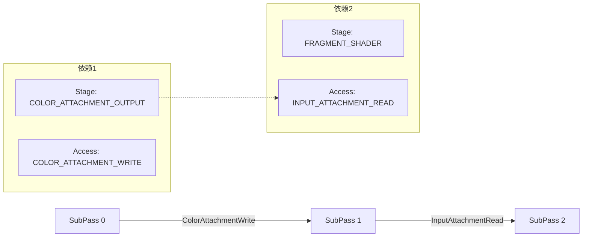

## 6. RenderPass完整配置

### 6.1 RenderPass创建结构

```cpp
VkRenderPassCreateInfo renderPassInfo{};
renderPassInfo.sType = VK_STRUCTURE_TYPE_RENDER_PASS_CREATE_INFO;

// Attachments
renderPassInfo.attachmentCount = static_cast<uint32_t>(attachments.size());
renderPassInfo.pAttachments = attachments.data();

// SubPasses
renderPassInfo.subpassCount = static_cast<uint32_t>(subpasses.size());
renderPassInfo.pSubpasses = subpasses.data();

// Dependencies
renderPassInfo.dependencyCount = static_cast<uint32_t>(dependencies.size());
renderPassInfo.pDependencies = dependencies.data();
```

### 6.2 完整示例

```cpp
// 1. 定义Attachments
std::vector<VkAttachmentDescription> attachments;

// Color Attachment
VkAttachmentDescription colorAttachment{};
colorAttachment.format = swapChainImageFormat;
colorAttachment.samples = VK_SAMPLE_COUNT_1_BIT;
colorAttachment.loadOp = VK_ATTACHMENT_LOAD_OP_CLEAR;
colorAttachment.storeOp = VK_ATTACHMENT_STORE_OP_STORE;
colorAttachment.stencilLoadOp = VK_ATTACHMENT_LOAD_OP_DONT_CARE;
colorAttachment.stencilStoreOp = VK_ATTACHMENT_STORE_OP_DONT_CARE;
colorAttachment.initialLayout = VK_IMAGE_LAYOUT_UNDEFINED;
colorAttachment.finalLayout = VK_IMAGE_LAYOUT_PRESENT_SRC_KHR;
attachments.push_back(colorAttachment);

// Depth Attachment
VkAttachmentDescription depthAttachment{};
depthAttachment.format = findDepthFormat();
depthAttachment.samples = VK_SAMPLE_COUNT_1_BIT;
depthAttachment.loadOp = VK_ATTACHMENT_LOAD_OP_CLEAR;
depthAttachment.storeOp = VK_ATTACHMENT_STORE_OP_DONT_CARE;
depthAttachment.stencilLoadOp = VK_ATTACHMENT_LOAD_OP_DONT_CARE;
depthAttachment.stencilStoreOp = VK_ATTACHMENT_STORE_OP_DONT_CARE;
depthAttachment.initialLayout = VK_IMAGE_LAYOUT_UNDEFINED;
depthAttachment.finalLayout = VK_IMAGE_LAYOUT_DEPTH_STENCIL_ATTACHMENT_OPTIMAL;
attachments.push_back(depthAttachment);

// 2. 定义SubPass References
VkAttachmentReference colorAttachmentRef{};
colorAttachmentRef.attachment = 0;
colorAttachmentRef.layout = VK_IMAGE_LAYOUT_COLOR_ATTACHMENT_OPTIMAL;

VkAttachmentReference depthAttachmentRef{};
depthAttachmentRef.attachment = 1;
depthAttachmentRef.layout = VK_IMAGE_LAYOUT_DEPTH_STENCIL_ATTACHMENT_OPTIMAL;

// 3. 定义SubPass
VkSubpassDescription subpass{};
subpass.pipelineBindPoint = VK_PIPELINE_BIND_POINT_GRAPHICS;
subpass.colorAttachmentCount = 1;
subpass.pColorAttachments = &colorAttachmentRef;
subpass.pDepthStencilAttachment = &depthAttachmentRef;

std::vector<VkSubpassDescription> subpasses = {subpass};

// 4. 定义Dependency
VkSubpassDependency dependency{};
dependency.srcSubpass = VK_SUBPASS_EXTERNAL;
dependency.dstSubpass = 0;
dependency.srcStageMask = VK_PIPELINE_STAGE_COLOR_ATTACHMENT_OUTPUT_BIT;
dependency.srcAccessMask = 0;
dependency.dstStageMask = VK_PIPELINE_STAGE_COLOR_ATTACHMENT_OUTPUT_BIT;
dependency.dstAccessMask = VK_ACCESS_COLOR_ATTACHMENT_READ_BIT | VK_ACCESS_COLOR_ATTACHMENT_WRITE_BIT;

std::vector<VkSubpassDependency> dependencies = {dependency};

// 5. 创建RenderPass
VkRenderPass renderPass;
if (vkCreateRenderPass(device, &renderPassInfo, nullptr, &renderPass) != VK_SUCCESS) {
    throw std::runtime_error("Failed to create render pass!");
}
```

## 7. Pipeline与RenderPass的关系

### 7.1 Pipeline的作用

**定义**：Pipeline是SubPass的渲染细节配置

**包含内容**：
- 图元类型（三角形、线、点）
- Shader使用
- 深度测试
- 颜色混合
- 顶点数据格式
- 等等

### 7.2 Pipeline与SubPass的关联

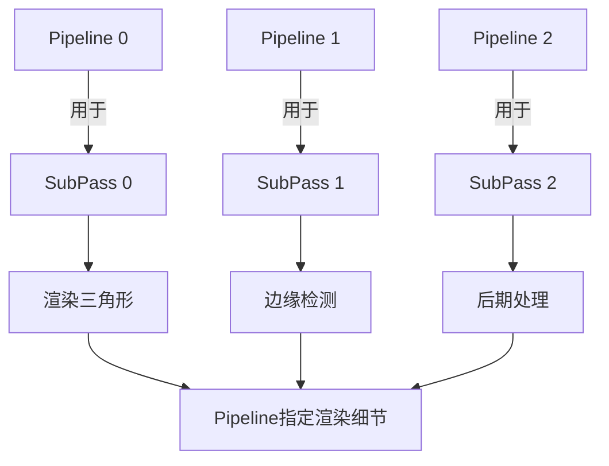

**说明**：
- 每个SubPass可以有自己的Pipeline
- 也可以多个SubPass共用同一个Pipeline
- Pipeline告诉SubPass如何渲染

### 7.3 Pipeline与RenderPass都是配置，不是数据

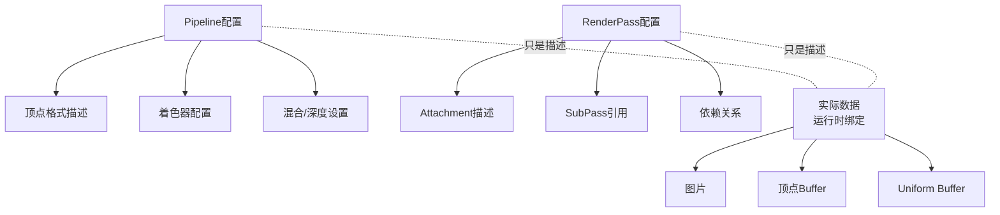

**关键点**：
- Pipeline和RenderPass都是渲染模式的设置
- 它们只描述"我希望收到怎样的信息"
- 实际数据（图片、顶点）在录制命令时动态绑定

### 7.4 Pipeline创建时关联RenderPass

```cpp
VkGraphicsPipelineCreateInfo pipelineInfo{};
pipelineInfo.sType = VK_STRUCTURE_TYPE_GRAPHICS_PIPELINE_CREATE_INFO;

// Pipeline指定使用哪个RenderPass
pipelineInfo.renderPass = renderPass;
pipelineInfo.subpass = 0;  // 使用第0个SubPass
```

## 8. FrameBuffer（帧缓冲）

### 8.1 什么是FrameBuffer

**定义**：FrameBuffer将RenderPass中的Attachment描述与实际的图像对象关联起来

**作用**：
- 提供实际的图像资源
- 为RenderPass提供渲染目标
- 一个RenderPass可以对应多个FrameBuffer（多窗口、多视口等）

### 8.2 FrameBuffer与RenderPass的关系

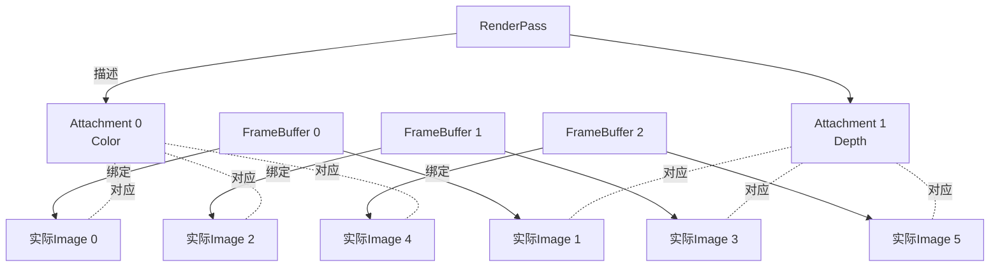

**说明**：
- RenderPass描述Attachment的属性
- FrameBuffer提供实际图像
- 一个RenderPass可以创建多个FrameBuffer（如双缓冲、三缓冲）

### 8.3 FrameBuffer创建

```cpp
// 1. 获取SwapChain图像视图
std::vector<VkImageView> swapChainImageViews = ...;

// 2. 创建FrameBuffer
std::vector<VkFramebuffer> swapChainFramebuffers;

for (size_t i = 0; i < swapChainImageViews.size(); i++) {
    std::array<VkImageView, 2> attachments = {
        swapChainImageViews[i],
        depthImageView
    };
    
    VkFramebufferCreateInfo framebufferInfo{};
    framebufferInfo.sType = VK_STRUCTURE_TYPE_FRAMEBUFFER_CREATE_INFO;
    framebufferInfo.renderPass = renderPass;
    framebufferInfo.attachmentCount = static_cast<uint32_t>(attachments.size());
    framebufferInfo.pAttachments = attachments.data();
    framebufferInfo.width = swapChainExtent.width;
    framebufferInfo.height = swapChainExtent.height;
    framebufferInfo.layers = 1;
    
    VkFramebuffer framebuffer;
    if (vkCreateFramebuffer(device, &framebufferInfo, nullptr, &framebuffer) != VK_SUCCESS) {
        throw std::runtime_error("Failed to create framebuffer!");
    }
    
    swapChainFramebuffers.push_back(framebuffer);
}
```

## 9. 完整渲染流程

### 9.1 全局渲染流程

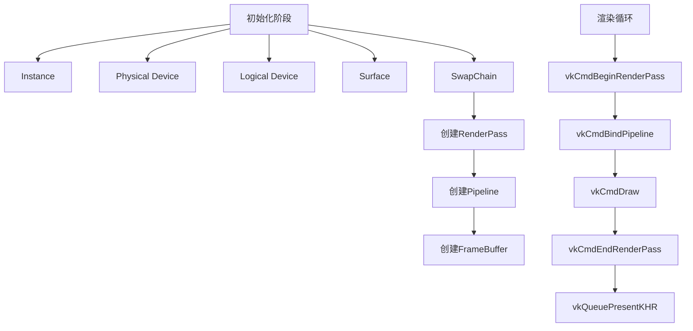

### 9.2 RenderPass内部流程

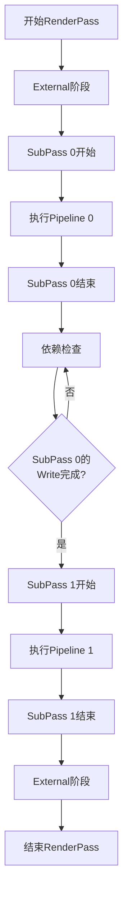

### 9.3 数据流

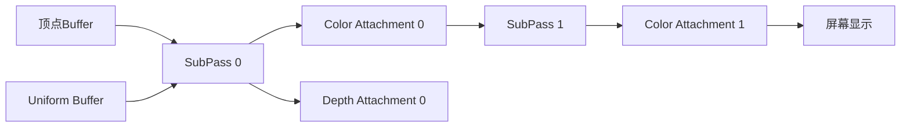

## 10. RenderPass知识点串联

### 10.1 整体架构

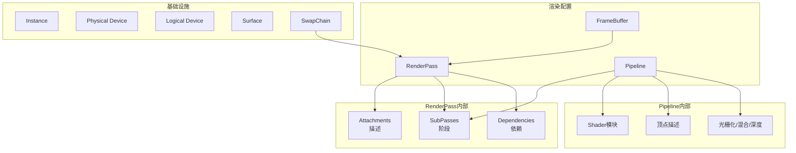

### 10.2 核心概念关系

| 概念 | 作用 | 数据还是配置 |
|------|------|-------------|
| **RenderPass** | 定义渲染过程的输入输出 | 配置 |
| **SubPass** | 渲染过程中的子阶段 | 配置 |
| **Attachment** | 渲染目标的画布 | 配置（描述）+ 数据（实际图像） |
| **Attachment Description** | 描述Attachment属性 | 配置 |
| **Attachment Reference** | SubPass引用哪个Attachment | 配置 |
| **Dependency** | SubPass之间的同步关系 | 配置 |
| **Pipeline** | SubPass的渲染细节 | 配置 |
| **FrameBuffer** | 为RenderPass提供实际图像 | 数据绑定 |
| **Command Buffer** | 录制渲染命令 | 命令（运行时） |

### 10.3 数据流分析

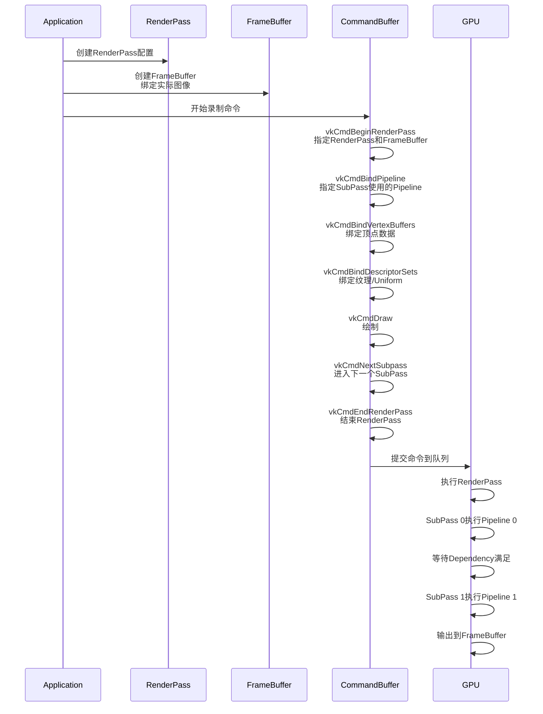

## 11. 最佳实践

### 11.1 RenderPass设计建议

1. **最小化SubPass数量**：
   - 只在必要时使用多个SubPass
   - 每个SubPass都有开销

2. **合理设置LoadOp/StoreOp**：
   - 不需要的数据用DONT_CARE
   - 可以提高性能

3. **优化依赖关系**：
   - 只在必要时添加依赖
   - 设置正确的Stage和Access

4. **复用Pipeline**：
   - 相同SubPass可以共用Pipeline
   - 减少Pipeline创建开销

### 11.2 性能优化

| 优化点 | 方法 |
|--------|------|
| **减少SubPass切换** | 合并可以并行的渲染操作 |
| **优化Attachment数量** | 只使用必要的Attachment |
| **正确设置LoadOp/StoreOp** | 不需要的数据用DONT_CARE |
| **使用RenderPass缓存** | 避免重复创建 |
| **Tile-based GPU优化** | 考虑移动设备的Tile架构 |

### 11.3 常见问题

#### 问题1：SubPass 1读取SubPass 0的数据，出现错误

**原因**：依赖关系设置不正确

**解决**：
```cpp
VkSubpassDependency dependency{};
dependency.srcSubpass = 0;
dependency.dstSubpass = 1;
dependency.srcStageMask = VK_PIPELINE_STAGE_COLOR_ATTACHMENT_OUTPUT_BIT;
dependency.srcAccessMask = VK_ACCESS_COLOR_ATTACHMENT_WRITE_BIT;
dependency.dstStageMask = VK_PIPELINE_STAGE_FRAGMENT_SHADER_BIT;
dependency.dstAccessMask = VK_ACCESS_INPUT_ATTACHMENT_READ_BIT;
```

#### 问题2：性能低下

**原因**：LoadOp/StoreOp设置不当

**解决**：
- 不需要的数据：`VK_ATTACHMENT_LOAD_OP_DONT_CARE`
- 不需要保存：`VK_ATTACHMENT_STORE_OP_DONT_CARE`

#### 问题3：FrameBuffer创建失败

**原因**：Attachment格式与RenderPass描述不匹配

**解决**：确保FrameBuffer使用的ImageView格式与RenderPass中的Attachment Description格式一致

## 12. 总结

### 核心概念

1. **RenderPass**：描述完整渲染过程的输入输出
2. **SubPass**：RenderPass中的子渲染阶段
3. **Attachment**：渲染目标的画布（颜色/深度模板）
4. **Dependency**：SubPass之间的同步关系
5. **Pipeline**：SubPass的渲染细节
6. **FrameBuffer**：为RenderPass提供实际图像

### 关键关系

- RenderPass → 包含多个SubPass
- SubPass → 关联Attachment（通过Attachment Reference）
- SubPass之间 → 通过Dependency同步
- Pipeline → 用于特定SubPass
- FrameBuffer → 绑定RenderPass的实际图像

### 设计哲学

- **配置与数据分离**：RenderPass和Pipeline是配置，实际数据在运行时绑定
- **细粒度控制**：通过Stage和Access精确控制同步
- **性能优先**：提供DONT_CARE等选项优化性能
- **灵活性**：支持复杂的多Pass渲染流程

RenderPass是Vulkan渲染的核心框架，理解了RenderPass就理解了Vulkan如何组织渲染过程。它提供了一种高效、灵活的方式来描述和管理复杂的渲染流程。
