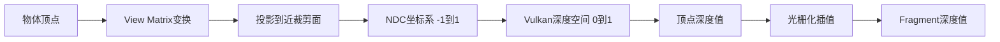
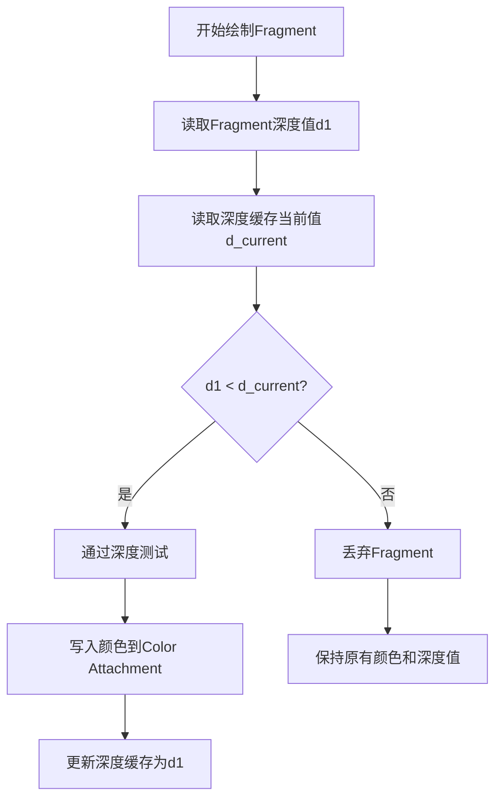
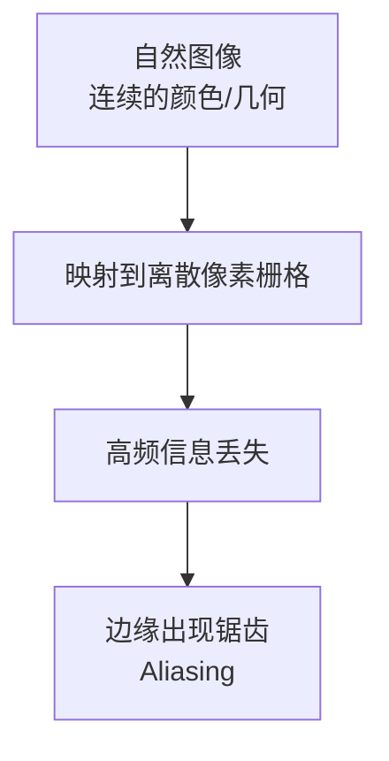
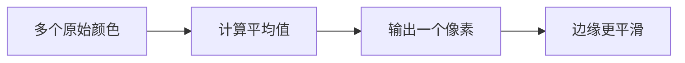
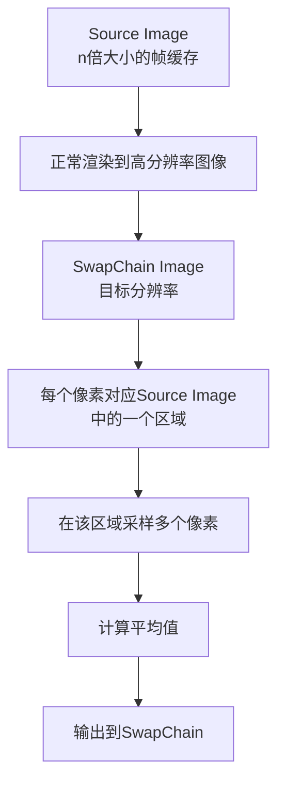
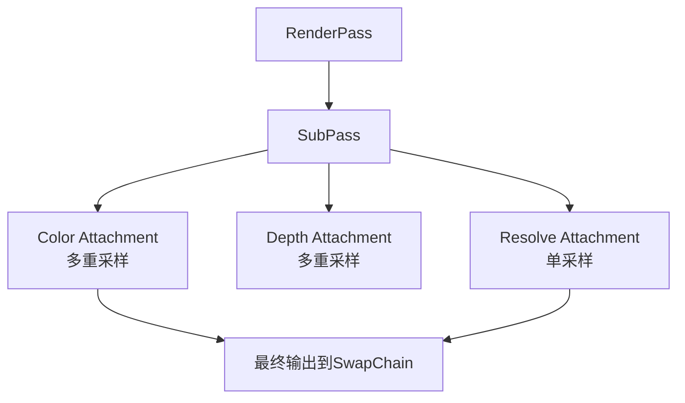

# 深度测试与抗锯齿

## 1. 深度缓存原理

### 1.1 深度测试解决的问题

在绘制多个三角形时，系统需要决定：
- **谁遮挡了谁**？
- 哪些物体在前面，哪些在后面？

### 1.2 画家画法（Painter's Algorithm）

**基本原理**：
- 从后往前一层一层绘制
- 后面绘制的物体会覆盖前面绘制的物体
- 类似画家在纸上画画：先画远处的山，再画中间的房子，最后画前面的人

**局限性**：
- 需要对所有物体进行排序
- 效率太低，不适合实时渲染
- 无法处理复杂遮挡关系

### 1.3 深度缓存概念

**定义**：
- 深度缓存（Depth Buffer）是一个用于保存每个像素深度值的图像（Image）
- 在RenderPass中作为一个Attachment存在，称为depth buffer attachment
- 每个像素对应一个深度值，范围是0.0到1.0的浮点数

**深度值含义**：
- **0.0**：距离摄像机最近
- **1.0**：距离摄像机最远

**深度值的来源**：



1. 顶点首先经过**View Matrix**变换到摄像机坐标系
2. 经过**投影矩阵**投影到近裁剪面，得到NDC坐标（-1到1）
3. Vulkan中进一步转换到**0到1**的深度空间
4. 光栅化后，每个Fragment通过插值得到自己的深度值

### 1.4 深度测试规则

**初始状态**：
- 深度缓存初始化为**1.0**（最大深度）

**测试流程**：



**示例说明**：

假设有一个9×9的栅格图片：

1. **初始状态**：深度缓存全为1.0（最远）
2. **绘制第一个三角形**（深度0.5）：
   - 比较：0.5 < 1.0 ✅
   - 写入颜色到Color Attachment
   - 更新深度缓存为0.5
3. **绘制第二个三角形**（深度0.4）：
   - 比较：0.4 < 0.5 ✅
   - 写入颜色
   - 更新深度缓存为0.4
4. **绘制第三个三角形**（深度0.6）：
   - 比较：0.6 < 0.4 ❌
   - **丢弃Fragment**，不写入

### 1.5 深度测试的 Vulkan 实现

**在RenderPass中**：
```cpp
// 创建深度缓存Attachment
VkAttachmentDescription depthAttachment = {};
depthAttachment.format = findDepthFormat();  // 通常为VK_FORMAT_D24_UNORM_S8_UINT
depthAttachment.samples = VK_SAMPLE_COUNT_1_BIT;
depthAttachment.loadOp = VK_ATTACHMENT_LOAD_OP_CLEAR;  // 清除为1.0
depthAttachment.storeOp = VK_ATTACHMENT_STORE_OP_DONT_CARE;
depthAttachment.stencilLoadOp = VK_ATTACHMENT_LOAD_OP_DONT_CARE;
depthAttachment.stencilStoreOp = VK_ATTACHMENT_STORE_OP_DONT_CARE;
depthAttachment.initialLayout = VK_IMAGE_LAYOUT_UNDEFINED;
depthAttachment.finalLayout = VK_IMAGE_LAYOUT_DEPTH_STENCIL_ATTACHMENT_OPTIMAL;

// 创建深度缓存引用
VkAttachmentReference depthAttachmentRef = {};
depthAttachmentRef.attachment = 1;  // 第二个Attachment
depthAttachmentRef.layout = VK_IMAGE_LAYOUT_DEPTH_STENCIL_ATTACHMENT_OPTIMAL;

// 在SubPass中使用
VkSubpassDescription subpass = {};
subpass.pipelineBindPoint = VK_PIPELINE_BIND_POINT_GRAPHICS;
subpass.colorAttachmentCount = 1;
subpass.pColorAttachments = &colorAttachmentRef;
subpass.pDepthStencilAttachment = &depthAttachmentRef;  // 指定深度缓存
```

**在Pipeline中启用深度测试**：
```cpp
VkPipelineDepthStencilStateCreateInfo depthStencil = {};
depthStencil.sType = VK_STRUCTURE_TYPE_PIPELINE_DEPTH_STENCIL_STATE_CREATE_INFO;
depthStencil.depthTestEnable = VK_TRUE;  // 启用深度测试
depthStencil.depthWriteEnable = VK_TRUE;  // 允许写入深度值
depthStencil.depthCompareOp = VK_COMPARE_OP_LESS;  // 深度比较操作：小于通过
depthStencil.depthBoundsTestEnable = VK_FALSE;
depthStencil.stencilTestEnable = VK_FALSE;
```

---

## 2. 抗锯齿原理

### 2.1 走样（Aliasing）现象

**什么是走样**：
- 渲染的图像放大后，边缘出现明显的锯齿状边缘
- 屏幕由离散的像素栅格构成，每个像素只能"点亮"或"不点亮"
- 就像Bresenham画直线算法一样，每次只能选择一个栅格点亮

**走样示例**：



**走样产生的原因**：
- **频率失配**：自然物体的细节变化频率（颜色、几何）非常高
- **采样频率低**：屏幕的像素分辨率有限，无法还原高频变化
- 类似信号处理中的**采样定理**：采样频率必须大于信号最高频率的2倍才能完美还原

### 2.2 反走样的基本思路

**问题**：
- 假设自然界中的三角形有一行非常密集的颜色变化（浅→深→浅→深...）
- 屏幕这一行只有5个像素
- 只能采样其中的某些点，无法还原完整的变化

**解决方案 - 平均化**：



**示例**：
- 原始颜色：浅、中浅、中、中深、深、深、中深、中、中浅
- 屏幕像素1：平均前3个 → 稍深
- 屏幕像素2：平均中间3个 → 中深
- 屏幕像素3：平均后3个 → 稍浅
- 结果：比直接采样更平滑

### 2.3 超级采样抗锯齿（SSAA）

**全称**：Super Sampling Anti-Aliasing

**基本原理**：
- 在更高分辨率下渲染图像
- 然后通过采样和平均降采样到目标分辨率

**实现步骤**：



**具体操作**：

1. **创建n倍大小的Source Image**：
   - 假设SwapChain是200×600
   - 创建200×n × 600×n的Source Image
   - 占用更多内存

2. **渲染到Source Image**：
   - 正常绘制，但输出到高分辨率图像
   - 记录所有Fragment的颜色

3. **降采样到SwapChain**：
   - 对于SwapChain上的每个像素（x, y）
   - 计算它在Source Image上的对应区域
     - 比例：横向0.3，纵向0.4
   - 在该区域内采样多个像素
     - 例如：4×4或8×8的像素块
   - 计算这些像素的**平均值**
   - 将平均值写入SwapChain的对应像素

**数学原理**：
```
SwapChain像素(x,y) = average(
    SourceImage中对应区域内的所有采样点颜色
)
```

### 2.4 其他抗锯齿技术简介

虽然课程主要讲解SSAA，但Vulkan中常用的抗锯齿技术还包括：

1. **MSAA（Multi-Sample Anti-Aliasing）**：
   - 只对边缘像素进行多重采样
   - 比SSAA更高效
   - Vulkan中通过设置`VkPipelineMultisampleStateCreateInfo`实现

2. **FXAA（Fast Approximate Anti-Aliasing）**：
   - 后处理技术
   - 在图像渲染完成后进行边缘检测和模糊
   - 性能开销小，效果适中

3. **TAA（Temporal Anti-Aliasing）**：
   - 利用前一帧的信息
   - 结合时间维度的采样
   - 需要运动向量

### 2.5 抗锯齿的 Vulkan 实现

**启用MSAA（在SwapChain创建时）**：
```cpp
// 查询支持的采样级别
VkSampleCountFlagBits msaaSamples = getMaxUsableSampleCount();

// 在Pipeline配置中设置多重采样
VkPipelineMultisampleStateCreateInfo multisampling = {};
multisampling.sType = VK_STRUCTURE_TYPE_PIPELINE_MULTISAMPLE_STATE_CREATE_INFO;
multisampling.sampleShadingEnable = VK_TRUE;  // 启用采样着色
multisampling.rasterizationSamples = msaaSamples;
multisampling.minSampleShading = 0.2f;  // 最小采样着色比例
```

**创建多重采样Color Attachment**：
```cpp
// Color attachment需要支持多重采样
VkAttachmentDescription colorAttachment = {};
colorAttachment.format = swapChainImageFormat;
colorAttachment.samples = msaaSamples;  // 设置采样级别
colorAttachment.loadOp = VK_ATTACHMENT_LOAD_OP_CLEAR;
colorAttachment.storeOp = VK_ATTACHMENT_STORE_OP_STORE;
colorAttachment.stencilLoadOp = VK_ATTACHMENT_LOAD_OP_DONT_CARE;
colorAttachment.stencilStoreOp = VK_ATTACHMENT_STORE_OP_DONT_CARE;
colorAttachment.initialLayout = VK_IMAGE_LAYOUT_UNDEFINED;
colorAttachment.finalLayout = VK_IMAGE_LAYOUT_COLOR_ATTACHMENT_OPTIMAL;
```

**创建Resolve Attachment（用于降采样）**：
```cpp
// Resolve attachment用于将多重采样图像解析为单采样图像
VkAttachmentDescription colorAttachmentResolve = {};
colorAttachmentResolve.format = swapChainImageFormat;
colorAttachmentResolve.samples = VK_SAMPLE_COUNT_1_BIT;  // 单采样
colorAttachmentResolve.loadOp = VK_ATTACHMENT_LOAD_OP_DONT_CARE;
colorAttachmentResolve.storeOp = VK_ATTACHMENT_STORE_OP_STORE;
colorAttachmentResolve.stencilLoadOp = VK_ATTACHMENT_LOAD_OP_DONT_CARE;
colorAttachmentResolve.stencilStoreOp = VK_ATTACHMENT_STORE_OP_DONT_CARE;
colorAttachmentResolve.initialLayout = VK_IMAGE_LAYOUT_UNDEFINED;
colorAttachmentResolve.finalLayout = VK_IMAGE_LAYOUT_PRESENT_SRC_KHR;

// 在SubPass中指定resolve attachment
VkSubpassDescription subpass = {};
subpass.pipelineBindPoint = VK_PIPELINE_BIND_POINT_GRAPHICS;
subpass.colorAttachmentCount = 1;
subpass.pColorAttachments = &colorAttachmentRef;
subpass.pResolveAttachments = &colorAttachmentResolveRef;  // 降采样
```

---

## 3. 深度测试与抗锯齿的结合

### 3.1 多重采样的深度缓存

在启用抗锯齿时，深度缓存也需要支持多重采样：

```cpp
VkAttachmentDescription depthAttachment = {};
depthAttachment.format = findDepthFormat();
depthAttachment.samples = msaaSamples;  // 与color attachment相同的采样级别
depthAttachment.loadOp = VK_ATTACHMENT_LOAD_OP_CLEAR;
depthAttachment.storeOp = VK_ATTACHMENT_STORE_OP_DONT_CARE;  // 不需要存储
depthAttachment.stencilLoadOp = VK_ATTACHMENT_LOAD_OP_DONT_CARE;
depthAttachment.stencilStoreOp = VK_ATTACHMENT_STORE_OP_DONT_CARE;
depthAttachment.initialLayout = VK_IMAGE_LAYOUT_UNDEFINED;
depthAttachment.finalLayout = VK_IMAGE_LAYOUT_DEPTH_STENCIL_ATTACHMENT_OPTIMAL;
```

### 3.2 完整的RenderPass配置



**配置示例**：
```cpp
// 创建RenderPass
VkRenderPassCreateInfo renderPassInfo = {};
renderPassInfo.sType = VK_STRUCTURE_TYPE_RENDER_PASS_CREATE_INFO;
renderPassInfo.attachmentCount = 3;
renderPassInfo.pAttachments = attachments;
renderPassInfo.subpassCount = 1;
renderPassInfo.pSubpasses = &subpass;
```

---

## 4. 最佳实践与注意事项

### 4.1 深度测试

✅ **推荐做法**：
- 永远启用深度测试（除非特殊需求）
- 使用`VK_COMPARE_OP_LESS`作为默认比较操作
- 清除深度缓存为1.0（最远）

⚠️ **注意事项**：
- 透明物体需要特殊处理（通常关闭深度写入）
- 深度精度问题可能导致Z-fighting（平面闪烁）
- 某些效果（如粒子系统）可能需要禁用深度测试

### 4.2 抗锯齿

✅ **推荐做法**：
- 根据硬件能力选择合适的采样级别（4x或8x）
- 使用MSAA而非SSAA（性能更好）
- 采样着色可以进一步提高质量

⚠️ **注意事项**：
- 多重采样会显著增加内存占用和GPU负载
- 某些后期处理效果需要在resolve后进行
- 移动设备可能不支持高采样级别

### 4.3 性能优化

**深度缓存优化**：
```cpp
// 提前深度测试（Early-Z）
depthStencil.depthBoundsTestEnable = VK_FALSE;  // 禁用不必要的深度范围测试

// 静态物体可以禁用深度写入（提高性能）
depthStencil.depthWriteEnable = VK_FALSE;  // 只进行测试，不写入
```

**抗锯齿优化**：
```cpp
// 只在需要的像素上启用采样着色
multisampling.sampleShadingEnable = VK_TRUE;
multisampling.minSampleShading = 0.2f;  // 只采样20%的片段

// 根据性能需求动态调整采样级别
VkSampleCountFlagBits msaaSamples = getMaxUsableSampleCount();
```

---

## 5. 总结

### 5.1 深度测试核心要点

| 概念 | 说明 |
|------|------|
| **目的** | 决定Fragment遮挡关系 |
| **存储** | Depth Buffer Attachment（Image） |
| **深度值** | 0.0（最近）到1.0（最远） |
| **测试规则** | 新深度 < 当前深度 → 通过 |
| **用途** | 写入Color Attachment和更新Depth Buffer |

### 5.2 抗锯齿核心要点

| 技术 | 原理 | 优缺点 |
|------|------|--------|
| **SSAA** | 高分辨率渲染+平均采样 | 质量高，性能差 |
| **MSAA** | 多重采样边缘像素 | 质量好，性能优 |
| **FXAA** | 后处理边缘模糊 | 性能好，质量中等 |
| **TAA** | 时域累积采样 | 质量最高，需要运动向量 |

### 5.3 学习路径

1. **深度测试** → 理解遮挡关系 → 正确的深度缓存配置
2. **抗锯齿** → 理解走样原因 → 选择合适的抗锯齿技术
3. **结合使用** → 多重采样深度缓存 → 完整的渲染管线

深度测试和抗锯齿是Vulkan渲染管线中不可或缺的两个重要技术，它们共同确保了渲染结果的正确性和视觉质量。通过合理配置和优化，可以在保证视觉效果的同时，最大化渲染性能。
