# 06 绘制指令、同步机制和资源引用与解析规则（绘制的核心工作流程）

## 1. Command Buffer（指令缓冲）

### 1.1 什么是Command Buffer

**定义**：Command Buffer是CPU端内存空间，用于存储录制好的GPU指令及其参数

**作用**：
- 将多个指令录制到一个缓冲中
- 统一提交给GPU执行
- 减少CPU-GPU通信次数（非常耗时）

**指令类型**：
- 绑定VBO（顶点缓冲）
- 绑定Pipeline
- 绑定Uniform Buffer
- 绘制命令（Draw Calls）
- Barrier（布局转换）

### 1.2 指令录制过程

**录制定义**：将指令及其参数序列化为机器可读的二进制数据，存放到Command Buffer的内存空间中

**示例：vkCmdBindPipeline**

```cpp
vkCmdBindPipeline(
    commandBuffer,              // Command Buffer句柄
    VK_PIPELINE_BIND_POINT_GRAPHICS,  // 用于图形渲染
    pipeline                    // 要绑定的Pipeline句柄
);
```

**录制结果**：
- 指令类型被序列化到Command Buffer
- 指令的字节序号被记录
- 指令参数被转换为二进制数据

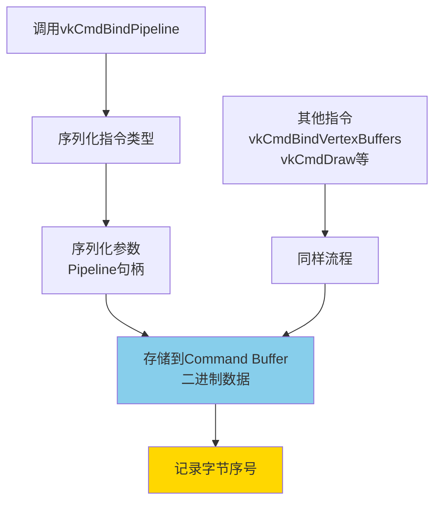

### 1.3 Command Buffer类型

#### Primary Command Buffer（主指令缓冲）

**特点**：
- 可以直接向GPU提交
- 包含完整渲染指令
- 可以执行Secondary Command Buffer

**用途**：作为主要的渲染指令容器

#### Secondary Command Buffer（二级指令缓冲）

**特点**：
- 不能直接提交给GPU
- 必须通过Primary Command Buffer执行
- 可以独立录制

**用途**：
- 多线程录制
- 按对象组织指令

### 1.4 Primary与Secondary的关系

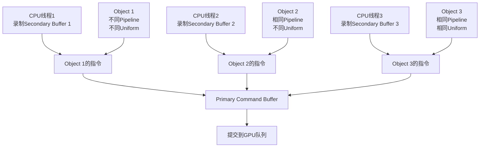

**设计优势**：

1. **按对象组织**：
   - 每个对象分配一个Secondary Command Buffer
   - 录制属于自己的指令
   - 灵活性高

2. **多线程录制**：
   - 不同线程并行录制不同Secondary Buffer
   - 充分利用多核CPU
   - 大幅提升录制效率

### 1.5 多线程渲染原理

#### 传统OpenGL的局限

**State Machine模型**：
- 保留状态机
- 单线程执行
- 状态设置耗时长

**Dispatch开销**：
- 将当前OpenGL状态（VBO绑定、纹理绑定等）转换为指令
- 送入GPU队列执行
- 每次Dispatch都消耗大量时间

**问题**：单线程 + 状态机 → 效率低下

#### Vulkan的多线程优势

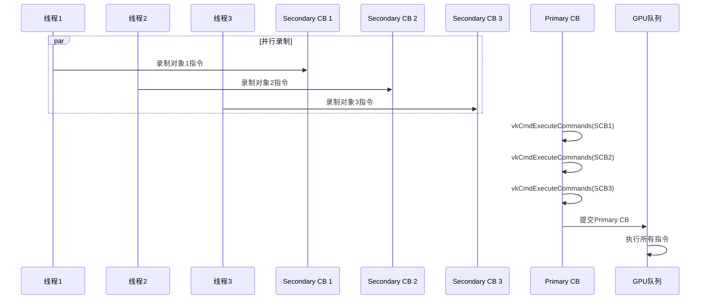

**优势总结**：

| 特性 | OpenGL | Vulkan |
|------|---------|--------|
| **线程模型** | 单线程 | 多线程录制 |
| **状态管理** | State Machine | 零抽象 |
| **指令录制** | 串行 | 并行 |
| **性能** | 受限于CPU单核 | 充分利用多核 |

## 2. 顶点描述系统

### 2.1 顶点数组概念

**问题**：如何将C++中的顶点数据传入Pipeline？

**组成要素**：
1. **GPU显存空间**：存储顶点数据
2. **描述**：告诉GPU如何读取和使用数据

**与传统VAO对比**：

| 特性 | OpenGL VAO | Vulkan顶点描述 |
|------|-----------|----------------|
| **抽象层级** | 高级抽象 | 详细控制 |
| **灵活性** | 较低 | 高度灵活 |
| **控制粒度** | 粗粒度 | 细粒度 |

### 2.2 GPU显存空间（VBO）

**示例：分离布局**

```cpp
// Buffer 0: 顶点位置
std::vector<glm::vec3> positions = {
    {0.0f, 0.0f, 0.0f},  // 顶点0
    {1.0f, 0.0f, 0.0f},  // 顶点1
    {0.0f, 1.0f, 0.0f}   // 顶点2
};

// Buffer 1: UV坐标
std::vector<glm::vec2> texCoords = {
    {0.0f, 0.0f},  // 顶点0
    {1.0f, 0.0f},  // 顶点1
    {0.0f, 1.0f}   // 顶点2
};
```

**内存布局**：
```
Buffer 0: [X0,Y0,Z0][X1,Y1,Z1][X2,Y2,Z2]...
Buffer 1: [U0,V0][U1,V1][U2,V2]...
```

### 2.3 VertexInputBindingDescription（绑定描述）

**作用**：描述Buffer的切割方式（Stride和InputRate）

**VkVertexInputBindingDescription结构**：

```cpp
struct VkVertexInputBindingDescription {
    uint32_t binding;        // Binding编号（Buffer在数组中的索引）
    uint32_t stride;         // 从一个顶点到下一个顶点的字节距离
    VkVertexInputRate inputRate;  // 输入速率
};
```

#### Stride（步幅）计算

**示例1：分离布局**

```cpp
// Binding 0: Position Buffer
VkVertexInputBindingDescription binding0{};
binding0.binding = 0;
binding0.stride = sizeof(glm::vec3);  // 12字节 (3个float × 4字节)
binding0.inputRate = VK_VERTEX_INPUT_RATE_VERTEX;

// Binding 1: TexCoord Buffer
VkVertexInputBindingDescription binding1{};
binding1.binding = 1;
binding1.stride = sizeof(glm::vec2);  // 8字节 (2个float × 4字节)
binding1.inputRate = VK_VERTEX_INPUT_RATE_VERTEX;
```

**含义**：
- Binding 0: 每次跳过12字节读取下一个顶点的位置
- Binding 1: 每次跳过8字节读取下一个顶点的UV坐标

**示例2：交错布局**

```cpp
struct Vertex {
    glm::vec3 position;
    glm::vec2 texCoord;
};

// Binding 0: Interleaved Buffer
VkVertexInputBindingDescription binding0{};
binding0.binding = 0;
binding0.stride = sizeof(Vertex);  // 20字节 (12+8)
binding0.inputRate = VK_VERTEX_INPUT_RATE_VERTEX;
```

**内存布局**：
```
[PX0,PY0,PZ0][U0,V0][PX1,PY1,PZ1][U1,V1]...
        ↑              ↑
      12字节        8字节
      总计20字节
```

#### InputRate（输入速率）

| 类型 | 说明 | 使用场景 |
|------|------|---------|
| `VK_VERTEX_INPUT_RATE_VERTEX` | 每执行一次Vertex Shader读取一个顶点数据 | 普通渲染 |
| `VK_VERTEX_INPUT_RATE_INSTANCE` | 每绘制一个实例读取一次顶点数据 | 实例化渲染 |

### 2.4 VertexInputAttributeDescription（属性描述）

**作用**：描述顶点属性的细粒度切割，将数据映射到Shader变量

**VkVertexInputAttributeDescription结构**：

```cpp
struct VkVertexInputAttributeDescription {
    uint32_t location;    // Location编号（对应Shader的layout(location=X)）
    uint32_t binding;     // 从哪个Binding获取
    VkFormat format;      // 数据格式
    uint32_t offset;      // 在顶点数据中的字节偏移
};
```

#### 分离布局示例

```cpp
std::vector<VkVertexInputAttributeDescription> attributeDescriptions;

// Position属性
VkVertexInputAttributeDescription posAttribute{};
posAttribute.binding = 0;           // 从Binding 0获取
posAttribute.location = 0;          // 对应Shader的location=0
posAttribute.format = VK_FORMAT_R32G32B32_SFLOAT;  // 3个float
posAttribute.offset = 0;            // 从Buffer开头读取
attributeDescriptions.push_back(posAttribute);

// TexCoord属性
VkVertexInputAttributeDescription uvAttribute{};
uvAttribute.binding = 1;           // 从Binding 1获取
uvAttribute.location = 1;          // 对应Shader的location=1
uvAttribute.format = VK_FORMAT_R32G32_SFLOAT;  // 2个float
uvAttribute.offset = 0;            // 从Buffer开头读取
attributeDescriptions.push_back(uvAttribute);
```

**Shader对应**：
```glsl
#version 450

layout(location = 0) in vec3 position;  // Binding 0, Format: RGB32
layout(location = 1) in vec2 texCoord; // Binding 1, Format: RG32

void main() {
    // ...
}
```

#### 交错布局示例

```cpp
struct Vertex {
    glm::vec3 position;  // offset 0, size 12
    glm::vec2 texCoord;  // offset 12, size 8
};

std::vector<VkVertexInputAttributeDescription> attributeDescriptions;

// Position属性
VkVertexInputAttributeDescription posAttribute{};
posAttribute.binding = 0;
posAttribute.location = 0;
posAttribute.format = VK_FORMAT_R32G32B32_SFLOAT;
posAttribute.offset = offsetof(Vertex, position);  // 0
attributeDescriptions.push_back(posAttribute);

// TexCoord属性
VkVertexInputAttributeDescription uvAttribute{};
uvAttribute.binding = 0;  // 同一个Buffer
uvAttribute.location = 1;
uvAttribute.format = VK_FORMAT_R32G32_SFLOAT;
uvAttribute.offset = offsetof(Vertex, texCoord);  // 12
attributeDescriptions.push_back(uvAttribute);
```

**内存读取流程**：

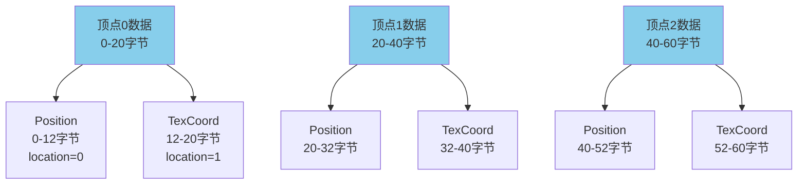

### 2.5 Binding Description vs Attribute Description

| 描述类型 | 作用 | 解决的问题 |
|---------|------|-----------|
| **Binding Description** | 描述Buffer的切割方式（Stride） | 如何在Buffer中跳到下一个顶点 |
| **Attribute Description** | 描述顶点属性的细粒度切割 | 顶点数据内部如何分配给不同属性 |

**关系示意图**：

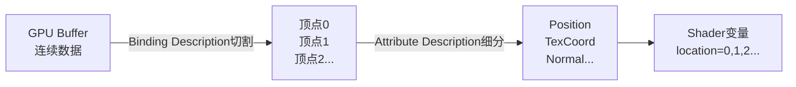

### 2.6 完整顶点输入状态

```cpp
VkPipelineVertexInputStateCreateInfo vertexInputInfo{};
vertexInputInfo.sType = VK_STRUCTURE_TYPE_PIPELINE_VERTEX_INPUT_STATE_CREATE_INFO;

// Binding Descriptions
std::vector<VkVertexInputBindingDescription> bindingDescriptions = {binding0, binding1};
vertexInputInfo.vertexBindingDescriptionCount = static_cast<uint32_t>(bindingDescriptions.size());
vertexInputInfo.pVertexBindingDescriptions = bindingDescriptions.data();

// Attribute Descriptions
std::vector<VkVertexInputAttributeDescription> attributeDescriptions = {posAttr, uvAttr, normalAttr};
vertexInputInfo.vertexAttributeDescriptionCount = static_cast<uint32_t>(attributeDescriptions.size());
vertexInputInfo.pVertexAttributeDescriptions = attributeDescriptions.data();
```

## 3. 描述符系统

### 3.1 Uniform Buffer概念

**问题**：如何向Shader传递频繁更新的数据？

**Uniform Buffer vs Vertex Buffer**：

| 特性 | Vertex Buffer | Uniform Buffer |
|------|--------------|----------------|
| **数据类型** | 顶点数据（每个顶点不同） | 全局数据（共享） |
| **更新频率** | 静态（加载模型时） | 每帧更新 |
| **数据大小** | 可能很大（几百MB） | 较小（KB级别） |
| **使用方式** | 逐顶点访问 | 所有顶点共享 |

**Uniform Buffer示例**：

```cpp
// 公用数据：所有模型共享
struct VPUniform {
    glm::mat4 viewMatrix;       // 视图矩阵
    glm::mat4 projectionMatrix; // 投影矩阵
};

// 每个模型独立数据
struct ModelUniform {
    glm::mat4 modelMatrix;     // 模型矩阵
};
```

**分类使用**：

```
模型1（6G） + 模型2（3G）
    ↓
Vertex Buffer存储顶点数据（不频繁更新）
    ↓
公用VP Uniform Buffer（128字节，每帧更新）
    ↓
每个模型独立Model Uniform Buffer（64字节，每帧更新）
```

### 3.2 Descriptor（描述符）

**定义**：描述符是对单个Uniform变量的参数描述

**作用**：描述Uniform变量的大小、存储空间、偏移、采样器等信息

**类型**：
- **Buffer描述符**：Uniform Buffer、Storage Buffer
- **Image描述符**：纹理图片

#### Buffer描述符

```cpp
struct VkDescriptorBufferInfo {
    VkBuffer buffer;      // 实际的Buffer句柄
    VkDeviceSize offset;  // 读取偏移（字节）
    VkDeviceSize range;   // 读取大小（字节）
};
```

**示例**：

```cpp
VPUniform vpData;
VkDescriptorBufferInfo bufferInfo{};
bufferInfo.buffer = uniformBuffer;     // Buffer句柄
bufferInfo.offset = 0;               // 从Buffer开头读取
bufferInfo.range = sizeof(VPUniform); // 读取整个结构体
```

#### Image描述符

```cpp
struct VkDescriptorImageInfo {
    VkSampler sampler;           // 采样器
    VkImageView imageView;        // 图片视图
    VkImageLayout imageLayout;    // 图片布局
};
```

### 3.3 Descriptor Set Layout（描述符集布局）

**作用**：描述Pipeline需要哪些Uniform变量以及它们的布局

**VkDescriptorSetLayoutBinding结构**：

```cpp
struct VkDescriptorSetLayoutBinding {
    uint32_t binding;                    // Binding编号
    VkDescriptorType descriptorType;      // 描述符类型
    uint32_t descriptorCount;             // 描述符数量（数组）
    VkShaderStageFlags stageFlags;        // 使用此描述符的Shader阶段
    const VkSampler* pImmutableSamplers;  // 不可变采样器
};
```

**示例**：

```cpp
std::vector<VkDescriptorSetLayoutBinding> bindings;

// Binding 0: VP Uniform（在Vertex Shader中使用）
VkDescriptorSetLayoutBinding vpBinding{};
vpBinding.binding = 0;
vpBinding.descriptorType = VK_DESCRIPTOR_TYPE_UNIFORM_BUFFER;
vpBinding.descriptorCount = 1;
vpBinding.stageFlags = VK_SHADER_STAGE_VERTEX_BIT;
vpBinding.pImmutableSamplers = nullptr;
bindings.push_back(vpBinding);

// Binding 1: Model Uniform（在Vertex Shader中使用）
VkDescriptorSetLayoutBinding modelBinding{};
modelBinding.binding = 1;
modelBinding.descriptorType = VK_DESCRIPTOR_TYPE_UNIFORM_BUFFER;
modelBinding.descriptorCount = 1;
modelBinding.stageFlags = VK_SHADER_STAGE_VERTEX_BIT;
modelBinding.pImmutableSamplers = nullptr;
bindings.push_back(modelBinding);

// Binding 2: Texture（在Fragment Shader中使用）
VkDescriptorSetLayoutBinding textureBinding{};
textureBinding.binding = 2;
textureBinding.descriptorType = VK_DESCRIPTOR_TYPE_COMBINED_IMAGE_SAMPLER;
textureBinding.descriptorCount = 1;
textureBinding.stageFlags = VK_SHADER_STAGE_FRAGMENT_BIT;
textureBinding.pImmutableSamplers = nullptr;
bindings.push_back(textureBinding);

// 创建Descriptor Set Layout
VkDescriptorSetLayout descriptorSetLayout;
VkDescriptorSetLayoutCreateInfo layoutInfo{};
layoutInfo.sType = VK_STRUCTURE_TYPE_DESCRIPTOR_SET_LAYOUT_CREATE_INFO;
layoutInfo.bindingCount = static_cast<uint32_t>(bindings.size());
layoutInfo.pBindings = bindings.data();

vkCreateDescriptorSetLayout(device, &layoutInfo, nullptr, &descriptorSetLayout);
```

**Shader对应**：

```glsl
// Vertex Shader
layout(binding = 0) uniform VPBlock {
    mat4 view;
    mat4 proj;
} vp;

layout(binding = 1) uniform ModelBlock {
    mat4 model;
} model;

// Fragment Shader
layout(binding = 2) uniform sampler2D texSampler;
```

### 3.4 Descriptor Set（描述符集）

**定义**：将多个Descriptor组合成一个集合，提交给Command Buffer

**作用**：为每次绘制提供具体的Uniform Buffer和Texture

**特点**：
- 可以为每个物体创建独立的Descriptor Set
- 可以复用公共的Descriptor（如VP Uniform）

**结构**：

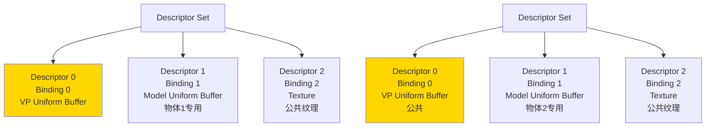

### 3.5 Pipeline Layout（管线布局）

**作用**：Pipeline的布局信息，包含Descriptor Set Layout

**创建**：

```cpp
VkPipelineLayoutCreateInfo pipelineLayoutInfo{};
pipelineLayoutInfo.sType = VK_STRUCTURE_TYPE_PIPELINE_LAYOUT_CREATE_INFO;

// 可以有多个Descriptor Set Layout
pipelineLayoutInfo.setLayoutCount = 1;
pipelineLayoutInfo.pSetLayouts = &descriptorSetLayout;

// Push Constant（可选）
pipelineLayoutInfo.pushConstantRangeCount = 0;
pipelineLayoutInfo.pPushConstantRanges = nullptr;

VkPipelineLayout pipelineLayout;
vkCreatePipelineLayout(device, &pipelineLayoutInfo, nullptr, &pipelineLayout);
```

### 3.6 完整描述符系统流程

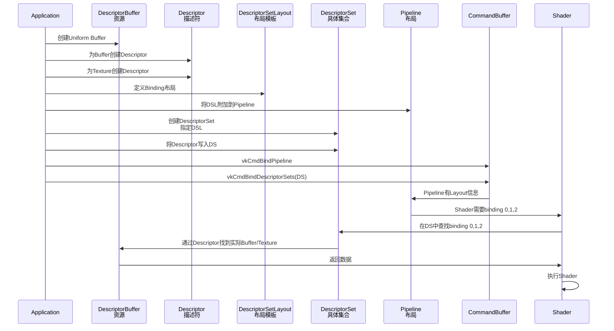

**数据查找流程**：

1. **Shader读取阶段**：
   ```glsl
   layout(binding = 0) uniform VPBlock vp;
   ```
   Shader发现需要binding 0的数据

2. **Pipeline核对**：
   - 检查Pipeline的Descriptor Set Layout
   - 确认binding 0存在且类型匹配

3. **Command Buffer查找**：
   - 在当前绑定的Descriptor Set中查找binding 0
   - 获取对应的Descriptor

4. **Descriptor定位资源**：
   - Descriptor包含Buffer句柄、Offset、Range
   - 从指定Offset开始读取Range大小的数据

5. **Shader使用数据**：
   - 将数据复制到Shader变量
   - 继续执行

## 4. 绘制流程与同步机制

### 4.1 完整绘制流程

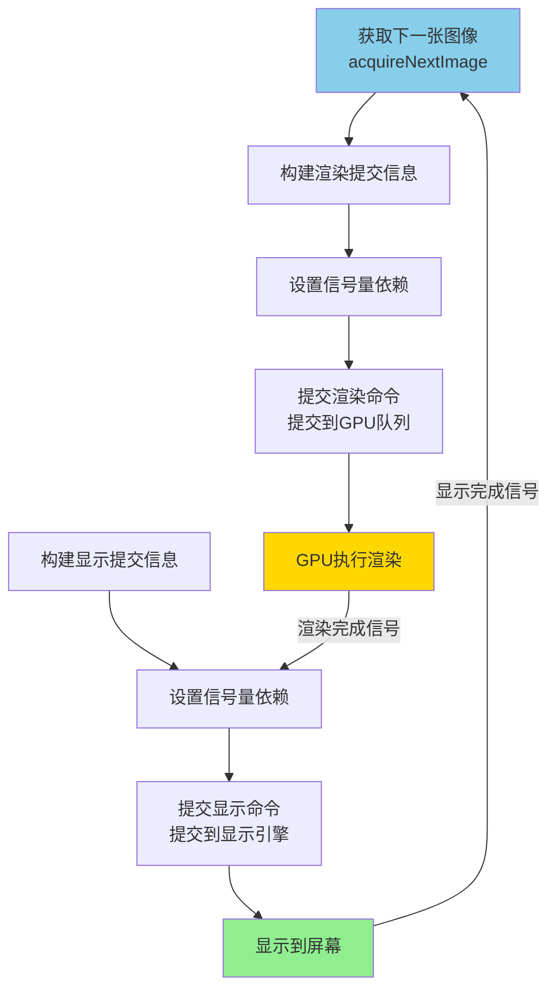

### 4.2 Semaphore（信号量）

**定义**：用于同步不同操作间执行的信号量

**状态**：
- **非激发态**：0（未触发）
- **激发态**：1（已触发）

**作用**：控制大Stage之间的同步

### 4.3 渲染与显示的同步

#### 同步需求

1. **渲染必须在显示完成后进行**：
   - 不能在图像正在显示时渲染
   - 否则会显示部分绘制结果

2. **显示必须在渲染完成后进行**：
   - 不能显示未完成的图像
   - 否则会显示错误内容

#### 信号量设置

**类型**：

1. **Image Available Semaphore**：
   - 标记图像可用（显示完成）
   - 触发后可以开始渲染

2. **Render Finished Semaphore**：
   - 标记渲染完成
   - 触发后可以开始显示

### 4.4 提交信息结构

#### VkSubmitInfo（渲染提交信息）

```cpp
struct VkSubmitInfo {
    VkStructureType sType;
    const void* pNext;
    uint32_t waitSemaphoreCount;      // 等待的信号量数量
    const VkSemaphore* pWaitSemaphores;  // 等待的信号量数组
    const VkPipelineStageFlags* pWaitDstStageMask;  // 在哪个阶段等待
    uint32_t commandBufferCount;       // Command Buffer数量
    const VkCommandBuffer* pCommandBuffers;  // Command Buffer数组
    uint32_t signalSemaphoreCount;    // 要激发的信号量数量
    const VkSemaphore* pSignalSemaphores;  // 要激发的信号量数组
};
```

**示例配置**：

```cpp
// 等待图像可用
VkSemaphore waitSemaphores[] = {imageAvailableSemaphore};
VkPipelineStageFlags waitStages[] = {VK_PIPELINE_STAGE_COLOR_ATTACHMENT_OUTPUT_BIT};

// 激发渲染完成
VkSemaphore signalSemaphores[] = {renderFinishedSemaphore};

VkSubmitInfo submitInfo{};
submitInfo.sType = VK_STRUCTURE_TYPE_SUBMIT_INFO;
submitInfo.waitSemaphoreCount = 1;
submitInfo.pWaitSemaphores = waitSemaphores;
submitInfo.pWaitDstStageMask = waitStages;
submitInfo.commandBufferCount = 1;
submitInfo.pCommandBuffers = &commandBuffer;
submitInfo.signalSemaphoreCount = 1;
submitInfo.pSignalSemaphores = signalSemaphores;
```

#### VkPresentInfoKHR（显示提交信息）

```cpp
struct VkPresentInfoKHR {
    VkStructureType sType;
    const void* pNext;
    uint32_t waitSemaphoreCount;      // 等待的信号量数量
    const VkSemaphore* pWaitSemaphores;  // 等待渲染完成的信号量
    uint32_t swapchainCount;          // 交换链数量
    const VkSwapchainKHR* pSwapchains;  // 交换链数组
    const uint32_t* pImageIndices;   // 图像索引数组
};
```

**示例配置**：

```cpp
VkPresentInfoKHR presentInfo{};
presentInfo.sType = VK_STRUCTURE_TYPE_PRESENT_INFO_KHR;
presentInfo.waitSemaphoreCount = 1;
presentInfo.pWaitSemaphores = &renderFinishedSemaphore;
presentInfo.swapchainCount = 1;
presentInfo.pSwapchains = &swapChain;
presentInfo.pImageIndices = &imageIndex;
```

### 4.5 同步执行流程

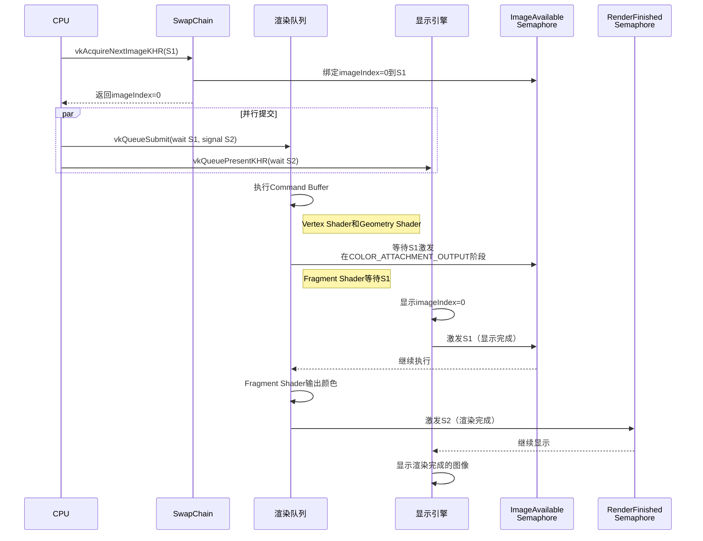

### 4.6 等待Stage的作用

**问题**：为什么在COLOR_ATTACHMENT_OUTPUT阶段等待？

**答案**：

1. **前面阶段可以并行**：
   - Vertex Shader：不依赖图像可用性
   - Geometry Shader：不依赖图像可用性
   - 这些阶段可以提前执行，提高效率

2. **只在关键阶段等待**：
   - Fragment Shader完成后的像素输出
   - 这个阶段需要写入图像
   - 必须等待图像可用

**优势**：
- 最大化GPU并行性
- 只在必要时同步
- 提高整体性能

### 4.7 Image Layout转换

#### Layout转换需求

**问题**：
- 渲染需要的Layout：`VK_IMAGE_LAYOUT_COLOR_ATTACHMENT_OPTIMAL`
- 显示需要的Layout：`VK_IMAGE_LAYOUT_PRESENT_SRC_KHR`
- 两者不同，需要转换

#### RenderPass自动转换

**机制**：
- RenderPass的Attachment Description定义了InitialLayout和FinalLayout
- 在SubPass进出时自动插入Barrier
- 自动进行Layout转换

**示例**：

```cpp
VkAttachmentDescription colorAttachment{};
colorAttachment.format = swapChainImageFormat;
colorAttachment.initialLayout = VK_IMAGE_LAYOUT_UNDEFINED;  // 初始
colorAttachment.finalLayout = VK_IMAGE_LAYOUT_PRESENT_SRC_KHR;  // 最终显示
```

**自动转换流程**：

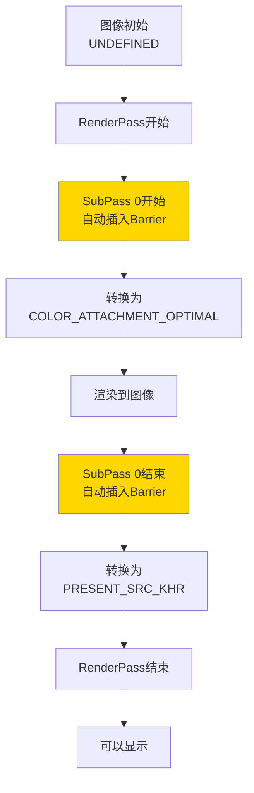

### 4.8 GPU乱序执行问题

**CPU的乱序执行**：

**现象**：
- 代码顺序：`A → B → C`
- 实际执行：可能先执行`C`，再执行`A`，最后执行`B`

**原因**：
- 指令之间没有强关联
- CPU为了性能会重新排序执行

**CPU的解决方案**：
- 使用汇编指令（如`mfence`、`sfence`）强制顺序
- 保证前面的指令完成后，后面的指令才能执行

**GPU的乱序执行**：

**现象**：
- Command Buffer录制时：按顺序启动
- 一旦开始执行：无法保证相互之间的顺序

**问题示例**：

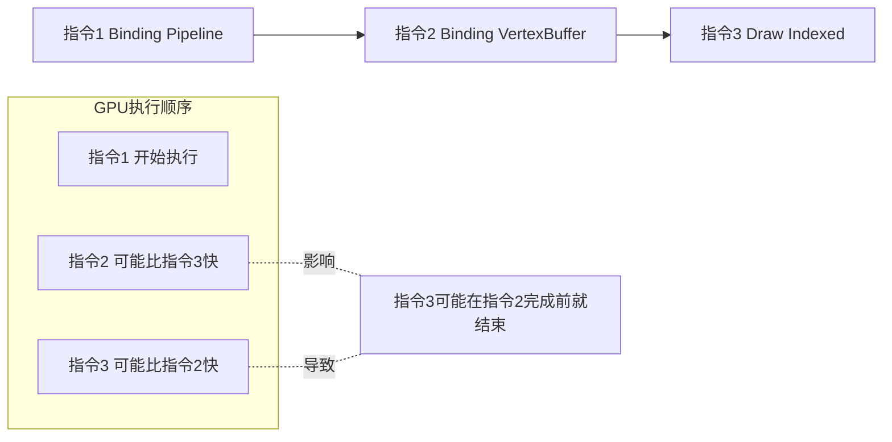

**结果**：
- 指令3可能利用了指令2的成果
- 如果指令2还未完成，指令3的结果是错误的

### 4.9 Barrier（内存屏障）

**定义**：Barrier是在两个操作之间强制顺序的机制

**作用**：
- 确保前面的某个阶段、某个操作完成后
- 后面的某个阶段、某个操作才能开始

**Barrier的作用方式**：

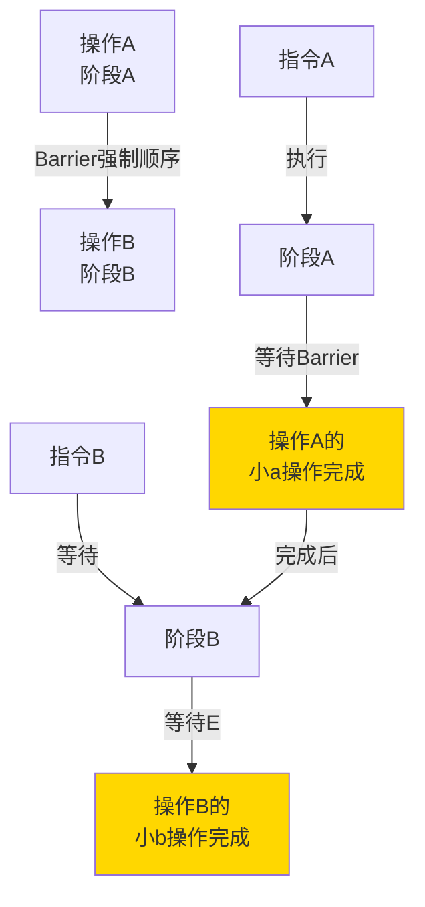

**Barrier的强制顺序**：
```
阶段A的操作a完成后 → 阶段B的操作b才能开始
```

### 4.10 Pipeline Stage详解

**Pipeline Stage的概念**：

不管哪种Pipeline（Graphics、Compute、Transfer），它们都有共同的阶段：

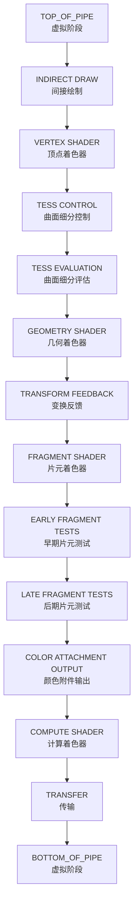

**三种队列类型**：

| 队列类型 | 支持的命令 | 说明 |
|---------|-----------|------|
| **Graphics** | Graphics命令 | 渲染、绘制、光栅化等 |
| **Compute** | Compute命令 | 计算着色器执行 |
| **Transfer** | Transfer命令 | Buffer/Image拷贝、Layout转换 |

**队列与Pipeline的对应**：

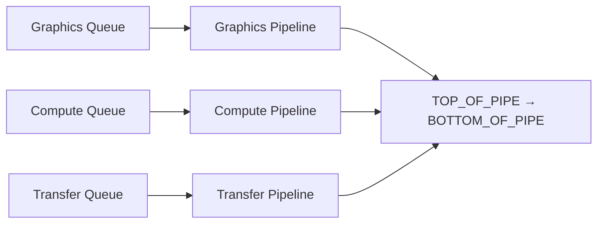

**注意**：
- 本课程中Graphics Queue也可以执行Transfer命令
- 没有单独列出Transfer Queue

### 4.11 三种Barrier类型

**VkMemoryBarrier**：

**作用**：全局内存屏障，影响所有内存访问

```cpp
struct VkMemoryBarrier {
    VkStructureType sType;
    const void* pNext;
    VkAccessFlags srcAccessMask;    // 源访问类型
    VkAccessFlags dstAccessMask;    // 目标访问类型
    uint32_t srcQueueFamilyIndex;   // 源队列族
    uint32_t dstQueueFamilyIndex;   // 目标队列族
};
```

**VkBufferMemoryBarrier**：

**作用**：Buffer专用的内存屏障

```cpp
struct VkBufferMemoryBarrier {
    VkStructureType sType;
    const void* pNext;
    VkAccessFlags srcAccessMask;
    VkAccessFlags dstAccessMask;
    uint32_t srcQueueFamilyIndex;
    uint32_t dstQueueFamilyIndex;
    VkBuffer buffer;               // 目标Buffer
    VkDeviceSize offset;           // 偏移
    VkDeviceSize size;             // 大小
};
```

**VkImageMemoryBarrier**：

**作用**：Image专用的内存屏障，最常用

```cpp
struct VkImageMemoryBarrier {
    VkStructureType sType;
    const void* pNext;
    VkAccessFlags srcAccessMask;
    VkAccessFlags dstAccessMask;
    VkImageLayout oldLayout;       // 旧布局
    VkImageLayout newLayout;       // 新布局
    uint32_t srcQueueFamilyIndex;
    uint32_t dstQueueFamilyIndex;
    VkImage image;                 // 目标Image
    VkImageSubresourceRange subresourceRange;  // 子资源范围
};
```

**Image Barrier使用示例**：

```cpp
VkImageMemoryBarrier barrier{};
barrier.sType = VK_STRUCTURE_TYPE_IMAGE_MEMORY_BARRIER;
barrier.oldLayout = VK_IMAGE_LAYOUT_TRANSFER_DST_OPTIMAL;  // 传输后
barrier.newLayout = VK_IMAGE_LAYOUT_SHADER_READ_ONLY_OPTIMAL;  // Shader只读
barrier.srcQueueFamilyIndex = VK_QUEUE_FAMILY_IGNORED;
barrier.dstQueueFamilyIndex = VK_QUEUE_FAMILY_IGNORED;
barrier.image = textureImage;
barrier.subresourceRange.aspectMask = VK_IMAGE_ASPECT_COLOR_BIT;
barrier.subresourceRange.baseMipLevel = 0;
barrier.subresourceRange.levelCount = 1;
barrier.subresourceRange.baseArrayLayer = 0;
barrier.subresourceRange.layerCount = 1;

barrier.srcAccessMask = VK_ACCESS_TRANSFER_WRITE_BIT;
barrier.dstAccessMask = VK_ACCESS_SHADER_READ_BIT;

vkCmdPipelineBarrier(
    commandBuffer,
    VK_PIPELINE_STAGE_TRANSFER_BIT,           // 源阶段
    VK_PIPELINE_STAGE_FRAGMENT_SHADER_BIT,     // 目标阶段
    0,
    0, nullptr,
    0, nullptr,
    1, &barrier
);
```

**Barrier与Semaphore的区别**：

| 特性 | Semaphore | Barrier |
|------|-----------|----------|
| **同步级别** | 大Stage之间同步 | 细粒度内存同步 |
| **使用场景** | 渲染与显示同步 | 布局转换、内存访问同步 |
| **开销** | 较低 | 较高 |
| **Granularity** | 粗粒度 | 细粒度 |

## 5. Image与Sampler系统

### 5.1 Image概念

**定义**：VkImage代表一个图像，可以是：
- 读取的纹理贴图
- 渲染好的图片（作为RenderPass的Attachment）

### 5.2 VkImage的构成

Image由三部分组成：

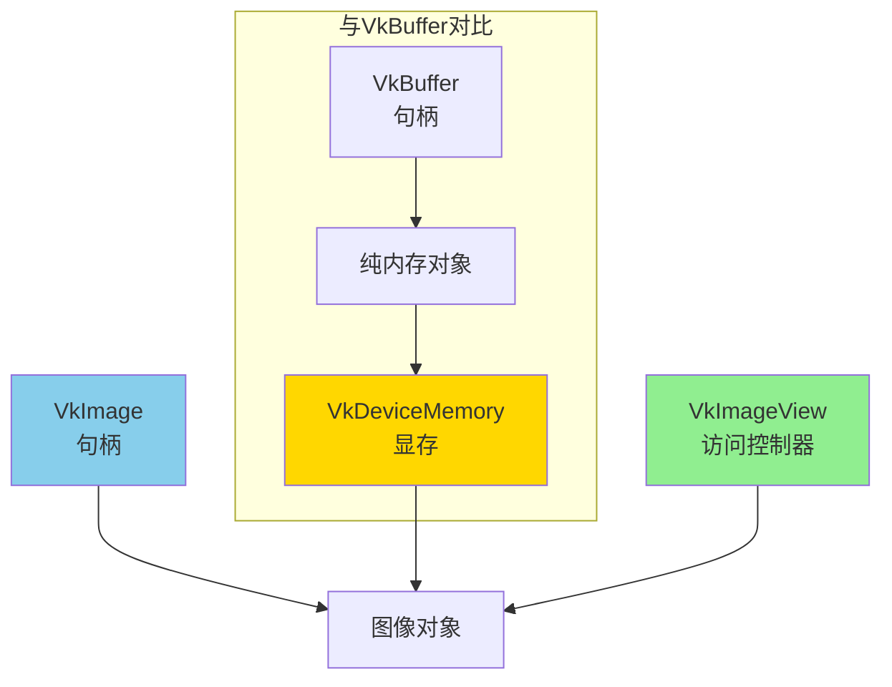

**组成部分说明**：

| 组件 | 作用 | 说明 |
|------|------|------|
| **VkImage** | 图像句柄 | CPU端用于操作GPU图像的句柄 |
| **VkDeviceMemory** | 显存空间 | 实际存储图像数据的GPU显存 |
| **VkImageView** | 访问控制器 | 对外的访问接口，控制访问方式 |

### 5.3 Image访问方式

通过VkImageView的设置，Image可以被访问为不同的类型：

| Aspect | 说明 | 使用场景 |
|--------|------|---------|
| **Color Aspect** | 按颜色方式访问 | 纹理采样、颜色附件 |
| **Depth Aspect** | 按深度图方式访问 | 深度测试、阴影贴图 |
| **Stencil Aspect** | 按模板方式访问 | 模板测试、镂空效果 |

### 5.4 创建纹理贴图的流程

**步骤概览**：

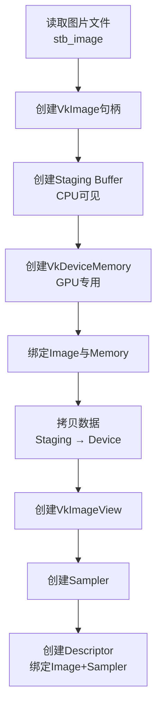

**详细步骤**：

#### 步骤1：读取图片

```cpp
int texWidth, texHeight, texChannels;
stbi_uc* pixels = stbi_load("texture.jpg", &texWidth, &texHeight, &texChannels, STBI_rgb_alpha);
VkDeviceSize imageSize = texWidth * texHeight * 4;
```

#### 步骤2：创建Staging Buffer

**为什么需要Staging Buffer？**

- 纹理图片用于Shader采样
- CPU不需要读取
- Memory Property：`VK_MEMORY_PROPERTY_DEVICE_LOCAL_BIT`
- 这种显存只能在GPU上访问，速度快

**解决**：使用Staging Buffer作为跳板

```cpp
// 创建Staging Buffer（CPU可见）
VkBuffer stagingBuffer;
VkDeviceMemory stagingBufferMemory;
createBuffer(imageSize, VK_BUFFER_USAGE_TRANSFER_SRC_BIT, 
            VK_MEMORY_PROPERTY_HOST_VISIBLE_BIT | VK_MEMORY_PROPERTY_HOST_COHERENT_BIT,
            stagingBuffer, stagingBufferMemory);

// 拷贝图片数据到Staging Buffer
void* data;
vkMapMemory(device, stagingBufferMemory, 0, imageSize, 0, &data);
memcpy(data, pixels, static_cast<size_t>(imageSize));
vkUnmapMemory(device, stagingBufferMemory);
```

#### 步骤3：创建Image

```cpp
VkImage textureImage;
VkImageCreateInfo imageInfo{};
imageInfo.sType = VK_STRUCTURE_TYPE_IMAGE_CREATE_INFO;
imageInfo.imageType = VK_IMAGE_TYPE_2D;
imageInfo.extent.width = static_cast<uint32_t>(texWidth);
imageInfo.extent.height = static_cast<uint32_t>(texHeight);
imageInfo.extent.depth = 1;
imageInfo.mipLevels = 1;
imageInfo.arrayLayers = 1;
imageInfo.format = VK_FORMAT_R8G8B8A8_SRGB;
imageInfo.tiling = VK_IMAGE_TILING_OPTIMAL;
imageInfo.initialLayout = VK_IMAGE_LAYOUT_UNDEFINED;
imageInfo.usage = VK_IMAGE_USAGE_TRANSFER_DST_BIT | VK_IMAGE_USAGE_SAMPLED_BIT;
imageInfo.samples = VK_SAMPLE_COUNT_1_BIT;
imageInfo.sharingMode = VK_SHARING_MODE_EXCLUSIVE;

vkCreateImage(device, &imageInfo, nullptr, &textureImage);
```

#### 步骤4：分配并绑定Memory

```cpp
VkDeviceMemory textureImageMemory;
VkMemoryRequirements memRequirements;
vkGetImageMemoryRequirements(device, textureImage, &memRequirements);

VkMemoryAllocateInfo allocInfo{};
allocInfo.sType = VK_STRUCTURE_TYPE_MEMORY_ALLOCATE_INFO;
allocInfo.allocationSize = memRequirements.size;
allocInfo.memoryTypeIndex = findMemoryType(memRequirements.memoryTypeBits,
                                            VK_MEMORY_PROPERTY_DEVICE_LOCAL_BIT);

vkAllocateMemory(device, &allocInfo, nullptr, &textureImageMemory);
vkBindImageMemory(device, textureImage, textureImageMemory, 0);
```

#### 步骤5：拷贝数据

```cpp
VkCommandBuffer commandBuffer = beginSingleTimeCommands();

// 转换Image Layout
VkImageMemoryBarrier barrier{};
// ... 设置从UNDEFINED到TRANSFER_DST_OPTIMAL
vkCmdPipelineBarrier(commandBuffer, /* ... */);

// 拷贝Buffer到Image
VkBufferImageCopy region{};
region.bufferOffset = 0;
region.bufferRowLength = 0;
region.bufferImageHeight = 0;
region.imageSubresource.aspectMask = VK_IMAGE_ASPECT_COLOR_BIT;
region.imageSubresource.mipLevel = 0;
region.imageSubresource.baseArrayLayer = 0;
region.imageSubresource.layerCount = 1;
region.imageOffset = {0, 0, 0};
region.imageExtent = {static_cast<uint32_t>(texWidth), 
                     static_cast<uint32_t>(texHeight), 1};

vkCmdCopyBufferToImage(commandBuffer, stagingBuffer, textureImage,
                     VK_IMAGE_LAYOUT_TRANSFER_DST_OPTIMAL, 1, &region);

// 转换到Shader只读
// ... 设置从TRANSFER_DST_OPTIMAL到SHADER_READ_ONLY_OPTIMAL
vkCmdPipelineBarrier(commandBuffer, /* ... */);

endSingleTimeCommands(commandBuffer);
```

#### 步骤6：创建ImageView

```cpp
VkImageView textureImageView;
VkImageViewCreateInfo viewInfo{};
viewInfo.sType = VK_STRUCTURE_TYPE_IMAGE_VIEW_CREATE_INFO;
viewInfo.image = textureImage;
viewInfo.viewType = VK_IMAGE_VIEW_TYPE_2D;
viewInfo.format = VK_FORMAT_R8G8B8A8_SRGB;
viewInfo.subresourceRange.aspectMask = VK_IMAGE_ASPECT_COLOR_BIT;
viewInfo.subresourceRange.baseMipLevel = 0;
viewInfo.subresourceRange.levelCount = 1;
viewInfo.subresourceRange.baseArrayLayer = 0;
viewInfo.subresourceRange.layerCount = 1;

vkCreateImageView(device, &viewInfo, nullptr, &textureImageView);
```

### 5.5 VkImage参数详解

#### Image Format（格式）

**作用**：定义像素的格式和颜色信息

**常见格式**：

| 格式 | 说明 | 分量 |
|------|------|--------|
| `VK_FORMAT_R8G8B8A8_UNORM` | RGBA，每个分量8位 | RGBA |
| `VK_FORMAT_R8G8B8A8_SRGB` | RGBA，SRGB颜色空间 | RGBA |
| `VK_FORMAT_B8G8R8A8_UNORM` | BGRA，每个分量8位 | BGRA |
| `VK_FORMAT_R32G32B32A32_SFLOAT` | RGBA，每个分量32位浮点 | HDR |
| `VK_FORMAT_D32_SFLOAT` | 深度32位浮点 | 深度 |

#### Image Type（类型）

**定义**：图像的维度类型

| 类型 | 说明 | 示例 |
|------|------|------|
| `VK_IMAGE_TYPE_1D` | 一维图像 | 纹理数组 |
| `VK_IMAGE_TYPE_2D` | 二维图像 | 普通纹理 |
| `VK_IMAGE_TYPE_3D` | 三维图像 | 体积纹理、体素 |

#### Extent（尺寸）

**作用**：定义图像的宽、高、深

```cpp
VkExtent3D extent;
extent.width = 512;   // 宽度
extent.height = 512;  // 高度
extent.depth = 1;     // 深度（2D图像为1）
```

#### Array Layers（层数）

**作用**：Image对象包含多少张图片

**应用场景**：
- **Cubemap（天空盒）**：6张图片，`arrayLayers = 6`
- **纹理数组**：一次访问多张纹理

**示意图**：

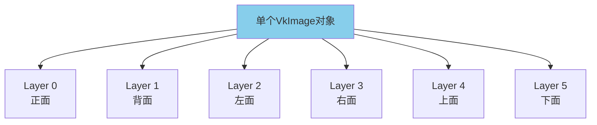

#### Usage（用途）

**作用**：定义Image的用途

| 用途标志 | 说明 | 使用场景 |
|---------|------|---------|
| `VK_IMAGE_USAGE_TRANSFER_SRC_BIT` | 传输源 | 拷贝到其他Image/Buffer |
| `VK_IMAGE_USAGE_TRANSFER_DST_BIT` | 传输目标 | 从其他Image/Buffer拷贝 |
| `VK_IMAGE_USAGE_SAMPLED_BIT` | 可采样 | 作为纹理使用 |
| `VK_IMAGE_USAGE_COLOR_ATTACHMENT_BIT` | 颜色附件 | 渲染目标 |
| `VK_IMAGE_USAGE_DEPTH_STENCIL_ATTACHMENT_BIT` | 深度模板附件 | 深度测试 |

#### Samples（采样数）

**作用**：抗锯齿设置

| 值 | 说明 | 使用场景 |
|-----|------|---------|
| `VK_SAMPLE_COUNT_1_BIT` | 无抗锯齿 | 默认设置 |
| `VK_SAMPLE_COUNT_4_BIT` | 4倍MSAA | 高质量抗锯齿 |
| `VK_SAMPLE_COUNT_8_BIT` | 8倍MSAA | 更高质量抗锯齿 |

#### Tiling（平铺方式）

**作用**：Image在内存中的存储方式

| Tiling | 说明 | 性能 |
|--------|------|------|
| `VK_IMAGE_TILING_LINEAR` | 线性存储 | 可直接访问，性能较低 |
| `VK_IMAGE_TILING_OPTIMAL` | 优化存储 | GPU最优，性能最高 |

**选择建议**：
- 纹理图片：使用`OPTIMAL`（Shader采样，不需要CPU访问）
- Staging Buffer：使用`LINEAR`（需要CPU写入数据）

### 5.6 Sampler（采样器）

**定义**：Sampler控制如何从纹理中采样颜色

**VkSamplerCreateInfo结构**：

```cpp
struct VkSamplerCreateInfo {
    VkStructureType sType;
    const void* pNext;
    VkFilter magFilter;              // 放大过滤
    VkFilter minFilter;              // 缩小过滤
    VkSamplerMipmapMode mipmapMode;  // Mipmap模式
    VkSamplerAddressMode addressModeU; // U方向包裹模式
    VkSamplerAddressMode addressModeV; // V方向包裹模式
    VkSamplerAddressMode addressModeW; // W方向包裹模式
    float mipLodBias;               // Mipmap LOD偏移
    float anisotropyEnable;          // 各向异性过滤
    float maxAnisotropy;            // 最大各向异性
    VkCompareOp compareOp;           // 比较操作
    float minLod;                   // 最小LOD
    float maxLod;                   // 最大LOD
    VkBorderColor borderColor;        // 边界颜色
    float unnormalizedCoordinates;     // 是否使用非归一化坐标
};
```

#### Filter（过滤模式）

| 模式 | 说明 | 效果 |
|------|------|------|
| `VK_FILTER_NEAREST` | 最近邻采样 | 像素化效果 |
| `VK_FILTER_LINEAR` | 线性插值 | 平滑效果 |

**示意图**：

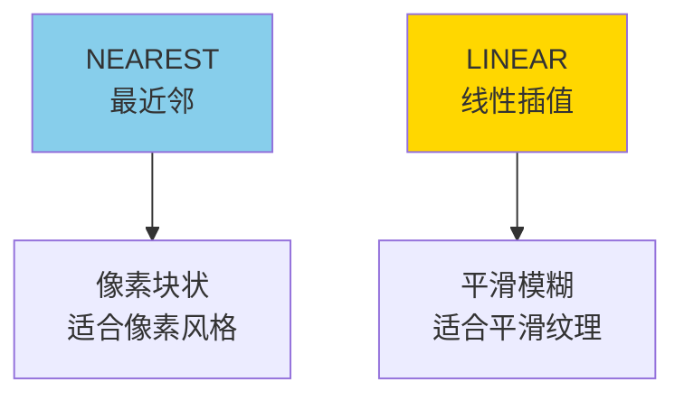

#### Address Mode（包裹模式）

| 模式 | 说明 | 效果 |
|------|------|------|
| `VK_SAMPLER_ADDRESS_MODE_REPEAT` | 重复 | 纹理重复平铺 |
| `VK_SAMPLER_ADDRESS_MODE_MIRRORED_REPEAT` | 镜像重复 | 镜像重复平铺 |
| `VK_SAMPLER_ADDRESS_MODE_CLAMP_TO_EDGE` | 钳位到边缘 | 边缘颜色 |
| `VK_SAMPLER_ADDRESS_MODE_CLAMP_TO_BORDER` | 钳位到边界 | 边界颜色 |

**示意图**：

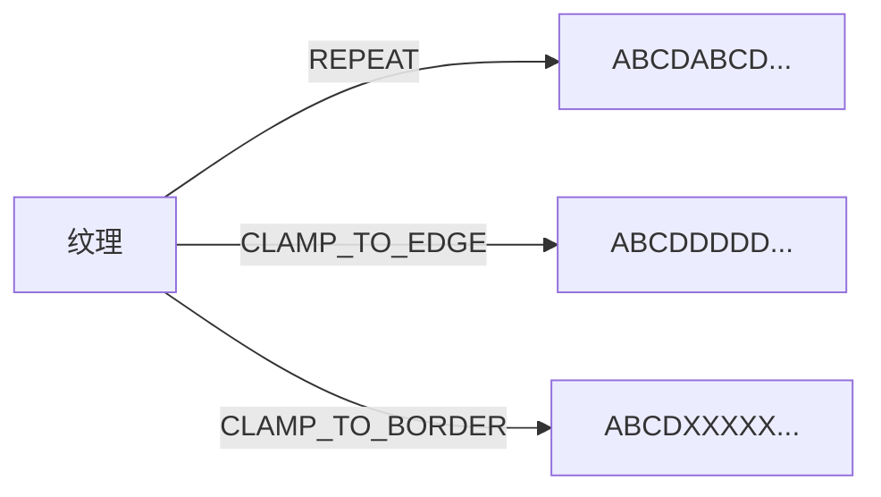

#### 完整Sampler创建示例

```cpp
VkSampler textureSampler;
VkSamplerCreateInfo samplerInfo{};
samplerInfo.sType = VK_STRUCTURE_TYPE_SAMPLER_CREATE_INFO;
samplerInfo.magFilter = VK_FILTER_LINEAR;
samplerInfo.minFilter = VK_FILTER_LINEAR;
samplerInfo.addressModeU = VK_SAMPLER_ADDRESS_MODE_REPEAT;
samplerInfo.addressModeV = VK_SAMPLER_ADDRESS_MODE_REPEAT;
samplerInfo.addressModeW = VK_SAMPLER_ADDRESS_MODE_REPEAT;
samplerInfo.anisotropyEnable = VK_TRUE;
samplerInfo.maxAnisotropy = 16.0f;
samplerInfo.borderColor = VK_BORDER_COLOR_INT_OPAQUE_BLACK;
samplerInfo.unnormalizedCoordinates = VK_FALSE;
samplerInfo.compareEnable = VK_FALSE;
samplerInfo.mipmapMode = VK_SAMPLER_MIPMAP_MODE_LINEAR;
samplerInfo.mipLodBias = 0.0f;
samplerInfo.minLod = 0.0f;
samplerInfo.maxLod = 0.0f;

vkCreateSampler(device, &samplerInfo, nullptr, &textureSampler);
```

## 6. 完整绘制工作流程

### 6.1 单帧渲染流程

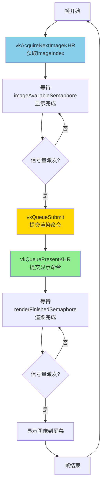

### 6.2 Command Buffer录制流程

```mermaid
graph TD
    A[vkBeginCommandBuffer] --> B[vkCmdBeginRenderPass]
    B --> C[vkCmdBindPipeline]
    C --> D[vkCmdBindVertexBuffers]
    D --> E[vkCmdBindIndexBuffer]
    E --> F[vkCmdBindDescriptorSets]
    F --> G[vkCmdPushConstants<br/>可选]
    G --> H[vkCmdDrawIndexed<br/>绘制物体1]
    
    H --> I{还有物体?}
    I -->|是| J[vkCmdBindDescriptorSets<br/>物体2]
    J --> K[vkCmdPushConstants<br/>物体2]
    K --> L[vkCmdDrawIndexed<br/>绘制物体2]
    L --> I
    
    I -->|否| M[vkCmdEndRenderPass]
    M --> N[vkEndCommandBuffer]
    
    style A fill:#87CEEB
    style N fill:#FFD700
```

### 6.3 多物体绘制示例

```cpp
// 录制Command Buffer
vkBeginCommandBuffer(commandBuffer, &beginInfo);

// 开始RenderPass
vkCmdBeginRenderPass(commandBuffer, &renderPassInfo, VK_SUBPASS_CONTENTS_INLINE);

// 绑定Pipeline
vkCmdBindPipeline(commandBuffer, VK_PIPELINE_BIND_POINT_GRAPHICS, pipeline);

// 绑定顶点Buffer
VkBuffer vertexBuffers[] = {vertexBuffer};
VkDeviceSize offsets[] = {0};
vkCmdBindVertexBuffers(commandBuffer, 0, 1, vertexBuffers, offsets);

// 绑定索引Buffer
vkCmdBindIndexBuffer(commandBuffer, indexBuffer, 0, VK_INDEX_TYPE_UINT32);

// 绘制物体1
vkCmdBindDescriptorSets(commandBuffer, VK_PIPELINE_BIND_POINT_GRAPHICS, 
                      pipelineLayout, 0, 1, &descriptorSet1, 0, nullptr);
vkCmdDrawIndexed(commandBuffer, indexCount1, 1, 0, 0, 0);

// 绘制物体2
vkCmdBindDescriptorSets(commandBuffer, VK_PIPELINE_BIND_POINT_GRAPHICS, 
                      pipelineLayout, 0, 1, &descriptorSet2, 0, nullptr);
vkCmdDrawIndexed(commandBuffer, indexCount2, 1, 0, 0, 0);

// 绘制物体3
vkCmdBindDescriptorSets(commandBuffer, VK_PIPELINE_BIND_POINT_GRAPHICS, 
                      pipelineLayout, 0, 1, &descriptorSet3, 0, nullptr);
vkCmdPushConstants(commandBuffer, pipelineLayout, VK_SHADER_STAGE_VERTEX_BIT,
                0, sizeof(pushConstant), &pushConstantData);
vkCmdDrawIndexed(commandBuffer, indexCount3, 1, 0, 0, 0);

// 结束RenderPass
vkCmdEndRenderPass(commandBuffer);

// 结束Command Buffer录制
vkEndCommandBuffer(commandBuffer);
```

### 6.4 资源引用与数据流

```mermaid
graph LR
    A[Uniform Buffer<br/>VP] -->|Descriptor 0<br/>Binding 0| B[Descriptor Set 1<br/>物体1]
    C[Uniform Buffer<br/>Model1] -->|Descriptor 1<br/>Binding 1| B
    D[Texture] -->|Descriptor 2<br/>Binding 2| B
    
    A -->|Descriptor 0<br/>Binding 0| E[Descriptor Set 2<br/>物体2]
    F[Uniform Buffer<br/>Model2] -->|Descriptor 1<br/>Binding 1| E
    D -->|Descriptor 2<br/>Binding 2| E
    
    B -->|vkCmdBindDescriptorSets| G[Command Buffer]
    E -->|vkCmdBindDescriptorSets| G
    
    H[Pipeline<br/>包含Descriptor Set Layout] --> G
    I[Vertex Buffer] -->|vkCmdBindVertexBuffers| G
    J[Index Buffer] -->|vkCmdBindIndexBuffer| G
    
    G --> K[GPU执行]
```

### 6.5 Shader数据访问流程

```mermaid
sequenceDiagram
    participant Shader as Shader执行
    participant Pipe as Pipeline Layout
    participant DSL as Descriptor Set Layout
    participant DS as Descriptor Set
    participant Desc as Descriptor
    participant Buffer as Uniform Buffer
    
    Shader->>Shader: 需要binding=0的VP数据
    
    Shader->>Pipe: 查询binding=0是否存在
    Pipe->>DSL: 检查Descriptor Set Layout
    DSL-->>Pipe: binding=0存在，类型UNIFORM_BUFFER
    Pipe-->>Shader: 确认存在
    
    Shader->>DS: 获取binding=0的Descriptor
    DS-->>Shader: 返回Descriptor 0
    
    Shader->>Desc: 获取Buffer信息
    Desc-->>Shader: buffer=handle, offset=0, range=128bytes
    
    Shader->>Buffer: 读取128bytes数据
    Buffer-->>Shader: 返回VP数据
    
    Shader->>Shader: 数据赋值给vp变量
    Shader->>Shader: 继续执行
```

## 7. 最佳实践与性能优化

### 7.1 Command Buffer优化

| 优化策略 | 说明 |
|---------|------|
| **重用Command Buffer** | 避免每帧重新录制 |
| **多线程录制** | 使用Secondary Command Buffer并行录制 |
| **批量提交** | 多个物体使用同一个Command Buffer |
| **最小化State Change** | 减少Pipeline、Descriptor切换 |

### 7.2 Descriptor Set优化

| 优化策略 | 说明 |
|---------|------|
| **Descriptor Pool预分配** | 避免运行时分配 |
| **复用公共Descriptor** | VP Uniform、Texture等共享 |
| **按需创建** | 只为需要的物体创建Descriptor Set |
| **批量更新** | 使用vkUpdateDescriptorSets批量更新 |

### 7.3 同步优化

| 优化策略 | 说明 |
|---------|------|
| **最小化Barrier** | 只在必要时插入 |
| **精确等待Stage** | 只在关键阶段等待 |
| **利用RenderPass自动转换** | 避免手动插入Layout转换Barrier |
| **Pipeline Barrier替代Fence** | Fence更昂贵，尽量使用Semaphore

### 7.4 Image优化

| 优化策略 | 说明 |
|---------|------|
| **使用Staging Buffer** | GPU专用显存+CPU可见缓冲 |
| **OPTIMAL Tiling** | 纹理使用最优平铺方式 |
| **Mipmap生成** | 提高远距离渲染质量 |
| **各向异性过滤** | 提高斜视角纹理质量 |

### 7.5 常见问题与解决

#### 问题1：顶点数据错乱

**原因**：Stride或Offset设置错误

**解决**：
- 检查Binding Description的Stride
- 检查Attribute Description的Offset
- 确保与内存布局一致

#### 问题2：Uniform数据未生效

**原因**：Descriptor Set绑定或更新错误

**解决**：
- 检查Descriptor Set Layout与Shader匹配
- 确保Descriptor已更新到Set
- 确认在绘制前绑定了正确的Set

#### 问题3：渲染闪烁或撕裂

**原因**：同步设置不正确

**解决**：
- 检查Semaphore的等待和激发
- 确认waitStageMask设置正确
- 验证Image Layout转换

#### 问题4：纹理采样错误

**原因**：Image Layout或Sampler设置错误

**解决**：
- 确认Image Layout为SHADER_READ_ONLY_OPTIMAL
- 检查Sampler的过滤和包裹模式
- 验证Descriptor中ImageInfo的正确性

## 8. 总结

### 核心组件

1. **Command Buffer**：录制和提交GPU指令
   - Primary：直接提交
   - Secondary：多线程录制

2. **顶点描述系统**：
   - Binding Description：Stride和InputRate
   - Attribute Description：Location和Offset

3. **描述符系统**：
   - Descriptor：资源描述
   - Descriptor Set Layout：布局模板
   - Descriptor Set：具体集合
   - Pipeline Layout：包含布局信息

4. **同步机制**：
   - Semaphore：大Stage同步
   - Barrier：细粒度内存同步
   - RenderPass自动Layout转换

5. **Image与Sampler系统**：
   - VkImage：图像句柄
   - VkDeviceMemory：显存空间
   - VkImageView：访问控制器
   - Sampler：采样器配置

### 绘制核心流程

```
1. 获取图像 → 2. 录制Command → 3. 设置同步 → 
4. 提交渲染 → 5. GPU执行 → 6. 显示到屏幕
```

### 关键原则

- **配置与数据分离**：Layout和Set分离
- **多线程录制**：充分利用CPU多核
- **精确同步**：只在必要时同步
- **资源复用**：公共Descriptor和Buffer
- **GPU乱序执行**：需要Barrier保证顺序
- **Image布局转换**：使用Staging Buffer作为跳板

通过Command Buffer、顶点描述、描述符系统、同步机制和Image/Sampler系统的协同工作，Vulkan实现了高效、灵活的渲染流程。理解这些核心组件是掌握Vulkan绘制的关键。
