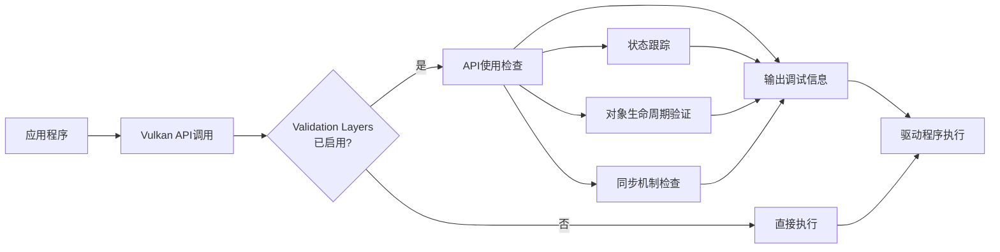
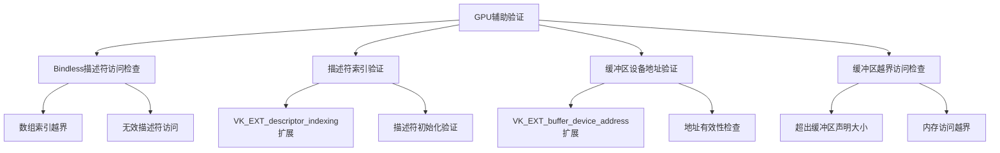
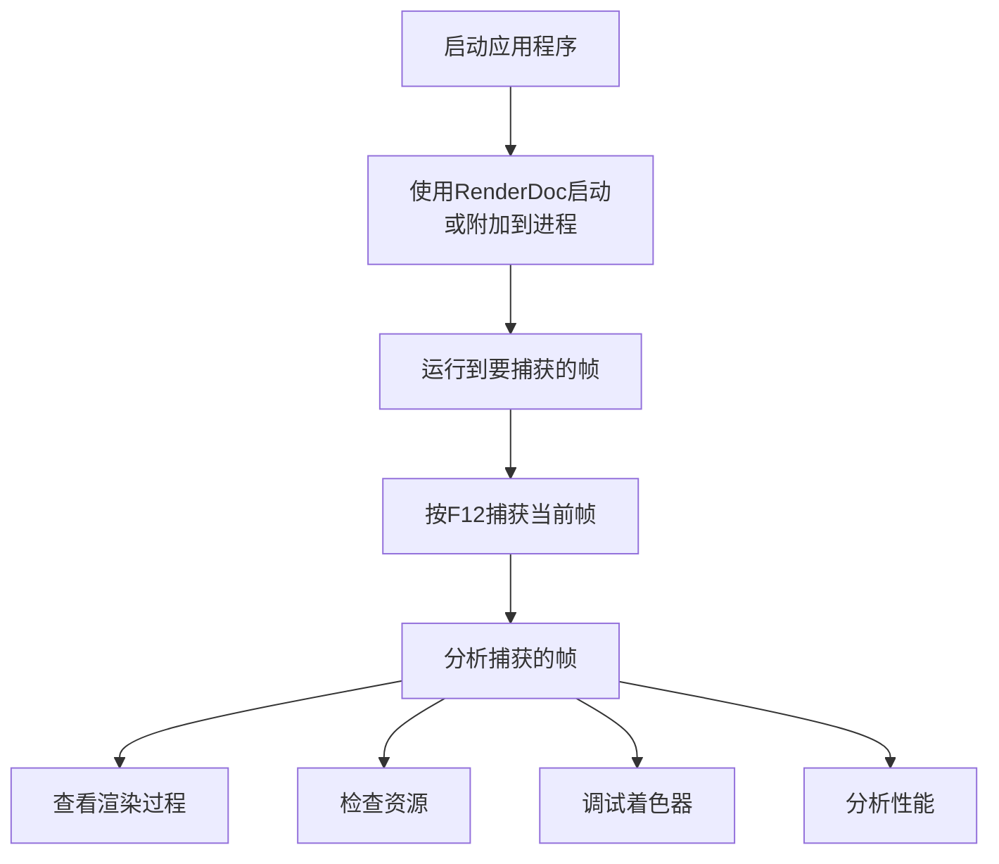
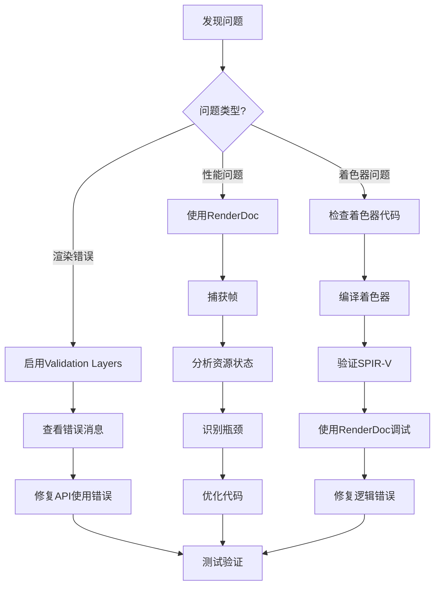

# Vulkan开发指南

## 1. 调试工具

Vulkan提供了多种调试工具来帮助开发者发现和解决问题。由于Vulkan的显式性和复杂性，合理使用调试工具至关重要。

### 1.1 Validation Layers（验证层）

**概述**：
Validation Layers是Vulkan开发中最重要、最基础的调试工具。它们在Vulkan API调用时进行检查，验证应用程序是否正确使用API。

**工作原理**：



**主要检查类型**：

| 检查类型 | 说明 | 示例 |
|---------|------|------|
| **参数验证** | 检查API参数是否合法 | 句柄非空、枚举值有效、指针有效 |
| **状态跟踪** | 跟踪对象状态变化 | 对象未初始化就使用、重复销毁 |
| **对象生命周期** | 验证对象的创建和销毁顺序 | 使用已销毁的对象 |
| **内存访问** | 检查内存访问越界 | 超出缓冲区边界访问 |
| **同步验证** | 验证同步原语的使用 | 未等待信号量就提交命令 |
| **描述符验证** | 检查描述符使用是否正确 | 绑定未更新的描述符集 |

**启用Validation Layers**：

```cpp
// 检查是否支持验证层
const std::vector<const char*> validationLayers = {
    "VK_LAYER_KHRONOS_validation"
};

bool checkValidationLayerSupport() {
    uint32_t layerCount;
    vkEnumerateInstanceLayerProperties(&layerCount, nullptr);

    std::vector<VkLayerProperties> availableLayers(layerCount);
    vkEnumerateInstanceLayerProperties(&layerCount, availableLayers.data());

    for (const char* layerName : validationLayers) {
        bool layerFound = false;
        for (const auto& layerProperties : availableLayers) {
            if (strcmp(layerName, layerProperties.layerName) == 0) {
                layerFound = true;
                break;
            }
        }
        if (!layerFound) {
            return false;
        }
    }
    return true;
}

// 创建实例时启用验证层
VkInstanceCreateInfo createInfo = {};
createInfo.sType = VK_STRUCTURE_TYPE_INSTANCE_CREATE_INFO;
createInfo.enabledLayerCount = static_cast<uint32_t>(validationLayers.size());
createInfo.ppEnabledLayerNames = validationLayers.data();
```

**创建调试回调**：

```cpp
VkResult CreateDebugUtilsMessengerEXT(
    VkInstance instance,
    const VkDebugUtilsMessengerCreateInfoEXT* pCreateInfo,
    const VkAllocationCallbacks* pAllocator,
    VkDebugUtilsMessengerEXT* pDebugMessenger) {
    
    auto func = (PFN_vkCreateDebugUtilsMessengerEXT)
        vkGetInstanceProcAddr(instance, "vkCreateDebugUtilsMessengerEXT");
    if (func != nullptr) {
        return func(instance, pCreateInfo, pAllocator, pDebugMessenger);
    } else {
        return VK_ERROR_EXTENSION_NOT_PRESENT;
    }
}

// 设置调试回调
static VKAPI_ATTR VkBool32 VKAPI_CALL debugCallback(
    VkDebugUtilsMessageSeverityFlagBitsEXT messageSeverity,
    VkDebugUtilsMessageTypeFlagsEXT messageType,
    const VkDebugUtilsMessengerCallbackDataEXT* pCallbackData,
    void* pUserData) {
    
    std::cerr << "validation layer: " << pCallbackData->pMessage << std::endl;
    return VK_FALSE;
}

void populateDebugMessengerCreateInfo(
    VkDebugUtilsMessengerCreateInfoEXT& createInfo) {
    
    createInfo = {};
    createInfo.sType = VK_STRUCTURE_TYPE_DEBUG_UTILS_MESSENGER_CREATE_INFO_EXT;
    createInfo.messageSeverity =
        VK_DEBUG_UTILS_MESSAGE_SEVERITY_VERBOSE_BIT_EXT |
        VK_DEBUG_UTILS_MESSAGE_SEVERITY_WARNING_BIT_EXT |
        VK_DEBUG_UTILS_MESSAGE_SEVERITY_ERROR_BIT_EXT;
    createInfo.messageType =
        VK_DEBUG_UTILS_MESSAGE_TYPE_GENERAL_BIT_EXT |
        VK_DEBUG_UTILS_MESSAGE_TYPE_VALIDATION_BIT_EXT |
        VK_DEBUG_UTILS_MESSAGE_TYPE_PERFORMANCE_BIT_EXT;
    createInfo.pfnUserCallback = debugCallback;
}
```

**消息严重级别**：

```cpp
// 可以根据需要调整消息级别
createInfo.messageSeverity =
    VK_DEBUG_UTILS_MESSAGE_SEVERITY_INFO_BIT_EXT |      // 信息
    VK_DEBUG_UTILS_MESSAGE_SEVERITY_WARNING_BIT_EXT |    // 警告
    VK_DEBUG_UTILS_MESSAGE_SEVERITY_ERROR_BIT_EXT;       // 错误

// 开发阶段：启用所有级别
// 发布阶段：只启用WARNING和ERROR
```

**配置Validation Layers**：

可以通过环境变量或代码配置验证层的行为：

```cpp
// 通过代码设置（在启用验证层之前）
const char* validationConfig[] = {
    "VK_LAYER_KHRONOS_validation"
};

// 设置过滤器
VkLayerSettingEXT layerSetting = {};
layerSetting.pLayerName = "VK_LAYER_KHRONOS_validation";
layerSetting.pSettingName = "validate_sync";
layerSetting.type = VK_LAYER_SETTING_TYPE_BOOL32_EXT;
layerSetting.valueCount = 1;
VkBool32 value = VK_TRUE;
layerSetting.pValues = &value;
```

**最佳实践**：

✅ **开发阶段**：
- 始终启用Validation Layers
- 启用所有消息级别（VERBOSE、INFO、WARNING、ERROR）
- 使用调试回调输出详细信息

⚠️ **发布阶段**：
- 禁用Validation Layers（性能优化）
- 或只启用WARNING和ERROR级别
- 避免影响性能

### 1.2 GPU辅助验证（GPU-Assisted Validation）

**概述**：
GPU辅助验证通过修改着色器来在GPU端检查API使用错误。它可以检测到CPU端验证层无法发现的问题。

**检测的问题类型**：



**启用GPU辅助验证**：

```cpp
// 在设备创建时启用
VkDeviceCreateInfo deviceCreateInfo = {};
deviceCreateInfo.sType = VK_STRUCTURE_TYPE_DEVICE_CREATE_INFO;

// 启用GPU验证特性
VkPhysicalDeviceFeatures2 deviceFeatures2 = {};
deviceFeatures2.sType = VK_STRUCTURE_TYPE_PHYSICAL_DEVICE_FEATURES_2;

VkPhysicalDeviceShaderAtomicFloatFeaturesEXT atomicFloatFeatures = {};
atomicFloatFeatures.sType = VK_STRUCTURE_TYPE_PHYSICAL_DEVICE_SHADER_ATOMIC_FLOAT_FEATURES_EXT;

// 链接pNext链
deviceFeatures2.pNext = &atomicFloatFeatures;
```

**注意事项**：
- GPU验证会显著影响性能（10-100倍）
- 仅在调试阶段使用
- 某些GPU可能不支持所有验证功能

### 1.3 RenderDoc

**概述**：
RenderDoc是一个强大的图形调试器，支持Vulkan、DirectX 11/12、OpenGL等API。它可以捕获帧、检查资源、查看着色器代码等。

**安装**：
- **Windows**：从 https://renderdoc.org 下载安装包
- **Linux**：`sudo apt install renderdoc` 或从源码编译
- **macOS**：通过Homebrew安装 `brew install renderdoc`（不推荐，官方并没有支持Mac）

**使用流程**：



**主要功能**：

1. **帧捕获**：
   - 捕获单帧或连续多帧
   - 保存到.rdc文件供后续分析

2. **资源检查**：
   - 查看所有缓冲区、图像、纹理内容
   - 查看缓冲区格式化的数据
   - 查看图像的各个Mip级别和数组层

3. **渲染过程分析**：
   - 查看所有绘制调用
   - 检查每个Pass的输入/输出
   - 追踪资源变化

4. **着色器调试**：
   - 查看重绕译后的SPIR-V代码
   - 查看重绕译后的GLSL/HLSL代码
   - 逐步调试着色器（部分支持）

5. **性能分析**：
   - 查看GPU时间线
   - 识别性能瓶颈
   - 分析API调用开销

**捕获配置**：

```cpp
// 使用RenderDoc API进行程序化捕获
#include <renderdoc_app.h>

RENDERDOC_API_1_4_1* rdoc_api = nullptr;

// 获取RenderDoc API
if(HMODULE mod = LoadLibraryA("renderdoc.dll")) {
    pRENDERDOC_GetAPI RENDERDOC_GetAPI =
        (pRENDERDOC_GetAPI)GetProcAddress(mod, "RENDERDOC_GetAPI");
    int ret = RENDERDOC_GetAPI(eRENDERDOC_API_Version_1_4_1, (void**)&rdoc_api);
}

// 设置捕获选项
rdoc_api->SetCaptureOptionUF(CAPTURE_OPTION_API_VALIDATION, 1);
rdoc_api->SetCaptureOptionUF(CAPTURE_OPTION_CAPTURE_CALLSTACKS, 1);
rdoc_api->SetCaptureOptionUF(CAPTURE_OPTION_REF_ALL_RESOURCES, 1);

// 触发捕获
rdoc_api->TriggerCapture();
```

**常见调试场景**：

| 问题 | RenderDoc解决方案 |
|-----|-------------------|
| 渲染结果不正确 | 检查资源内容、验证着色器输出 |
| 性能问题 | 查看GPU时间线、分析绘制调用 |
| 着色器错误 | 查看重绕译代码、调试着色器 |
| 内存问题 | 检查资源状态和布局转换 |
| 同步问题 | 查看事件时间线、分析信号量 |

### 1.4 其他调试工具

**Nsight Graphics（NVIDIA）**：
- NVIDIA官方图形调试器
- 深度集成NVIDIA GPU特性
- 提供详细的性能分析

**PIX（Microsoft）**：
- DirectX调试工具，支持Vulkan
- 在Windows平台上功能强大
- 提供详细的GPU Trace

**Tracy Profiler**：
- 轻量级性能分析器
- 支持CPU和GPU分析
- 可视化性能数据

---

## 2. 开发注意事项

### 2.1 同步机制

**常见陷阱**：

```cpp
// ❌ 错误：未等待就提交命令
vkQueueSubmit(queue, 1, &submitInfo, fence);
vkQueueWaitIdle(queue);  // 漏掉同步！

// ✅ 正确：使用信号量和栅栏
vkQueueSubmit(queue, 1, &submitInfo, fence);
vkWaitForFences(device, 1, &fence, VK_TRUE, UINT64_MAX);

// 或使用信号量
vkQueueSubmit(queue, 1, &submitInfo, VK_NULL_HANDLE);
vkQueuePresentKHR(queue, &presentInfo);
```

**内存屏障的重要性**：

```cpp
// ❌ 错误：缺少内存屏障
vkCmdPipelineBarrier(commandBuffer, ...);  // 源阶段：VK_PIPELINE_STAGE_TOP_OF_PIPE_BIT
// 写入图像后立即读取 -> 未定义行为！

// ✅ 正确：添加适当的内存屏障
VkImageMemoryBarrier barrier = {};
barrier.sType = VK_STRUCTURE_TYPE_IMAGE_MEMORY_BARRIER;
barrier.srcAccessMask = VK_ACCESS_TRANSFER_WRITE_BIT;
barrier.dstAccessMask = VK_ACCESS_SHADER_READ_BIT;
barrier.oldLayout = VK_IMAGE_LAYOUT_TRANSFER_DST_OPTIMAL;
barrier.newLayout = VK_IMAGE_LAYOUT_SHADER_READ_ONLY_OPTIMAL;
barrier.srcQueueFamilyIndex = VK_QUEUE_FAMILY_IGNORED;
barrier.dstQueueFamilyIndex = VK_QUEUE_FAMILY_IGNORED;
barrier.image = image;
barrier.subresourceRange = {VK_IMAGE_ASPECT_COLOR_BIT, 0, 1, 0, 1};

vkCmdPipelineBarrier(
    commandBuffer,
    VK_PIPELINE_STAGE_TRANSFER_BIT,
    VK_PIPELINE_STAGE_FRAGMENT_SHADER_BIT,
    0,
    0, nullptr,
    0, nullptr,
    1, &barrier
);
```

**SubPass依赖**：

```cpp
// ❌ 错误：未设置SubPass依赖
VkSubpassDependency dependency = {};
dependency.srcSubpass = VK_SUBPASS_EXTERNAL;
dependency.dstSubpass = 0;
dependency.srcStageMask = VK_PIPELINE_STAGE_COLOR_ATTACHMENT_OUTPUT_BIT;
dependency.dstStageMask = VK_PIPELINE_STAGE_FRAGMENT_SHADER_BIT;
dependency.srcAccessMask = 0;
dependency.dstAccessMask = VK_ACCESS_SHADER_READ_BIT;
// 漏掉dependencyMask！

// ✅ 正确：设置完整的依赖
VkSubpassDependency dependency = {};
dependency.srcSubpass = VK_SUBPASS_EXTERNAL;
dependency.dstSubpass = 0;
dependency.srcStageMask = VK_PIPELINE_STAGE_COLOR_ATTACHMENT_OUTPUT_BIT;
dependency.dstStageMask = VK_PIPELINE_STAGE_FRAGMENT_SHADER_BIT;
dependency.srcAccessMask = 0;
dependency.dstAccessMask = VK_ACCESS_SHADER_READ_BIT;
dependency.dependencyFlags = VK_DEPENDENCY_BY_REGION_BIT;
```

### 2.2 资源管理

**对象生命周期管理**：

```cpp
// ❌ 错误：过早销毁对象
vkDestroyImageView(device, imageView, nullptr);
vkDestroyImage(device, image, nullptr);
// 还在使用imageView时就销毁了！

// ✅ 正确：按依赖关系销毁
// 确保GPU完成所有使用
vkDeviceWaitIdle(device);
vkDestroyImageView(device, imageView, nullptr);
vkDestroyImage(device, image, nullptr);
vkFreeMemory(device, imageMemory, nullptr);
```

**内存泄漏检测**：

```cpp
// 使用Validation Layers检测内存泄漏
// 在程序退出时检查是否有未释放的资源

// 手动跟踪资源（推荐）
class ResourceManager {
public:
    ~ResourceManager() {
        // 析构时自动清理所有资源
        for (auto& buffer : buffers) {
            vkDestroyBuffer(device, buffer, nullptr);
        }
        for (auto& memory : memories) {
            vkFreeMemory(device, memory, nullptr);
        }
    }

private:
    VkDevice device;
    std::vector<VkBuffer> buffers;
    std::vector<VkDeviceMemory> memories;
};
```

### 2.3 描述符管理

**描述符越界访问**：

```cpp
// ❌ 错误：访问越界的描述符
// uniform BufferData data[10];
// 只绑定了5个描述符
uint32_t index = 7;  // 越界！
color = data[index].color;

// ✅ 正确：检查描述符数量
struct PushConstants {
    uint32_t descriptorCount;
};
void setPushConstants(uint32_t count) {
    vkCmdPushConstants(commandBuffer, layout, ..., &count);
}

// 在着色器中检查
layout(push_constant) uniform PushConsts {
    uint32_t descriptorCount;
} pushConsts;

if (index < pushConsts.descriptorCount) {
    color = data[index].color;
}
```

**描述符更新问题**：

```cpp
// ❌ 错误：忘记更新描述符集
vkAllocateDescriptorSets(device, &allocInfo, &descriptorSet);
// 没有调用vkUpdateDescriptorSets！

// ✅ 正确：更新描述符集
VkDescriptorBufferInfo bufferInfo = {};
bufferInfo.buffer = uniformBuffer;
bufferInfo.offset = 0;
bufferInfo.range = sizeof(UniformBufferObject);

VkWriteDescriptorSet descriptorWrite = {};
descriptorWrite.sType = VK_STRUCTURE_TYPE_WRITE_DESCRIPTOR_SET;
descriptorWrite.dstSet = descriptorSet;
descriptorWrite.dstBinding = 0;
descriptorWrite.dstArrayElement = 0;
descriptorWrite.descriptorType = VK_DESCRIPTOR_TYPE_UNIFORM_BUFFER;
descriptorWrite.descriptorCount = 1;
descriptorWrite.pBufferInfo = &bufferInfo;

vkUpdateDescriptorSets(device, 1, &descriptorWrite, 0, nullptr);
```

### 2.4 着色器问题

**着色器编译错误**：

```bash
# 使用glslangValidator编译着色器
glslangValidator shader.vert -V -o shader.vert.spv

# 常见错误
# - 未定义的变量
# - 类型不匹配
# - 版本不支持
# - 扩展未启用
```

**SPIR-V验证**：

```bash
# 验证SPIR-V字节码
spirv-val shader.vert.spv

# 常见错误
# - 非法指令
# - 类型不匹配
# - 内存布局问题
```

**着色器调试技巧**：

```glsl
// 使用调试颜色
vec3 debugColor = vec3(1.0, 0.0, 0.0);  // 红色表示错误
if (errorCondition) {
    outColor = vec4(debugColor, 1.0);
    return;
}

// 输出调试信息到颜色
outColor = vec4(debugValue, debugValue, debugValue, 1.0);

// 使用uvec2输出调试数据
layout(location = 0) out uvec2 debugData;
debugData = uvec2(threadId.x, threadId.y);
```

---

## 3. 最佳实践

### 3.1 性能优化

**命令缓冲区录制**：

```cpp
// ✅ 预录制动状态命令
void recordStaticCommands(VkCommandBuffer commandBuffer) {
    vkBeginCommandBuffer(commandBuffer, &beginInfo);
    
    // 录制动状态命令
    vkCmdBindPipeline(commandBuffer, ...);
    vkCmdBindDescriptorSets(commandBuffer, ...);
    vkCmdBindVertexBuffers(commandBuffer, ...);
    
    vkEndCommandBuffer(commandBuffer);
}

// ✅ 多线程录制命令缓冲区
std::vector<std::thread> threads;
for (int i = 0; i < threadCount; ++i) {
    threads.emplace_back([&, i]() {
        recordCommandBuffer(commandBuffers[i], i);
    });
}
for (auto& thread : threads) {
    thread.join();
}
```

**资源复用**：

```cpp
// ✅ 使用描述符池
VkDescriptorPoolSize poolSize = {};
poolSize.type = VK_DESCRIPTOR_TYPE_UNIFORM_BUFFER;
poolSize.descriptorCount = 1000;  // 预分配足够多

VkDescriptorPoolCreateInfo poolInfo = {};
poolInfo.sType = VK_STRUCTURE_TYPE_DESCRIPTOR_POOL_CREATE_INFO;
poolInfo.poolSizeCount = 1;
poolInfo.pPoolSizes = &poolSize;
poolInfo.maxSets = 100;

vkCreateDescriptorPool(device, &poolInfo, nullptr, &descriptorPool);

// ✅ 复用命令缓冲区
// 不要每帧都创建新的命令缓冲区
vkAllocateCommandBuffers(device, &allocInfo, commandBuffers);

// 每帧重置命令缓冲区
vkResetCommandBuffer(commandBuffer, 0);
```

**内存管理**：

```cpp
// ✅ 使用内存分配器
// 推荐：VMA (Vulkan Memory Allocator)
#include <vk_mem_alloc.h>

VmaAllocator allocator;
VmaAllocatorCreateInfo allocatorInfo = {};
allocatorInfo.vulkanApiVersion = VK_API_VERSION_1_2;
allocatorInfo.physicalDevice = physicalDevice;
allocatorInfo.device = device;
allocatorInfo.instance = instance;

vmaCreateAllocator(&allocatorInfo, &allocator);

// 分配缓冲区
VkBufferCreateInfo bufferInfo = {};
VmaAllocationCreateInfo allocInfo = {};
allocInfo.usage = VMA_MEMORY_USAGE_GPU_ONLY;

VkBuffer buffer;
VmaAllocation allocation;
vmaCreateBuffer(allocator, &bufferInfo, &allocInfo, &buffer, &allocation, nullptr);

// 释放内存
vmaDestroyBuffer(allocator, buffer, allocation);
vmaDestroyAllocator(allocator);
```

**Pipeline缓存**：

```cpp
// ✅ 使用Pipeline缓存
VkPipelineCacheCreateInfo cacheInfo = {};
cacheInfo.sType = VK_STRUCTURE_TYPE_PIPELINE_CACHE_CREATE_INFO;

// 从文件加载缓存数据
// if (cacheFile) {
//     cacheInfo.initialDataSize = cacheSize;
//     cacheInfo.pInitialData = cacheData;
// }

VkPipelineCache pipelineCache;
vkCreatePipelineCache(device, &cacheInfo, nullptr, &pipelineCache);

// 创建Pipeline时使用缓存
pipelineCreateInfo.pCache = pipelineCache;

// 保存缓存到文件
size_t cacheSize;
vkGetPipelineCacheData(device, pipelineCache, &cacheSize, nullptr);
std::vector<char> cacheData(cacheSize);
vkGetPipelineCacheData(device, pipelineCache, &cacheSize, cacheData.data());
// 保存cacheData到文件
```

### 3.2 错误处理

**错误检查宏**：

```cpp
#define VK_CHECK(x)                                                     \
    do {                                                                 \
        VkResult err = x;                                                \
        if (err) {                                                       \
            std::cerr << "Vulkan error: " << err << " at " << __FILE__  \
                      << ":" << __LINE__ << std::endl;                   \
            std::abort();                                               \
        }                                                                \
    } while (0)

// 使用
VK_CHECK(vkCreateDevice(physicalDevice, &createInfo, nullptr, &device));
```

**RAII封装**：

```cpp
class VulkanBuffer {
public:
    VulkanBuffer(VkDevice device, VkPhysicalDevice physicalDevice,
                 VkDeviceSize size, VkBufferUsageFlags usage)
        : device_(device), size_(size) {
        VkBufferCreateInfo bufferInfo = {};
        bufferInfo.sType = VK_STRUCTURE_TYPE_BUFFER_CREATE_INFO;
        bufferInfo.size = size;
        bufferInfo.usage = usage;
        bufferInfo.sharingMode = VK_SHARING_MODE_EXCLUSIVE;

        VK_CHECK(vkCreateBuffer(device, &bufferInfo, nullptr, &buffer_));
    }

    ~VulkanBuffer() {
        if (buffer_) {
            vkDestroyBuffer(device_, buffer_, nullptr);
        }
    }

    // 禁止拷贝
    VulkanBuffer(const VulkanBuffer&) = delete;
    VulkanBuffer& operator=(const VulkanBuffer&) = delete;

    // 允许移动
    VulkanBuffer(VulkanBuffer&& other) noexcept
        : device_(other.device_), buffer_(other.buffer_),
          size_(other.size_), memory_(other.memory_) {
        other.buffer_ = VK_NULL_HANDLE;
        other.memory_ = VK_NULL_HANDLE;
    }

    VkBuffer handle() const { return buffer_; }
    VkDeviceMemory memory() const { return memory_; }
    VkDeviceSize size() const { return size_; }

private:
    VkDevice device_;
    VkBuffer buffer_ = VK_NULL_HANDLE;
    VkDeviceMemory memory_ = VK_NULL_HANDLE;
    VkDeviceSize size_;
};
```

### 3.3 跨平台开发

**macOS注意事项**：

```cpp
// macOS必须启用的扩展
const std::vector<const char*> requiredExtensions = {
    VK_KHR_SURFACE_EXTENSION_NAME,
    VK_KHR_PORTABILITY_ENUMERATION_EXTENSION_NAME
};

// 创建实例时设置标志
VkInstanceCreateInfo createInfo = {};
createInfo.sType = VK_STRUCTURE_TYPE_INSTANCE_CREATE_INFO;
createInfo.flags = VK_INSTANCE_CREATE_ENUMERATE_PORTABILITY_BIT_KHR;

// 设备必须启用VK_KHR_portability_subset扩展
const std::vector<const char*> deviceExtensions = {
    VK_KHR_SWAPCHAIN_EXTENSION_NAME,
    VK_KHR_PORTABILITY_SUBSET_EXTENSION_NAME
};
```

**平台特定的扩展**：

```cpp
std::vector<const char*> getRequiredExtensions() {
    uint32_t glfwExtensionCount = 0;
    const char** glfwExtensions =
        glfwGetRequiredInstanceExtensions(&glfwExtensionCount);

    std::vector<const char*> extensions(glfwExtensions,
                                       glfwExtensions + glfwExtensionCount);

#ifdef __APPLE__
    extensions.push_back(VK_KHR_PORTABILITY_ENUMERATION_EXTENSION_NAME);
#endif

    return extensions;
}
```

### 3.4 Shader优化

**Uniform缓冲区布局**：

```glsl
// ❌ 错误：非标准布局
struct UniformData {
    vec3 position;  // 对齐到16字节
    float padding;
    vec3 color;
    float padding2;
};

// ✅ 正确：使用std140布局
layout(std140, binding = 0) uniform UniformBlock {
    vec3 position;
    float _padding1;  // 显式填充
    vec3 color;
    float _padding2;
} ubo;
```

**描述符绑定优化**：

```glsl
// ✅ 使用描述符索引扩展
#extension GL_EXT_descriptor_indexing : enable

layout(set = 0, binding = 0) uniform sampler2D textures[];
// 非绑定描述符访问
vec4 color = texture(textures[nonUniformExt(textureIndex)], uv);

// CPU端需要启用相应特性
VkPhysicalDeviceDescriptorIndexingFeatures indexingFeatures = {};
indexingFeatures.sType = VK_STRUCTURE_TYPE_PHYSICAL_DEVICE_DESCRIPTOR_INDEXING_FEATURES;
indexingFeatures.shaderUniformBufferArrayNonUniformIndexing = VK_TRUE;
```

**Subgroup优化**：

```glsl
// ✅ 使用Subgroup进行并行计算
layout(local_size_x = 256) in;
void main() {
    uint localId = gl_SubgroupInvocationID;
    
    // Subgroup操作
    float sum = subgroupAdd(localData[localId]);
    
    // Subgroup操作比全局原子操作快得多
}
```

---

## 4. 常见问题与解答（Q&A）

### 4.1 初始化问题

**Q: vkCreateInstance返回VK_ERROR_EXTENSION_NOT_PRESENT**

A: 检查：
1. 安装的GPU驱动是否支持Vulkan
2. 是否安装了Vulkan SDK
3. 是否正确查询了可用扩展

```cpp
// 查询可用扩展
uint32_t extensionCount = 0;
vkEnumerateInstanceExtensionProperties(nullptr, &extensionCount, nullptr);
std::vector<VkExtensionProperties> extensions(extensionCount);
vkEnumerateInstanceExtensionProperties(nullptr, &extensionCount, extensions.data());

// 打印所有可用扩展
for (const auto& ext : extensions) {
    std::cout << "\t" << ext.extensionName << std::endl;
}
```

**Q: vkCreateDevice返回VK_ERROR_INITIALIZATION_FAILED**

A: 可能原因：
1. 请求了设备不支持的扩展
2. 请求了设备不支持的功能
3. 队列族配置不正确

```cpp
// 检查设备是否支持请求的扩展
bool checkDeviceExtensionSupport(VkPhysicalDevice device) {
    uint32_t extensionCount;
    vkEnumerateDeviceExtensionProperties(device, nullptr, &extensionCount, nullptr);
    
    std::vector<VkExtensionProperties> availableExtensions(extensionCount);
    vkEnumerateDeviceExtensionProperties(device, nullptr, &extensionCount, 
                                        availableExtensions.data());
    
    std::set<std::string> requiredExtensions(deviceExtensions.begin(),
                                            deviceExtensions.end());
    
    for (const auto& extension : availableExtensions) {
        requiredExtensions.erase(extension.extensionName);
    }
    
    return requiredExtensions.empty();
}
```

### 4.2 渲染问题

**Q: 屏幕全黑，什么都没显示**

A: 检查清单：
1. SwapChain创建是否成功
2. RenderPass和FrameBuffer是否正确绑定
3. 视口和剪裁矩形是否设置
4. Pipeline是否成功创建
5. 提交的命令是否正确

```cpp
// 检查SwapChain
VkSurfaceCapabilitiesKHR capabilities;
vkGetPhysicalDeviceSurfaceCapabilitiesKHR(physicalDevice, surface, &capabilities);
if (capabilities.currentExtent.width == 0 || capabilities.currentExtent.height == 0) {
    // 窗口最小化，跳过渲染
    return;
}

// 检查RenderPass
VkRenderPassBeginInfo renderPassInfo = {};
renderPassInfo.sType = VK_STRUCTURE_TYPE_RENDER_PASS_BEGIN_INFO;
renderPassInfo.renderPass = renderPass;
renderPassInfo.framebuffer = swapChainFramebuffers[imageIndex];
renderPassInfo.renderArea.offset = {0, 0};
renderPassInfo.renderArea.extent = swapChainExtent;
renderPassInfo.clearValueCount = 1;
renderPassInfo.pClearValues = &clearColor;

vkCmdBeginRenderPass(commandBuffer, &renderPassInfo, VK_SUBPASS_CONTENTS_INLINE);
```

**Q: 纹理显示为紫色或全黑**

A: 检查：
1. 图像格式是否正确（RGBA vs RGB）
2. 图像布局转换是否正确
3. 采样器参数是否正确
4. Mipmaps是否生成

```cpp
// 检查图像格式
VkFormat format = VK_FORMAT_R8G8B8A8_SRGB;
VkImageCreateInfo imageInfo = {};
imageInfo.format = format;
// 确保着色器中的格式匹配
// layout(binding = 1) uniform sampler2D texSampler;

// 检查布局转换
transitionImageLayout(image, VK_IMAGE_LAYOUT_UNDEFINED,
                      VK_IMAGE_LAYOUT_TRANSFER_DST_OPTIMAL);
// 复制数据后
transitionImageLayout(image, VK_IMAGE_LAYOUT_TRANSFER_DST_OPTIMAL,
                      VK_IMAGE_LAYOUT_SHADER_READ_ONLY_OPTIMAL);
```

### 4.3 性能问题

**Q: 帧率很低，如何优化？**

A: 优化步骤：
1. 使用RenderDoc分析GPU时间线
2. 检查绘制调用数量
3. 查看是否有过多的状态切换
4. 检查是否有过多的内存屏障
5. 使用帧间数据复用

```cpp
// 优化绘制调用
// ❌ 错误：每个对象一次绘制
for (auto& object : objects) {
    vkCmdBindPipeline(commandBuffer, object.pipeline);
    vkCmdDraw(commandBuffer, ...);
}

// ✅ 正确：批量绘制
vkCmdBindPipeline(commandBuffer, commonPipeline);
vkCmdBindDescriptorSets(commandBuffer, ...);
vkCmdDrawIndexed(commandBuffer, indexCount, 1, 0, 0, 0);
```

**Q: CPU占用过高**

A: 检查：
1. 是否每帧都重新录制命令缓冲区
2. 是否有过多的vkDeviceWaitIdle调用
3. 是否有过多的Map/Unmap操作

```cpp
// ❌ 错误：每帧都录制命令
void drawFrame() {
    vkBeginCommandBuffer(commandBuffer, ...);
    // 录制命令...
    vkEndCommandBuffer(commandBuffer);
    vkQueueSubmit(queue, ...);
}

// ✅ 正确：预录制命令
void init() {
    // 录制动状态命令
    vkBeginCommandBuffer(commandBuffer, ...);
    vkCmdBindPipeline(commandBuffer, ...);
    vkCmdBindDescriptorSets(commandBuffer, ...);
    vkEndCommandBuffer(commandBuffer);
}

void drawFrame() {
    // 只录制动态部分
    vkBeginCommandBuffer(dynamicCommandBuffer, ...);
    vkCmdPushConstants(dynamicCommandBuffer, ...);
    vkEndCommandBuffer(dynamicCommandBuffer);
    vkQueueSubmit(queue, ...);
}
```

### 4.4 内存问题

**Q: 内存使用过高**

A: 优化策略：
1. 使用VMA管理内存
2. 复用缓冲区和图像
3. 使用缓冲区子分配
4. 及时释放不再使用的资源

```cpp
// 使用VMA优化内存
VmaAllocatorCreateInfo allocatorInfo = {};
allocatorInfo.flags = VMA_ALLOCATOR_CREATE_EXT_MEMORY_BUDGET_BIT;
vmaCreateAllocator(&allocatorInfo, &allocator);

// 使用内存池
VkBufferCreateInfo bufferInfo = {};
VmaAllocationCreateInfo allocInfo = {};
allocInfo.pool = memoryPool;  // 使用预分配的内存池

VmaAllocation allocation;
vmaCreateBuffer(allocator, &bufferInfo, &allocInfo, &buffer, &allocation, nullptr);
```

**Q: 越界访问错误**

A: 检查：
1. 缓冲区大小是否足够
2. 描述符绑定是否正确
3. 着色器中的索引是否有效

```glsl
// 在着色器中添加边界检查
layout(std430, binding = 0) buffer DataBuffer {
    vec4 data[];
};

layout(push_constant) uniform PushConsts {
    uint32_t dataCount;
} pushConsts;

void main() {
    uint index = computeIndex();
    
    // 添加边界检查
    if (index < pushConsts.dataCount) {
        value = data[index];
    } else {
        // 处理错误
        value = vec4(1.0, 0.0, 0.0, 1.0);  // 红色表示错误
    }
}
```

### 4.5 同步问题

**Q: 图像闪烁或撕裂**

A: 检查：
1. 信号量和栅栏是否正确使用
2. SwapChain的present模式
3. 是否等待GPU完成

```cpp
// 使用正确数量的帧
constexpr int MAX_FRAMES_IN_FLIGHT = 2;
std::vector<VkSemaphore> imageAvailableSemaphores(MAX_FRAMES_IN_FLIGHT);
std::vector<VkSemaphore> renderFinishedSemaphores(MAX_FRAMES_IN_FLIGHT);
std::vector<VkFence> inFlightFences(MAX_FRAMES_IN_FLIGHT);

// 等待前一帧完成
vkWaitForFences(device, 1, &inFlightFences[currentFrame], VK_TRUE, UINT64_MAX);

// 获取图像
vkAcquireNextImageKHR(device, swapChain, UINT64_MAX,
                      imageAvailableSemaphores[currentFrame], VK_NULL_HANDLE, &imageIndex);

// 提交命令
VkSubmitInfo submitInfo = {};
submitInfo.signalSemaphoreCount = 1;
submitInfo.pSignalSemaphores = &renderFinishedSemaphores[currentFrame];
// ...
vkQueueSubmit(graphicsQueue, 1, &submitInfo, inFlightFences[currentFrame]);

// 呈现
VkPresentInfoKHR presentInfo = {};
presentInfo.waitSemaphoreCount = 1;
presentInfo.pWaitSemaphores = &renderFinishedSemaphores[currentFrame];
// ...
vkQueuePresentKHR(presentQueue, &presentInfo);
```

**Q: 验证层报告同步错误**

A: 常见同步错误：
1. 未设置正确的访问掩码
2. SubPass依赖配置错误
3. 阶段不匹配

```cpp
// 检查访问掩码和阶段
VkMemoryBarrier barrier = {};
barrier.sType = VK_STRUCTURE_TYPE_MEMORY_BARRIER;
barrier.srcAccessMask = VK_ACCESS_COLOR_ATTACHMENT_WRITE_BIT;  // 写入后
barrier.dstAccessMask = VK_ACCESS_SHADER_READ_BIT;  // 读取前
barrier.srcQueueFamilyIndex = VK_QUEUE_FAMILY_IGNORED;
barrier.dstQueueFamilyIndex = VK_QUEUE_FAMILY_IGNORED;

vkCmdPipelineBarrier(
    commandBuffer,
    VK_PIPELINE_STAGE_COLOR_ATTACHMENT_OUTPUT_BIT,  // 写入阶段
    VK_PIPELINE_STAGE_FRAGMENT_SHADER_BIT,            // 读取阶段
    0,
    1, &barrier,
    0, nullptr,
    0, nullptr
);
```

---

## 5. 调试工作流

### 5.1 系统化调试流程



### 5.2 调试清单

**初始化阶段**：
- [ ] 检查Vulkan驱动是否安装
- [ ] 运行vkcube测试环境
- [ ] 启用Validation Layers
- [ ] 检查所有扩展是否可用
- [ ] 验证物理设备支持

**渲染阶段**：
- [ ] 检查SwapChain创建
- [ ] 验证RenderPass配置
- [ ] 检查Pipeline创建
- [ ] 确认CommandBuffer录制
- [ ] 验证提交和同步

**性能优化**：
- [ ] 使用RenderDoc分析
- [ ] 检查绘制调用数量
- [ ] 优化内存分配
- [ ] 减少状态切换
- [ ] 使用缓存和复用

---

## 6. 学习资源

### 6.1 官方资源

- **Vulkan规范**：https://www.khronos.org/registry/vulkan/
- **Vulkan SDK**：https://vulkan.lunarg.com/
- **Vulkan Guide**：https://docs.vulkan.org/guide/latest/
- **Vulkan Tutorial**：https://vulkan-tutorial.com/

### 6.2 调试工具

- **RenderDoc**：https://renderdoc.org/
- **Nsight Graphics**：https://developer.nvidia.com/nsight-graphics
- **Vulkan Memory Allocator (VMA)**：https://github.com/GPUOpen-LibrariesAndSDKs/VulkanMemoryAllocator

### 6.3 社区资源

- **Vulkan Discourse**：https://discourse.vulkan.org/
- **Vulkan Discord**：https://discord.gg/vulkan
- **Vulkan on Stack Overflow**：https://stackoverflow.com/questions/tagged/vulkan

---

## 7. 总结

Vulkan开发虽然复杂，但通过合理使用调试工具和遵循最佳实践，可以大大简化开发过程。

**关键要点**：

1. **始终启用Validation Layers**（开发阶段）
2. **使用RenderDoc进行深入调试**
3. **注意同步和内存管理**
4. **遵循RAII和资源管理最佳实践**
5. **使用VMA等工具管理内存**
6. **系统化调试，不要盲目尝试**

**开发建议**：

- 从简单示例开始，逐步增加复杂度
- 充分利用Validation Layers的错误信息
- 使用RenderDoc分析渲染问题
- 关注性能，但要先确保正确性
- 保持代码整洁，使用现代C++特性

Vulkan提供了前所未有的控制权和性能，但也带来了复杂性。通过本文档介绍的工具和方法，开发者可以更高效地构建高质量的Vulkan应用程序。
