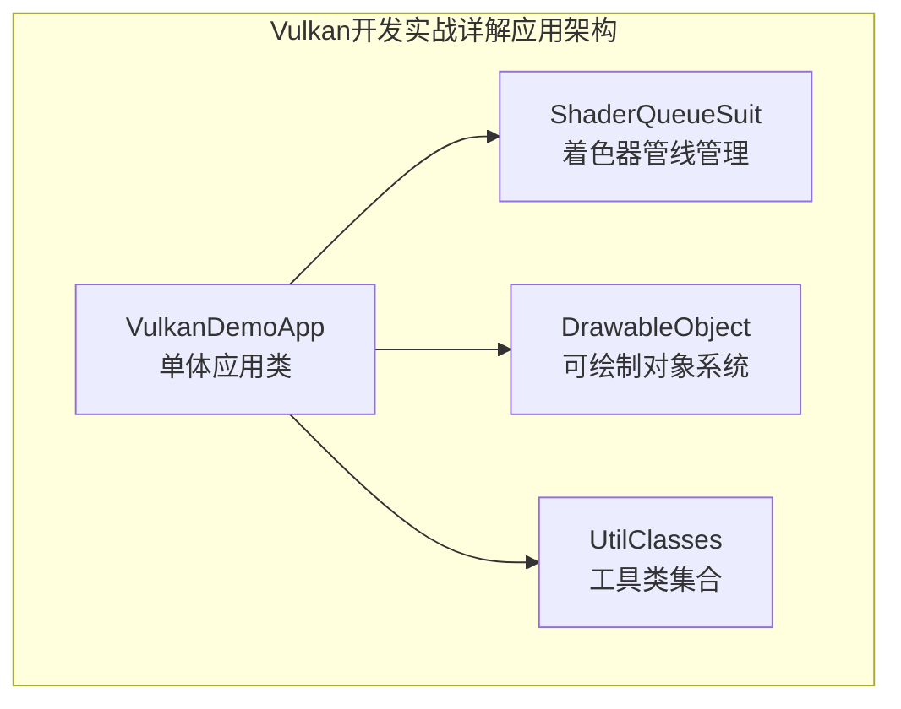

# 项目说明

## 项目说明

通过学习本项目中包含的Vulkan相关参考书示例代码和现代C++教程，开发者可以以相对平缓的学习曲线完成Vulkan入门到进阶阶段的学习。

**发行版中的epub文件仅供学习用途！**

### 📋 快速开始

**🔴 重要：使用前请先下载项目依赖**

由于项目包含大量模型和纹理文件，请先从下方的网盘链接下载"项目依赖以及资产.zip"并解压到项目根目录。

如果您是Vulkan初学者，建议直接从 `ep01` 开始学习现代Vulkan开发。

## 本项目的内容包含

### 🟢 推荐学习路径（现代C++框架）
- **现代Vulkan教程系列** - 项目前缀为 `ep*` (ep01-ep13)
- **现代架构重构示例** - `Chapter13-04-refactored`
- **特点**: 使用现代C++特性，RAII资源管理，智能指针，模块化设计

### 🟡 传统应用架构（参考学习）
- **《Vulkan开发实战详解》(吴亚峰)**的随书代码；项目前缀为 `Chapter*`
- **特点**: 完整的应用程序，实用导向，适合了解实际项目开发

## 开发环境以及项目依赖

* 独立显卡(可选项，支持的层和扩展更多)
* VS/CLion/VSCode
* VulkanSDK:1.3.290.0(安装时勾选glm)
* glfw:3.4
* sdl:3.1.6
* sdl_mixer:2.8.0
* glm:复制自vulkanSDK中的include文件夹
* glslang:在Github[仓库](https://github.com/KhronosGroup/glslang)选择与vulkanSDK版本匹配的1.3.290.0版本的分支并克隆到本项目的依赖文件夹内(在CMakeLists.txt中已经配置完毕)

### 📦 项目依赖以及资产下载

由于项目包含大量的模型文件、纹理图片和其他依赖资源，文件体积过大无法提交到远程仓库。

**下载链接：**

- **百度网盘**: [项目依赖以及资产.zip](https://pan.baidu.com/s/18fhhZLzBAHb3xwj7DAnQCA?pwd=1111) 提取码: 1111

**下载后请解压到项目根目录**，确保目录结构如下：

```
vulkan-book-code/
├── models/              # 3D模型文件
├── textures/            # 纹理图片文件
├── dependencies/
│   ├── glfw/            # 窗口和输入管理 (3.4)
│   ├── sdl/             # 窗口和输入管理 (3.1.6)
│   ├── sdl_mixer/       # 音频混音库 (2.8.0)
│   ├── glm/             # 数学运算库
│   ├── glslang/         # 着色器编译器 (1.3.290)
│   └── gli/             # 图像处理库
├── include/
│   ├── imgui/           # 图形界面库
│   ├── nlohmann/        # JSON解析库
│   ├── STD/
│   │   └── stb_image.h  # 图像加载
│   └── TOL/
│       └── tiny_obj_loader.h  # 模型加载
└── ...
```

## 📚 学习路径建议

### 🚀 根据经验选择学习路径

#### 🔸 完全初学者路径
1. **现代C++框架学习** (`ep*` 系列)
   - ep01-ep03: 环境搭建和设备初始化
   - ep04-ep07: 交换链、管线、命令基础
   - ep08-ep09: 顶点和Uniform数据
   - ep10-ep13: 纹理、深度、抗锯齿、模型绘制

#### 🔸 有经验开发者路径
1. **直接现代C++框架** (`ep*` 系列)
   - 适合：有Vulkan基础和现代C++经验的开发者
   - 学习现代Vulkan开发最佳实践

2. **参考实际应用** (`Chapter*` 系列)
   - 了解完整的渲染应用架构
   - 学习实际项目中的功能模块划分
   - 参考复杂功能的实现方式

#### AI时代的学习助推器

* 安装opencode或者claude code
* 购买国内或者国外平台的编码套餐获取api key并配置
* 让AI自行配置配置[epub-mcp](https://github.com/onebirdrocks/ebook-mcp)，方便读取书中对应的内容帮助理解
* 利用AI解释复杂的Vulkan API概念和渲染管线流程
* 使用AI辅助调试Vulkan错误，特别是VK_ERROR_*错误码的快速定位和解决方案
* 让AI帮助对比传统架构与现代C++架构的优缺点，加速理解设计模式
* AI辅助解决平台特定问题（如macOS的MoltenVK适配、不同GPU的驱动差异）
* 利用AI进行代码重构建议，从传统C++向现代C++（智能指针、RAII）的渐进式改造
* 使用AI生成跨章节的知识点连接，构建完整的Vulkan知识体系
* AI驱动的实践项目建议，基于所学内容创作小型的渲染演示

### ⚠️ 重要说明

#### 《Vulkan开发实战详解》部分 - **参考学习**
- **代码位置**: 本项目中所有以 `Chapter` 为前缀的文件夹内
- **内容**: 包含原书全19章的PC实例代码（第19章mac运行白屏）
- **特点**: 使用新开发环境、替换过时API、修复BUG并小幅重构后的可运行代码
- **说明**:
  - 所有项目共用文件夹根目录的依赖
  - 仓库内上传了前18章的模型和纹理文件
  - 一个模型或纹理文件可能会被多个项目使用
  - 文件使用UTF8编码
  - 使用GLFW代替WIN32API实现窗口创建和外设输入处理

由于所有项目使用的物理设备均为物理设备列表中的第一个设备，需要使用设备的高级特性请调整选择的物理设备索引；当然这里也给出了使用Json配置GPU选择的一种方式：在仓库的根目录创建`config.json`文件

~~~json
{
  "GpuIndex": 0
}
~~~

然后在代码中使用：

~~~ c++
//头文件导入
#include <fstream>
#include <nlohmann/json.hpp>

//读取并输出json文件中键对应的值
std::ifstream f("../config.json");
json data = json::parse(f);
std::cout << data["GpuIndex"] << std::endl;
f.close();
~~~

## 待办列表：

* **重要(影响程序效果)**
    * 后续修复16.02黑屏的问题
    * 后续修复17.07没有水面效果的问题
    * 找到为什么使用RenderDoc对进阶学习中的项目进行抓帧启动时会报错的原因(在Clion中可以运行，在文件管理器中双击打开报错 可能是缺库？)
* **次要(不影响效果)**
    * 后续修复12.14关闭程序会报错`0xC0000374`的问题
    * 后续修复12.15关闭程序会报错`0xC0000374`的问题
    * 后续修复13.07关闭程序会报错`0xC0000374`的问题
    * 后续修复14.01关闭程序会报错`0xC0000374`的问题
    * 后续修复14.02关闭程序会报错`0xC0000374`的问题
    * 后续修复14.07关闭程序会报错`0xC0000374`的问题
    * 后续修复15.03关闭程序会报错`0xC0000374`的问题
    * 后续修复15.05关闭程序会报错`0xC0000374`的问题
    * 后续修复15.08关闭程序会报错`0xC0000374`的问题
    * 后续修复16.01关闭程序会报错`0xC0000374`的问题
    * 后续修复16.03关闭程序会报错`0xC0000374`的问题
    * 后续修复16.04关闭程序会报错`0xC0000374`的问题
    * 后续修复16.05关闭程序会报错`0xC0000374`的问题
    * 后续修复17.01关闭程序会报错`0xC0000374`的问题
    * 后续修复18.01关闭程序会报错`0xC0000374`的问题
* **后续计划**
  * 在完成18章的示例项目后给出一个集成[ImGui](https://github.com/ocornut/imgui),[Json](https://github.com/nlohmann/json)的三色三角形示例项目

## 🏗️ 项目架构设计

### 项目分类与定位

本项目包含三个主要系列，分别适应不同的学习需求和开发阶段：

#### 🟢 ep_* 系列 - 现代Vulkan教程（推荐）
- **技术栈**: 现代C++20 + RAII + 智能指针
- **架构特点**: 三层架构设计（应用层、封装层、系统层）
- **设计模式**: 工厂模式、RAII、智能指针管理
- **适合人群**: 所有Vulkan学习者，特别是希望学习现代C++实践的开发者
- **代码位置**: `ep01` 到 `ep13` 目录
- **详细架构**: 参见 `doc/现代cppVulkan开发架构设计文档.md`

#### 🟡 Chapter_* 系列 - 传统应用架构（进阶参考）
- **教材来源**: 《Vulkan开发实战详解》(吴亚峰)
- **教学目标**: 实际应用开发，掌握完整的渲染流程
- **架构特点**: 单体应用模式，功能模块化设计
- **适合人群**: 有一定Vulkan基础，希望了解实际项目架构的开发者
- **代码位置**: 以`Chapter`为前缀的文件夹
- **详细架构**: 参见 `doc/《Vulkan开发实战详解》架构说明.md`

### 架构设计对比

| 特性 | 🟡 Chapter_* 系列 (参考) | 🟢 ep_* 系列 (推荐) |
|------|----------------|----------------|
| **设计理念** | 应用导向，功能完整 | 现代C++，类型安全 |
| **架构模式** | 单体应用模式 | 三层架构模式 |
| **文件组织** | src/ 功能导向结构 | 模块化封装设计 |
| **类设计** | 单体应用类 + 功能模块 | 智能指针 + 工厂模式 |
| **资源管理** | 手动资源管理 | 自动RAII + 智能指针 |
| **C++标准** | C++11/14 | **C++20** |
| **学习曲线** | 中等（完整应用） | 平缓（现代实践） |
| **实用性** | 实际应用参考 | **现代开发标准** |
| **可维护性** | 中等（耦合度高） | **很高（现代设计）** |
| **代码质量** | 中等（实用导向） | **很高（最佳实践）** |
| **推荐状态** | ⚠️ **参考学习** | ✅ **强烈推荐** |

### 🎯 现代Vulkan教程 (ep*) 详细内容

#### 教学路径
```
ep01 instance      → Vulkan实例创建和验证层
ep02 device        → 物理设备选择和逻辑设备创建
ep03 surface       → 窗口表面和渲染目标
ep04 swapChain     → 交换链和帧缓冲管理
ep05 pipeline      → 图形管线和着色器
ep06 renderPass    → 渲染过程和子通道
ep07 command       → 命令缓冲和录制
ep08 vertex        → 顶点缓冲和属性
ep09 uniform       → Uniform缓冲和描述符
ep10 imageSampler  → 图像纹理和采样器
ep11 depth         → 深度缓冲和深度测试
ep12 antiAlias     → 抗锯齿技术
ep13 modelDrawing  → 完整的3D模型渲染
```

#### 现代C++特性应用
- **智能指针**: `std::shared_ptr`, `std::unique_ptr` 自动内存管理
- **RAII**: 资源获取即初始化，异常安全
- **工厂模式**: 统一的对象创建接口
- **异常处理**: 现代错误处理机制
- **类型安全**: 强类型封装和编译时检查

#### 🌟 为什么推荐现代Vulkan教程 (ep*系列)

1. **现代C++最佳实践**
   - 使用C++20最新特性，代码质量更高
   - RAII自动资源管理，避免内存泄漏
   - 异常安全的错误处理机制

2. **优秀的架构设计**
   - 三层架构：应用层、封装层、系统层
   - 职责分离，高内聚低耦合
   - 可扩展性和可维护性极佳

3. **循序渐进的学习路径**
   - 从基础概念到完整应用的渐进式教学
   - 每个章节专注特定主题，易于理解
   - 实践与理论相结合

4. **生产就绪的代码质量**
   - 跨平台支持（Windows、macOS）
   - 完整的错误处理和验证
   - 性能优化的实现方式

5. **未来发展趋势**
   - 符合现代C++开发标准
   - 代码风格与现代工业界一致
   - 为后续学习和工作奠定良好基础


### Chapter_* 系列架构特色

#### 应用架构模式


#### 核心设计特点
- **单体应用**: 所有Vulkan资源集中在一个主应用类中管理
- **功能模块化**: 按功能需求划分不同的模块类（光照、纹理、动画等）
- **实用导向**: 优先考虑实际应用需求而非教学抽象
- **完整功能**: 每个项目都是可运行的完整应用程序

#### 功能演进路径
| 章节 | 应用主题 | 主要功能 | 技术重点 |
|------|----------|----------|----------|
| Chapter01-01 | 几何体绘制 | 基础三角形、着色器编译 | 着色器使用 |
| Chapter04-01~16 | 3D渲染系统 | 完整3D渲染管线 | 变换、光照、纹理 |
| Chapter08-01~04 | 光照系统 | Phong光照、点光源 | 光照计算 |
| Chapter13-04 | 模型加载 | 3D模型加载渲染 | 资源管理 |
| Chapter16-02 | 机器人动画 | 骨骼动画、变换 | 动画系统 |
| Chapter17-07 | 水面效果 | 水波纹、反射 | 高级特效 |

### 现代架构重构 (Chapter13-04-refactored)

项目还包含了一个采用现代C++架构的重构版本，展示了如何将传统架构改进为模块化、类型安全的现代设计：

#### 核心改进
- **智能指针管理**: 使用 `std::shared_ptr` 和 RAII 自动管理资源
- **模块化封装**: Vulkan对象被封装在专门的Wrapper类中
- **异常安全**: 使用现代C++异常处理机制
- **工厂模式**: 统一的对象创建接口

```cpp
// 现代C++智能指针管理
class Application : public std::enable_shared_from_this<Application> {
public:
    using Ptr = std::shared_ptr<Application>;
    static Ptr create() { return std::make_shared<Application>(); }

private:
    Wrapper::Device::Ptr mDevice{ nullptr };
    Wrapper::SwapChain::Ptr mSwapChain{ nullptr };
    // 自动资源管理，无需手动析构
};
```

## 学习路径建议

### 初学者路径
1. **阶段1**: ep01-ep03 - 理解Vulkan基础概念
2. **阶段2**: ep04-ep07 - 掌握渲染流程
3. **阶段3**: ep08-ep09 - 实践顶点和Uniform数据
4. **阶段4**: ep10-ep13 - 深入高级特性
5. **阶段5**: Chapter08~13 - 开发实际项目

### 进阶开发者路径
1. **阶段1**: 重点关注Chapter04~16的高级功能
2. **阶段2**: 学习Chapter13-04-refactored现代架构
3. **阶段3**: 参考重构版本改进自己的项目

## Q&A

### Q:项目依赖以及资产文件如何获取？

**A:** 由于项目包含大量的3D模型文件、高清纹理图片和第三方库依赖，总文件大小超过数GB，无法直接提交到Git远程仓库。

**解决方案：**
1. 从提供的网盘链接下载"项目依赖以及资产.zip"
2. 解压到项目根目录
3. 确保解压后的目录结构与项目期望的一致

**重要提示：**
- 模型文件主要用于Chapter*系列的项目
- 纹理文件被多个项目共享使用
- dependencies/目录包含通过git submodule管理的第三方库
- 如果某些项目运行时找不到资源文件，请首先检查是否正确下载并解压了依赖文件

### Q:项目依赖如何配置？

本项目使用VulkanSDK版本为：1.3.290.0。并且以下第三方库作为依赖项，可以通过git submodule进行管理：

- **GLFW**: 窗口和输入管理库
  - 版本分支: 3.4
  - 仓库地址: https://github.com/glfw/glfw
  - 项目路径: dependencies/glfw

- **SDL**: 窗口和输入管理库
  - 版本分支: release-3.1.6
  - 仓库地址: https://github.com/libsdl-org/SDL
  - 项目路径: dependencies/sdl

- **SDL_mixer**: 音频混音库
  - 版本分支: release-2.8.0
  - 仓库地址: https://github.com/libsdl-org/SDL_mixer
  - 项目路径: dependencies/sdl_mixer

- **GLI**: OpenGL图像库，用于纹理加载
  - 版本分支: main
  - 仓库地址: https://github.com/g-truc/gli
  - 项目路径: dependencies/gli

- **GLM**: OpenGL数学库，用于图形计算
  - 版本分支: main
  - 仓库地址: https://github.com/g-truc/glm
  - 项目路径: dependencies/glm

- **GLSLang**: GLSL着色器编译器
  - 版本分支: vulkan-sdk-1.3.290
  - 仓库地址: https://github.com/KhronosGroup/glslang
  - 项目路径: dependencies/glslang

- **ImGui**: 即时模式GUI库（用于用户界面）
  - 版本分支: master
  - 仓库地址: https://github.com/ocornut/imgui
  - 项目路径: include/imgui

- **nlohmann/json**: JSON解析库（用于配置管理）
  - 版本分支: develop
  - 仓库地址: https://github.com/nlohmann/json
  - 项目路径: include/nlohmann


### Q:如何在MacOS(Apple Silicon)运行此项目?

**MoltenVK安装与版本要求**

   - macOS上Vulkan通过MoltenVK实现，需确保安装版本≥1.2.3以支持必要的扩展。
   - 推荐使用Homebrew安装：`brew install molten-vk`

**端口ability扩展配置**
   - **实例创建阶段**：需添加`VK_KHR_portability_enumeration`扩展和`VK_INSTANCE_CREATE_ENUMERATE_PORTABILITY_BIT_KHR`标志。
   - **设备创建阶段**：需添加`VK_KHR_portability_subset`扩展。
   - 确保`VK_KHR_get_physical_device_properties2`扩展在实例级别启用（非设备级别）。

**设备选择与配置**
   - 对于Apple GPU（M系列），需放宽设备类型要求（不严格要求独立显卡）。
   - 注意Apple GPU可能不支持某些特性（如几何着色器），需在设备评分和选择时考虑这些限制。

**扩展依赖关系**
   - 区分实例级扩展和设备级扩展，避免将实例级扩展错误添加到设备扩展列表。
   - `VK_KHR_portability_subset`依赖于`VK_KHR_get_physical_device_properties2`，需确保两者都正确配置。

**验证层错误处理**
   - 常见错误如`VK_KHR_portability_subset must be enabled`或依赖扩展缺失，需检查扩展配置。
   - 使用标准宏定义（如`VK_KHR_PORTABILITY_SUBSET_EXTENSION_NAME`）而非硬编码字符串，避免拼写错误。

**文件路径与资源加载**
   - macOS文件系统区分大小写，确保纹理、着色器等资源文件路径正确。
   - 检查STB_IMAGE库配置，确保正确读取图像数据。
**代码示例**

实例部分(instance.cpp)

~~~ cpp
Instance::Instance(bool enableValidationLayer) {
    mEnableValidationLayer = enableValidationLayer;

    if (mEnableValidationLayer && !checkValidationLayerSupport()) {
        throw std::runtime_error("Error: validation layer is not supported");
    }

    printAvailableExtensions();

    VkApplicationInfo appInfo = {};
    appInfo.sType = VK_STRUCTURE_TYPE_APPLICATION_INFO;
    appInfo.pApplicationName = "vulkanLession";
    appInfo.applicationVersion = VK_MAKE_VERSION(1, 0, 0);
    appInfo.pEngineName = "NO ENGINE";
    appInfo.engineVersion = VK_MAKE_VERSION(1, 0, 0);
    appInfo.apiVersion = VK_API_VERSION_1_0;

    VkInstanceCreateInfo instCreateInfo = {};
    instCreateInfo.sType = VK_STRUCTURE_TYPE_INSTANCE_CREATE_INFO;
    instCreateInfo.pApplicationInfo = &appInfo;

    //扩展相关
    auto extensions = getRequiredExtensions();
    instCreateInfo.enabledExtensionCount = static_cast<uint32_t>(extensions.size());
    instCreateInfo.ppEnabledExtensionNames = extensions.data();
    #if defined(__APPLE__)
    instCreateInfo.flags |= VK_INSTANCE_CREATE_ENUMERATE_PORTABILITY_BIT_KHR;
    #endif
    //layer相关
    if (mEnableValidationLayer) {
        instCreateInfo.enabledLayerCount = static_cast<uint32_t>(validationLayers.size());
        instCreateInfo.ppEnabledLayerNames = validationLayers.data();
    } else {
        instCreateInfo.enabledLayerCount = 0;
    }

    if (vkCreateInstance(&instCreateInfo, nullptr, &mInstance) != VK_SUCCESS) {
        throw std::runtime_error("Error:failed to create instance");
    }

    setupDebugger();
}

std::vector<const char *> Instance::getRequiredExtensions() {
    uint32_t glfwExtensionCount = 0;

    const char **glfwExtensions = glfwGetRequiredInstanceExtensions(&glfwExtensionCount);

    std::vector<const char *> extensions(glfwExtensions, glfwExtensions + glfwExtensionCount);

    extensions.push_back(VK_EXT_DEBUG_UTILS_EXTENSION_NAME);
    #if defined(__APPLE__)
    extensions.push_back(VK_KHR_PORTABILITY_ENUMERATION_EXTENSION_NAME);
    extensions.push_back(VK_KHR_GET_PHYSICAL_DEVICE_PROPERTIES_2_EXTENSION_NAME);
    #endif
    return extensions;
}
~~~

设备部分(device.cpp)

~~~ cpp
int Device::rateDevice(VkPhysicalDevice device) {
    int score = 0;

    // 设备名称 类型 支持vulkan的版本
    VkPhysicalDeviceProperties deviceProp;
    vkGetPhysicalDeviceProperties(device, &deviceProp);

    // 纹理压缩 浮点数运算特性 多视口渲染
    VkPhysicalDeviceFeatures deviceFeatures;
    vkGetPhysicalDeviceFeatures(device, &deviceFeatures);

    // 打印设备信息进行调试
    //printf("设备名称: %s\n", deviceProp.deviceName);
    //printf("设备类型: %d\n", deviceProp.deviceType);
    //printf("支持几何着色器: %d\n", deviceFeatures.geometryShader);
    //printf("支持各向异性采样: %d\n", deviceFeatures.samplerAnisotropy);

    // 不同平台的设备评分逻辑
    #if defined(__APPLE__)
    // macOS平台：M系列芯片只有集成显卡，否则会找不到物理设备 
    // 检查是否为Apple GPU (通过设备名称识别)
    if (std::string(deviceProp.deviceName).find("Apple") != std::string::npos)
    {
        score += 1000;
    }
    // 确保Apple GPU至少有基础分数
    score = std::max(score, 100);
    #elif defined(_WIN32)
    // Windows平台：仅为独立显卡提供高分
    if (deviceProp.deviceType == VK_PHYSICAL_DEVICE_TYPE_DISCRETE_GPU) {
        score += 1000;
    }
    #endif

    score += deviceProp.limits.maxImageDimension2D;

    return score;
}

bool Device::isDeviceSuitable(VkPhysicalDevice device) {
    // 设备名称 类型 支持vulkan的版本
    VkPhysicalDeviceProperties deviceProp;
    vkGetPhysicalDeviceProperties(device, &deviceProp);

    // 纹理压缩 浮点数运算特性 多视口渲染
    VkPhysicalDeviceFeatures deviceFeatures;
    vkGetPhysicalDeviceFeatures(device, &deviceFeatures);

    // 不同平台的设备适配逻辑
    #if defined(_WIN32)
    // Windows平台：保持原有要求
    return deviceProp.deviceType == VK_PHYSICAL_DEVICE_TYPE_DISCRETE_GPU &&
        deviceFeatures.geometryShader &&
        deviceFeatures.samplerAnisotropy;
		#elif defined(__APPLE__)
        // macOS平台：放宽设备特性支持要求
        return true;
		#else
		//比如要求物理设备必须是独立显卡且要支持几何着色器
		return deviceProp.deviceType == VK_PHYSICAL_DEVICE_TYPE_DISCRETE_GPU &&
			deviceFeatures.geometryShader;
		#endif
}
void Device::createLogicalDevice() {
    std::vector<VkDeviceQueueCreateInfo> queueCreateInfos;

    std::set<uint32_t> queueFamilies = {mGraphicQueueFamily.value(), mPresentQueueFamily.value()};

    float queuePriority = 1.0;

    for (uint32_t queueFamily: queueFamilies) {
        // 填写创建信息
        VkDeviceQueueCreateInfo queueCreateInfo = {};
        queueCreateInfo.sType = VK_STRUCTURE_TYPE_DEVICE_QUEUE_CREATE_INFO;
        queueCreateInfo.queueFamilyIndex = queueFamily;
        queueCreateInfo.queueCount = 1;
        queueCreateInfo.pQueuePriorities = &queuePriority;

        queueCreateInfos.push_back(queueCreateInfo);
    }

    // 填写逻辑设备创建信息
    VkPhysicalDeviceFeatures deviceFeatures = {};
    deviceFeatures.samplerAnisotropy = VK_TRUE;

    std::vector<const char *> extensions = deviceRequiredExtensions;
    #if defined(__APPLE__)
    // 添加VK_KHR_portability_subset扩展
    extensions.push_back("VK_KHR_portability_subset");
    #endif

    VkDeviceCreateInfo deviceCreateInfo = {};
    deviceCreateInfo.sType = VK_STRUCTURE_TYPE_DEVICE_CREATE_INFO;
    deviceCreateInfo.pQueueCreateInfos = queueCreateInfos.data();
    deviceCreateInfo.queueCreateInfoCount = static_cast<uint32_t>(queueCreateInfos.size());
    deviceCreateInfo.pEnabledFeatures = &deviceFeatures;
    deviceCreateInfo.enabledExtensionCount = static_cast<uint32_t>(extensions.size());
    deviceCreateInfo.ppEnabledExtensionNames = extensions.data();

    // layer层
    if (mInstance->getEnableValidationLayer()) {
        deviceCreateInfo.enabledLayerCount = static_cast<uint32_t>(validationLayers.size());
        deviceCreateInfo.ppEnabledLayerNames = validationLayers.data();
    } else {
        deviceCreateInfo.enabledLayerCount = 0;
    }

    if (vkCreateDevice(mPhysicalDevice, &deviceCreateInfo, nullptr, &mDevice) != VK_SUCCESS) {
        throw std::runtime_error("Error:failed to create logical device");
    }

    vkGetDeviceQueue(mDevice, mGraphicQueueFamily.value(), 0, &mGraphicQueue);
    vkGetDeviceQueue(mDevice, mPresentQueueFamily.value(), 0, &mPresentQueue);
}
~~~

### Q:为什么本项目需要使用VS打开？，以及为什么使用CLion默认设置有可能会构建失败

因为MSVC编译器对于依赖库的链接顺序相对宽松，而CLion默认设置(使用MingW编译器)则相对严格，需要调整CMakeLists.txt文件中的链接顺序，否则会出现链接错误。

~~~ cmake
# 比如
target_link_libraries(${CHAPTER_NAME}
        vulkanLib
        textureLib # 因为textureLib依赖vulkanLib
        Vulkan::Vulkan
        glslang
        glslang::SPIRV
        glslang::glslang-default-resource-limits
        glfw
        glm
)
#需要调整为
target_link_libraries(${CHAPTER_NAME}
        textureLib
        vulkanLib
        Vulkan::Vulkan
        glslang
        glslang::SPIRV
        glslang::glslang-default-resource-limits
        glfw
        glm
)
~~~

## 新架构 vs 旧架构的详细优点

本项目包含了原始架构（Chapter13-04）和重构后架构（Chapter13-04-refactored）的对比。重构后的架构相比原始架构具有显著的优势，以下是详细分析：

### 1. 架构设计层面的改进

#### 1.1 模块化设计 vs 单体式设计

**旧架构（Chapter13-04）：**
```cpp
class VulkanDemoApp {
    // 所有功能都集中在一个类中
    VkInstance instance;
    VkDevice device;
    VkSwapchainKHR swapChain;
    VkRenderPass renderPass;
    VkPipeline pipeline;
    // ... 100多个成员变量
    // 所有方法都在一个类中
    void initVulkanInstance();
    void createVulkanDevices();
    void createVulkanSwapChain();
    // ... 50多个方法
};
```

**新架构（Chapter13-04-refactored）：**
```cpp
// 职责分离，每个类负责特定功能
class Application {
    Wrapper::Instance::Ptr mInstance;
    Wrapper::Device::Ptr mDevice;
    Wrapper::SwapChain::Ptr mSwapChain;
    // 清晰的依赖关系
};

class Wrapper::Device {
    // 专门负责设备管理
};

class Wrapper::SwapChain {
    // 专门负责交换链管理
};
```

**优点：**
- **单一职责原则**：每个类只负责一个特定功能
- **降低耦合度**：模块间依赖关系清晰
- **提高可测试性**：可以独立测试每个模块
- **便于团队协作**：不同开发者可以并行开发不同模块

#### 1.2 依赖注入 vs 硬编码依赖

**旧架构：**
```cpp
void VulkanDemoApp::initVulkan() {
    // 直接创建和管理所有对象
    instance = createInstance();
    device = createDevice();
    swapChain = createSwapChain();
}
```

**新架构：**
```cpp
void Application::initVulkan() {
    // 通过工厂方法创建，依赖注入
    mInstance = Wrapper::Instance::create(true);
    mDevice = Wrapper::Device::create(mInstance, mSurface);
    mSwapChain = Wrapper::SwapChain::create(mDevice, mWindow, mSurface, mCommandPool);
}
```

**优点：**
- **灵活性**：可以轻松替换实现
- **可配置性**：参数化创建过程
- **可扩展性**：易于添加新的创建策略

### 2. 资源管理层面的改进

#### 2.1 RAII + 智能指针 vs 手动管理

**旧架构：**
```cpp
class VulkanDemoApp {
    VkDevice device;
    VkSwapchainKHR swapChain;
    VkRenderPass renderPass;
    
    ~VulkanDemoApp() {
        // 手动清理，容易遗漏
        vkDestroyRenderPass(device, renderPass, nullptr);
        vkDestroySwapchainKHR(device, swapChain, nullptr);
        vkDestroyDevice(device, nullptr);
    }
};
```

**新架构：**
```cpp
class Application {
    Wrapper::Device::Ptr mDevice{ nullptr };
    Wrapper::SwapChain::Ptr mSwapChain{ nullptr };
    Wrapper::RenderPass::Ptr mRenderPass{ nullptr };
    
    // 析构函数自动调用智能指针的析构
    // 无需手动管理资源
};

class Wrapper::Device {
    VkDevice mDevice{ VK_NULL_HANDLE };
    ~Device() {
        if (mDevice != VK_NULL_HANDLE) {
            vkDestroyDevice(mDevice, nullptr);
        }
    }
};
```

**优点：**
- **自动资源管理**：智能指针自动处理资源释放
- **异常安全**：即使发生异常也能正确清理资源
- **减少内存泄漏**：RAII机制确保资源不泄漏
- **简化代码**：无需手动编写清理代码

### 3. 错误处理层面的改进

#### 3.1 异常处理 vs 错误码

**旧架构：**
```cpp
VkResult result = vkCreateInstance(&createInfo, nullptr, &instance);
if (result != VK_SUCCESS) {
    // 简单的错误处理
    std::cerr << "Failed to create instance!" << std::endl;
    return;
}
```

**新架构：**
```cpp
class Wrapper::Instance {
    Instance() {
        if (vkCreateInstance(&createInfo, nullptr, &mInstance) != VK_SUCCESS) {
            throw std::runtime_error("Failed to create Vulkan instance!");
        }
    }
};

// 使用时的异常处理
try {
    mInstance = Wrapper::Instance::create(true);
} catch (const std::exception& e) {
    std::cerr << e.what() << std::endl;
    return EXIT_FAILURE;
}
```

**优点：**
- **统一的错误处理**：使用C++异常机制
- **更好的错误信息**：详细的错误描述
- **异常安全**：保证程序状态一致性
- **减少错误处理代码**：集中处理异常

### 4. 代码质量层面的改进

#### 4.1 类型安全

**旧架构：**
```cpp
// 使用原始指针，类型不安全
VkDevice device;
VkSwapchainKHR swapChain;
// 容易混淆不同类型的句柄
```

**新架构：**
```cpp
// 强类型封装
class Wrapper::Device {
    VkDevice mDevice{ VK_NULL_HANDLE };
public:
    [[nodiscard]] auto getDevice() const { return mDevice; }
};

class Wrapper::SwapChain {
    VkSwapchainKHR mSwapChain{ VK_NULL_HANDLE };
public:
    [[nodiscard]] auto getSwapChain() const { return mSwapChain; }
};
```

**优点：**
- **编译时类型检查**：避免类型错误
- **更好的IDE支持**：自动补全和错误提示
- **防止误用**：封装后的接口更安全

#### 4.2 现代C++特性

**旧架构：**
```cpp
// 使用C风格代码
VkDevice device = VK_NULL_HANDLE;
VkSwapchainKHR swapChain = VK_NULL_HANDLE;
```

**新架构：**
```cpp
// 使用现代C++特性
using Ptr = std::shared_ptr<Device>;
static Ptr create(const Instance::Ptr& instance, const WindowSurface::Ptr& surface) { 
    return std::make_shared<Device>(instance, surface); 
}

// 使用智能指针和RAII
Wrapper::Device::Ptr mDevice{ nullptr };
```

**优点：**
- **内存安全**：智能指针自动管理内存
- **异常安全**：RAII保证资源正确释放
- **代码简洁**：减少样板代码
- **性能优化**：移动语义和完美转发

### 5. 可维护性层面的改进

#### 5.1 代码组织

**旧架构：**
```
Chapter13-04/src/
├── VulkanDemoApp.h (132行，包含所有声明)
├── VulkanDemoApp.cpp (916行，包含所有实现)
├── 其他工具类文件...
```

**新架构：**
```
Chapter13-04-refactored/
├── application.h (94行，清晰的接口)
├── application.cpp (497行，专注应用逻辑)
├── vulkanWrapper/ (38个文件，模块化封装)
│   ├── device.h/cpp
│   ├── swapChain.h/cpp
│   └── ...
```

**优点：**
- **文件大小合理**：每个文件职责单一
- **易于导航**：清晰的目录结构
- **便于维护**：修改影响范围小

#### 5.2 接口设计

**旧架构：**
```cpp
// 暴露内部实现细节
class VulkanDemoApp {
public:
    VkDevice device;  // 直接暴露Vulkan句柄
    VkSwapchainKHR swapChain;
    // 大量公共成员变量
};
```

**新架构：**
```cpp
// 封装实现细节
class Application {
private:
    Wrapper::Device::Ptr mDevice{ nullptr };
    Wrapper::SwapChain::Ptr mSwapChain{ nullptr };
    
public:
    void run();  // 只暴露必要的接口
    void onMouseMove(double xpos, double ypos);
    void onKeyDown(int key, int action);
};
```

### 6. 性能层面的改进

#### 6.1 对象创建优化

**旧架构：**
```cpp
// 每次重建时重新创建所有对象
void recreateSwapChain() {
    vkDestroyRenderPass(device, renderPass, nullptr);
    vkDestroyPipeline(device, graphicsPipeline, nullptr);
    // 重新创建所有对象
}
```

**新架构：**
```cpp
// 智能指针自动管理，只重建必要的对象
void recreateSwapChain() {
    cleanupSwapChain();  // 自动清理
    mSwapChain = Wrapper::SwapChain::create(mDevice, mWindow, mSurface, mCommandPool);
    // 其他对象可以复用
}
```

### 7. 可扩展性层面的改进

#### 7.1 插件化架构

**旧架构：**
```cpp
// 硬编码的功能
class VulkanDemoApp {
    void drawObject();  // 固定的绘制逻辑
};
```

**新架构：**
```cpp
// 可扩展的架构
class Application {
    Model::Ptr mModel{ nullptr };
    void drawObjects();  // 可以绘制多个对象
    
    // 可以轻松添加新的渲染功能
    void addModel(const Model::Ptr& model);
    void setRenderMode(RenderMode mode);
};
```

## 架构对比总结

| 特性 | 旧架构 | 新架构 |
|------|--------|--------|
| **架构设计** | 单体式设计 | 模块化设计 |
| **资源管理** | 手动管理 | RAII + 智能指针 |
| **错误处理** | 基础错误码 | 异常安全 + 验证层 |
| **代码组织** | 大文件集中 | 模块化分离 |
| **类型安全** | 原始指针 | 强类型封装 |
| **可维护性** | 中等 | 高 |
| **可扩展性** | 有限 | 良好 |
| **代码复用** | 低 | 高 |
| **团队协作** | 困难 | 容易 |
| **测试性** | 困难 | 容易 |

## 本次重构带来的核心价值

1. **开发效率提升**：模块化设计使得开发更加高效
2. **维护成本降低**：清晰的架构减少了维护难度
3. **错误率减少**：类型安全和自动资源管理减少了常见错误
4. **团队协作改善**：清晰的模块边界便于多人协作
5. **功能扩展容易**：插件化架构支持快速添加新功能
6. **代码质量提升**：现代C++特性提高了代码质量

这些改进使得重构后的项目更加健壮、可维护、可扩展，为后续的功能开发奠定了坚实的基础。

## 后记

1. 为了让书中使用glslang将glsl编译成spir-v的代码可用。使用SDK中的头和库文件编译后一直报错找不到符号，折腾了三四天翻了几十篇博客才搞定依赖并解决glsl编译成spirV代码
2. 报错`0xC0000374`:堆栈溢出（Stack Overflow）,可能是ObjObject::~ObjObject()中的`delete vdata;`而不是`delete[] vdata;`造成的
3. 《实战详解》里这么多有价值的代码不能运行我真是醉了 (눈‸눈)


