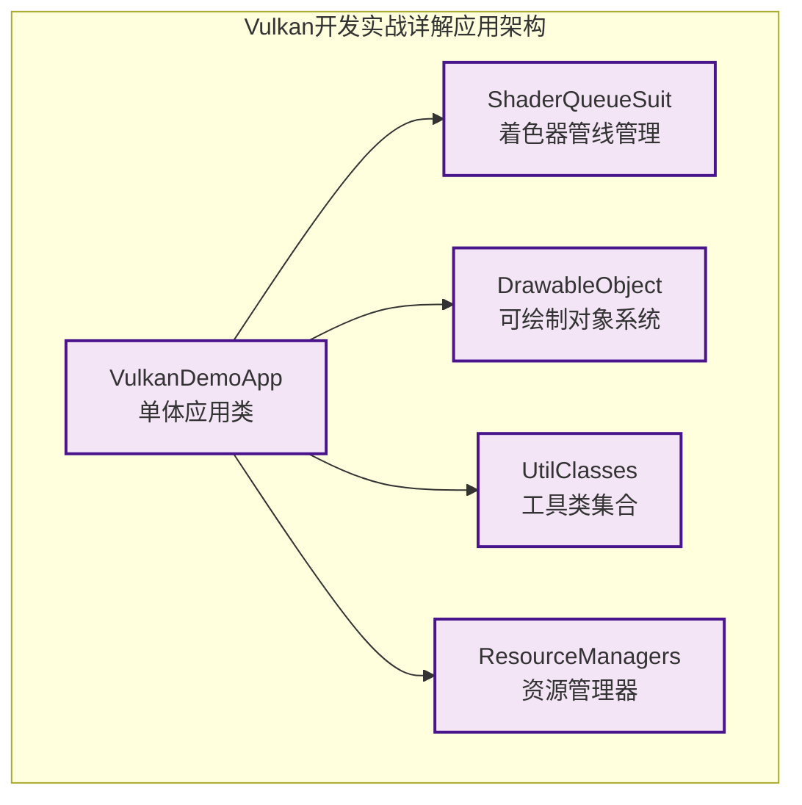

# 《Vulkan开发实战详解》架构说明

## 概述

《Vulkan开发实战详解》(吴亚峰) 采用应用导向的架构设计，通过 Chapter_* 系列项目教授实际的 Vulkan 应用开发。该系列项目的核心特色是每个项目都是完整的可运行程序，面向实际应用开发，适合有一定 Vulkan 基础的开发者学习如何构建复杂的渲染系统。

## 教学目标与特色

### 教学目标
- 掌握完整的 Vulkan 渲染流程
- 学习实际应用开发中的技术方案
- 理解复杂渲染系统的架构设计
- 培养解决实际问题的能力

### 项目特色
- **应用导向**: 每个项目都是完整的应用程序
- **功能完整**: 涵盖几何体、光照、纹理、动画等实际应用功能
- **实用性强**: 直接面向实际项目开发需求
- **技术全面**: 从基础绘制到高级特效的完整技术栈

## 整体架构模式

### 应用架构模式



### 架构设计理念

1. **单体应用**: 所有 Vulkan 资源集中在一个主应用类中管理
2. **功能模块化**: 按功能需求划分不同的模块类
3. **实用导向**: 优先考虑实际应用需求而非教学抽象
4. **快速原型**: 便于快速实现和验证渲染功能

## 文件组织结构

### 标准应用结构

```
ChapterXX-XX/
├── CMakeLists.txt                # 构建配置文件
├── shaders/                      # 着色器文件目录
│   ├── vert.spv                  # 顶点着色器(SPIR-V)
│   ├── frag.spv                  # 片段着色器(SPIR-V)
│   └── *.glsl                    # GLSL源文件(部分项目)
├── src/                          # 源代码目录
│   ├── main.cpp                  # 程序入口点
│   ├── VulkanDemoApp.h/cpp       # 主应用类(包含所有Vulkan资源)
│   ├── ShaderQueueSuit_Common.h/cpp # 着色器管线管理
│   ├── DrawableObjectCommon.h/cpp # 可绘制对象基类
│   ├── [功能模块].h/cpp          # 根据项目添加的功能模块
│   │   ├── MatrixState3D.h/cpp   # 3D矩阵状态管理
│   │   ├── TriangleData.h/cpp    # 三角形数据
│   │   ├── TextureManager.h/cpp  # 纹理管理(高级项目)
│   │   ├── LightManager.h/cpp    # 光照管理(高级项目)
│   │   ├── ObjObject.h/cpp       # 3D对象加载(高级项目)
│   │   └── Robot.h/cpp           # 机器人模型(动画项目)
│   └── [工具类].h/cpp            # 辅助工具类
│       ├── Util.h/cpp            # 通用工具函数
│       ├── FileUtil.h/cpp        # 文件操作工具
│       ├── FPSUtil.h/cpp         # FPS计算工具
│       ├── LoadUtil.h/cpp        # 资源加载工具
│       └── ValidateUtil.h/cpp    # 验证工具
└── [资源文件]                     # 项目特定资源
    ├── models/                   # 3D模型文件
    ├── textures/                 # 纹理图片
    └── config/                   # 配置文件
```

### 重构版本结构 (Chapter13-04-refactored)

```
Chapter13-04-refactored/
├── CMakeLists.txt
├── shaders/                      # 着色器文件
├── texture/                      # 纹理资源
├── vulkanWrapper/                # Vulkan封装库(现代架构)
│   ├── instance.h/cpp           # 实例管理
│   ├── device.h/cpp             # 设备管理
│   ├── swapChain.h/cpp          # 交换链
│   ├── pipeline.h/cpp           # 渲染管线
│   ├── buffer.h/cpp             # 缓冲区管理
│   └── [其他组件].h/cpp
├── main.cpp
├── application.h/cpp             # 现代化的应用类
├── base.h                       # 基础定义和类型
├── model.h                      # 模型类
└── uniformManager.h/cpp          # Uniform缓冲管理
```

## 类设计模式

### 1. 单体应用模式 - VulkanDemoApp

主应用类包含所有 Vulkan 资源，采用集中管理模式：

```cpp
class VulkanDemoApp {
private:
    // === Vulkan 核心对象 ===
    VkInstance instance;
    VkDebugUtilsMessengerEXT debugMessenger;
    VkPhysicalDevice physicalDevice;
    VkDevice device;
    VkQueue graphicsQueue;
    VkQueue presentQueue;

    // === 渲染相关 ===
    VkSurfaceKHR surface;
    VkSwapchainKHR swapChain;
    VkRenderPass renderPass;
    VkPipelineLayout pipelineLayout;
    VkPipeline graphicsPipeline;

    // === 资源管理 ===
    std::vector<VkFramebuffer> swapChainFramebuffers;
    VkCommandPool commandPool;
    std::vector<VkCommandBuffer> commandBuffers;

    // === 同步对象 ===
    std::vector<VkSemaphore> imageAvailableSemaphores;
    std::vector<VkSemaphore> renderFinishedSemaphores;
    std::vector<VkFence> inFlightFences;

    // === 功能组件 ===
    ShaderQueueSuit_Common* shaderSuit;           // 着色器管线
    std::vector<DrawableObjectCommon*> drawObjects; // 可绘制对象
    MatrixState3D matrixState3D;                   // 3D矩阵状态

    // === 应用状态 ===
    GLFWwindow* window;
    int currentFrame = 0;
    bool framebufferResized = false;

public:
    // === 生命周期管理 ===
    void initVulkan();              // 完整的Vulkan初始化
    void createDrawableObject();     // 创建绘制对象
    void drawObject();               // 渲染循环
    void flushUniformBuffer();       // 更新Uniform数据
    void recreateSwapChain();        // 重建交换链
    void cleanup();                  // 资源清理

    // === 事件处理 ===
    static void framebufferResizeCallback(GLFWwindow* window, int width, int height);
    void mainLoop();
};
```

### 2. 着色器管线管理 - ShaderQueueSuit_Common

着色器管线封装了渲染管线的创建和管理：

```cpp
class ShaderQueueSuit_Common {
private:
    // === 管线资源 ===
    VkPipelineLayout pipelineLayout;
    VkPipeline graphicsPipeline;
    VkDescriptorSetLayout descriptorSetLayout;
    VkDescriptorPool descriptorPool;
    std::vector<VkDescriptorSet> descriptorSets;

    // === Uniform缓冲 ===
    std::vector<VkBuffer> uniformBuffers;
    std::vector<VkDeviceMemory> uniformBuffersMemory;
    std::vector<void*> uniformBuffersMapped;

    // === 纹理资源 ===
    VkTexture texture;             // 纹理对象
    VkSampler textureSampler;      // 纹理采样器

    // === 数据结构 ===
    UniformBufferObject ubo;       // Uniform数据结构

public:
    // === 初始化和管理 ===
    void createDescriptorSetLayout(VkDevice device);
    void createGraphicsPipeline(VkDevice device, VkRenderPass renderPass);
    void createDescriptorSets(VkDevice device, VkImageView textureImageView);
    void createUniformBuffers(VkDevice device, VkPhysicalDevice physicalDevice);

    // === 数据更新 ===
    void updateUniformBuffer(uint32_t currentImage, const MatrixState3D& matrixState);
    void flushUniformBuffer();

    // === 资源管理 ===
    VkPipeline getGraphicsPipeline() const { return graphicsPipeline; }
    VkPipelineLayout getPipelineLayout() const { return pipelineLayout; }
    VkDescriptorSet getDescriptorSet(uint32_t index) const { return descriptorSets[index]; }
};
```

### 3. 可绘制对象系统 - DrawableObjectCommon

可绘制对象基类提供了灵活的绘制接口：

```cpp
class DrawableObjectCommon {
protected:
    // === 几何数据 ===
    std::vector<Vertex> vertices;      // 顶点数据
    std::vector<uint16_t> indices;     // 索引数据
    VkBuffer vertexBuffer;             // 顶点缓冲
    VkDeviceMemory vertexBufferMemory; // 顶点缓冲内存
    VkBuffer indexBuffer;              // 索引缓冲
    VkDeviceMemory indexBufferMemory;  // 索引缓冲内存

    // === 变换信息 ===
    float x, y, z;                     // 位置
    float xAngle, yAngle, zAngle;      // 旋转角度
    float scale;                       // 缩放比例

public:
    // === 生命周期 ===
    virtual ~DrawableObjectCommon() = default;

    // === 几何数据管理 ===
    virtual void initVertexData() = 0;           // 初始化顶点数据(纯虚函数)
    virtual void initShader() = 0;               // 初始化着色器(纯虚函数)
    void createBuffer(VkDevice device, VkPhysicalDevice physicalDevice);

    // === 绘制接口 ===
    virtual void drawSelf(VkCommandBuffer commandBuffer,
                         VkPipelineLayout pipelineLayout,
                         VkDescriptorSet descriptorSet) = 0; // 纯虚函数

    // === 变换操作 ===
    void setXYZ(float x, float y, float z) { this->x = x; this->y = y; this->z = z; }
    void setAngle(float xAngle, float yAngle, float zAngle);
    void setScale(float scale) { this->scale = scale; }

    // === 变换矩阵计算 ===
    glm::mat4 getModelMatrix();
};
```

### 4. 3D矩阵状态管理 - MatrixState3D

管理相机变换和投影矩阵：

```cpp
class MatrixState3D {
private:
    // === 相机参数 ===
    glm::vec3 cameraLocation;        // 相机位置
    glm::vec3 cameraUp;              // 上方向
    glm::vec3 cameraTarget;          // 观察目标
    float cx, cy, cz;                // 相机坐标分量

    // === 投影参数 ===
    float left, right, bottom, top;  // 正交投影参数
    float nearr, farr;               // 近远平面
    float projectRatio;              // 投影比例
    float fov;                       // 视场角

    // === 矩阵缓存 ===
    glm::mat4 viewMatrix;            // 视图矩阵
    glm::mat4 projectionMatrix;      // 投影矩阵
    glm::mat4 currMatrix;            // 当前变换矩阵
    glm::mat4 mvpMatrix;             // MVP矩阵

public:
    // === 相机控制 ===
    void setCamera(float cx, float cy, float cz,
                   float tx, float ty, float tz,
                   float upx, float upy, float upz);
    void setLookAtMatrix();

    // === 投影设置 ===
    void setProjectOrtho(float left, float right, float bottom, float top,
                        float nearr, float farr);
    void setProjectFrustum(float left, float right, float bottom, float top,
                          float nearr, float farr);
    void setProjectPerspective(float fov, float aspect, float nearr, float farr);

    // === 矩阵计算 ===
    void flushProjectBuffer();       // 计算投影矩阵
    glm::mat4 getFinalMatrix();      // 获取最终MVP矩阵
    glm::mat4 getMMatrix();          // 获取模型矩阵
    glm::mat4 getVMatrix();          // 获取视图矩阵
    glm::mat4 getPMatrix();          // 获取投影矩阵
};
```

## 资源管理策略

### 1. 手动资源管理模式

Chapter 系列采用手动的资源管理模式，需要显式的创建/销毁配对：

```cpp
void VulkanDemoApp::initVulkan() {
    // === 按顺序创建 Vulkan 资源 ===
    createInstance();                  // 1. 创建实例
    setupDebugMessenger();             // 2. 设置调试
    createSurface();                   // 3. 创建表面
    pickPhysicalDevice();              // 4. 选择物理设备
    createLogicalDevice();             // 5. 创建逻辑设备
    createSwapChain();                 // 6. 创建交换链
    createImageViews();                // 7. 创建图像视图
    createRenderPass();                // 8. 创建渲染过程
    createGraphicsPipeline();          // 9. 创建图形管线
    createFramebuffers();              // 10. 创建帧缓冲
    createCommandPool();               // 11. 创建命令池
    createVertexBuffer();              // 12. 创建顶点缓冲
    createIndexBuffer();               // 13. 创建索引缓冲
    createUniformBuffers();            // 14. 创建Uniform缓冲
    createDescriptorPool();            // 15. 创建描述符池
    createDescriptorSets();            // 16. 创建描述符集合
    createCommandBuffers();            // 17. 创建命令缓冲
    createSemaphores();                // 18. 创建信号量
    createFences();                    // 19. 创建栅栏
}

void VulkanDemoApp::cleanup() {
    // === 按相反顺序销毁资源 ===
    cleanupSwapChain();                // 清理交换链相关资源
    vkDestroyDescriptorPool(device, descriptorPool, nullptr);
    vkDestroyDescriptorSetLayout(device, descriptorSetLayout, nullptr);
    vkDestroyBuffer(device, indexBuffer, nullptr);
    vkFreeMemory(device, indexBufferMemory, nullptr);
    vkDestroyBuffer(device, vertexBuffer, nullptr);
    vkFreeMemory(device, vertexBufferMemory, nullptr);

    for (size_t i = 0; i < MAX_FRAMES_IN_FLIGHT; i++) {
        vkDestroySemaphore(device, renderFinishedSemaphores[i], nullptr);
        vkDestroySemaphore(device, imageAvailableSemaphores[i], nullptr);
        vkDestroyFence(device, inFlightFences[i], nullptr);
    }

    vkDestroyCommandPool(device, commandPool, nullptr);
    vkDestroyDevice(device, nullptr);
    // ... 更多销毁操作
}
```

### 2. 功能模块资源管理

每个功能模块管理自己的资源：

```cpp
// 着色器管线资源管理
void ShaderQueueSuit_Common::cleanup(VkDevice device) {
    vkDestroyPipelineLayout(device, pipelineLayout, nullptr);
    vkDestroyPipeline(device, graphicsPipeline, nullptr);
    vkDestroyDescriptorSetLayout(device, descriptorSetLayout, nullptr);
    vkDestroyDescriptorPool(device, descriptorPool, nullptr);

    for (size_t i = 0; i < uniformBuffers.size(); i++) {
        vkDestroyBuffer(device, uniformBuffers[i], nullptr);
        vkFreeMemory(device, uniformBuffersMemory[i], nullptr);
    }
}

// 可绘制对象资源管理
void DrawableObjectCommon::cleanup(VkDevice device) {
    vkDestroyBuffer(device, vertexBuffer, nullptr);
    vkFreeMemory(device, vertexBufferMemory, nullptr);
    vkDestroyBuffer(device, indexBuffer, nullptr);
    vkFreeMemory(device, indexBufferMemory, nullptr);
}
```

### 3. 交换链重建机制

处理窗口大小变化时的资源重建：

```cpp
void VulkanDemoApp::recreateSwapChain() {
    int width = 0, height = 0;
    glfwGetFramebufferSize(window, &width, &height);

    // 等待窗口恢复到正常大小
    while (width == 0 || height == 0) {
        glfwGetFramebufferSize(window, &width, &height);
        glfwWaitEvents();
    }

    vkDeviceWaitIdle(device);  // 等待设备空闲

    // 清理旧的交换链相关资源
    cleanupSwapChain();

    // 重新创建交换链相关资源
    createSwapChain();
    createImageViews();
    createFramebuffers();

    // 通知着色器管线重新创建资源
    if (shaderSuit) {
        shaderSuit->recreateResources(device, renderPass, swapChainExtent);
    }
}

void VulkanDemoApp::cleanupSwapChain() {
    for (auto framebuffer : swapChainFramebuffers) {
        vkDestroyFramebuffer(device, framebuffer, nullptr);
    }

    vkDestroyPipeline(device, graphicsPipeline, nullptr);
    vkDestroyPipelineLayout(device, pipelineLayout, nullptr);
    vkDestroyRenderPass(device, renderPass, nullptr);

    for (auto imageView : swapChainImageViews) {
        vkDestroyImageView(device, imageView, nullptr);
    }

    vkDestroySwapchainKHR(device, swapChain, nullptr);
}
```

## 应用程序生命周期

### 完整的渲染流程

```cpp
int main() {
    VulkanDemoApp app;

    try {
        app.run();  // 启动应用程序
    } catch (const std::exception& e) {
        std::cerr << e.what() << std::endl;
        return EXIT_FAILURE;
    }

    return EXIT_SUCCESS;
}

void VulkanDemoApp::run() {
    initWindow();        // 1. 初始化窗口
    initVulkan();        // 2. 初始化Vulkan
    createDrawableObject(); // 3. 创建绘制对象
    mainLoop();          // 4. 主循环
    cleanup();           // 5. 清理资源
}

void VulkanDemoApp::mainLoop() {
    while (!glfwWindowShouldClose(window)) {
        glfwPollEvents();     // 处理事件
        drawFrame();         // 绘制一帧
    }

    vkDeviceWaitIdle(device); // 等待所有操作完成
}
```

### 帧渲染流程

```cpp
void VulkanDemoApp::drawFrame() {
    // === 1. 等待前一帧完成 ===
    vkWaitForFences(device, 1, &inFlightFences[currentFrame], VK_TRUE, UINT64_MAX);

    // === 2. 获取下一帧图像 ===
    uint32_t imageIndex;
    VkResult result = vkAcquireNextImageKHR(device, swapChain, UINT64_MAX,
                                          imageAvailableSemaphores[currentFrame],
                                          VK_NULL_HANDLE, &imageIndex);

    // 处理交换链过期
    if (result == VK_ERROR_OUT_OF_DATE_KHR) {
        recreateSwapChain();
        return;
    }

    // === 3. 更新Uniform数据 ===
    updateUniformBuffer(imageIndex);

    // === 4. 重置栅栏 ===
    vkResetFences(device, 1, &inFlightFences[currentFrame]);

    // === 5. 重置并录制命令缓冲 ===
    vkResetCommandBuffer(commandBuffers[currentFrame], 0);
    recordCommandBuffer(commandBuffers[currentFrame], imageIndex);

    // === 6. 提交命令缓冲 ===
    VkSubmitInfo submitInfo{};
    submitInfo.sType = VK_STRUCTURE_TYPE_SUBMIT_INFO;

    VkSemaphore waitSemaphores[] = {imageAvailableSemaphores[currentFrame]};
    VkPipelineStageFlags waitStages[] = {VK_PIPELINE_STAGE_COLOR_ATTACHMENT_OUTPUT_BIT};
    submitInfo.waitSemaphoreCount = 1;
    submitInfo.pWaitSemaphores = waitSemaphores;
    submitInfo.pWaitDstStageMask = waitStages;

    submitInfo.commandBufferCount = 1;
    submitInfo.pCommandBuffers = &commandBuffers[currentFrame];

    VkSemaphore signalSemaphores[] = {renderFinishedSemaphores[currentFrame]};
    submitInfo.signalSemaphoreCount = 1;
    submitInfo.pSignalSemaphores = signalSemaphores;

    if (vkQueueSubmit(graphicsQueue, 1, &submitInfo, inFlightFences[currentFrame]) != VK_SUCCESS) {
        throw std::runtime_error("Failed to submit draw command buffer!");
    }

    // === 7. 呈现结果 ===
    VkPresentInfoKHR presentInfo{};
    presentInfo.sType = VK_STRUCTURE_TYPE_PRESENT_INFO_KHR;
    presentInfo.waitSemaphoreCount = 1;
    presentInfo.pWaitSemaphores = signalSemaphores;

    VkSwapchainKHR swapChains[] = {swapChain};
    presentInfo.swapchainCount = 1;
    presentInfo.pSwapchains = swapChains;
    presentInfo.pImageIndices = &imageIndex;

    result = vkQueuePresentKHR(presentQueue, &presentInfo);

    if (result == VK_ERROR_OUT_OF_DATE_KHR || result == VK_SUBOPTIMAL_KHR || framebufferResized) {
        framebufferResized = false;
        recreateSwapChain();
    }

    // === 8. 更新帧索引 ===
    currentFrame = (currentFrame + 1) % MAX_FRAMES_IN_FLIGHT;
}
```

## 功能演进路径

### Chapter_* 系列学习路径

| 章节 | 应用主题 | 主要功能 | 技术重点 | 架构特点 |
|------|----------|----------|----------|----------|
| Chapter01-01 | 几何体绘制 | 基础三角形、着色器编译 | 着色器使用、基础绘制 | 简单体架构 |
| Chapter02-01/02 | 多边形绘制 | 四边形、五边形 | 图元装配、索引绘制 | 基础功能扩展 |
| Chapter04-01~16 | 3D渲染系统 | 完整3D渲染管线 | 变换、光照、纹理 | 功能模块化 |
| Chapter08-01~04 | 光照系统 | Phong光照、点光源 | 光照计算、材质系统 | 光照模块 |
| Chapter13-04 | 模型加载 | 3D模型加载渲染 | 资源管理、模型解析 | 资源管理器 |
| Chapter16-02 | 机器人动画 | 骨骼动画、变换 | 动画系统、关节控制 | 动画模块 |
| Chapter17-07 | 水面效果 | 水波纹、反射 | 高级特效、着色器编程 | 特效系统 |

### 技术演进分析

#### 基础阶段 (Chapter 01-04)
- **架构特点**: 简单体应用，所有代码集中在主类
- **技术重点**: Vulkan基础API使用、简单几何体绘制
- **代码量**: 较少，每个项目约500-1000行

#### 功能扩展阶段 (Chapter 04-12)
- **架构特点**: 开始出现功能模块分离
- **技术重点**: 3D变换、光照、纹理映射
- **代码量**: 中等，每个项目约1000-2000行

#### 高级应用阶段 (Chapter 13-19)
- **架构特点**: 完整的功能模块系统
- **技术重点**: 模型加载、动画、高级特效
- **代码量**: 较大，每个项目约2000-5000行

## 高级项目架构示例

### Chapter16-02 机器人动画项目

```cpp
class VulkanDemoApp {
private:
    // === 基础Vulkan资源 ===
    // [同其他项目的基础Vulkan对象]

    // === 机器人动画系统 ===
    Robot* robot;                      // 机器人模型
    ActionGenerator* actionGenerator;  // 动作生成器
    std::vector<MatrixState3D> jointMatrices; // 关节矩阵

    // === 动画控制 ===
    float currentTime;                  // 当前时间
    std::vector<AnimationKey> keyFrames; // 关键帧
    int currentKeyFrame;                // 当前关键帧索引

public:
    void createRobot();                 // 创建机器人模型
    void loadAnimationData();           // 加载动画数据
    void updateAnimation(float deltaTime); // 更新动画状态
    void calculateJointMatrices();      // 计算关节变换矩阵
    void renderRobot();                 // 渲染机器人
};

class Robot {
private:
    std::vector<RobotJoint> joints;     // 关节列表
    std::vector<RobotMesh> meshes;      // 网格列表
    Skeleton skeleton;                  // 骨骼结构

public:
    void loadFromFile(const std::string& filename); // 从文件加载
    void updateJointMatrix(int jointId, const glm::mat4& matrix);
    void draw(VkCommandBuffer commandBuffer, VkPipelineLayout pipelineLayout);
};
```

### Chapter13-04-refactored 现代架构

```cpp
// 现代C++智能指针管理
class Application : public std::enable_shared_from_this<Application> {
public:
    using Ptr = std::shared_ptr<Application>;
    static Ptr create() { return std::make_shared<Application>(); }

private:
    // === Vulkan组件智能指针 ===
    Wrapper::Window::Ptr mWindow{nullptr};
    Wrapper::Instance::Ptr mInstance{nullptr};
    Wrapper::Device::Ptr mDevice{nullptr};
    Wrapper::WindowSurface::Ptr mSurface{nullptr};
    Wrapper::SwapChain::Ptr mSwapChain{nullptr};
    Wrapper::Pipeline::Ptr mPipeline{nullptr};
    Wrapper::RenderPass::Ptr mRenderPass{nullptr};
    Wrapper::CommandPool::Ptr mCommandPool{nullptr};

    // === 现代资源管理 ===
    UniformManager::Ptr mUniformManager{nullptr};
    Model::Ptr mModel{nullptr};

public:
    void run() {
        initWindow();
        initVulkan();
        mainLoop();
        cleanUp();
    }
};

// RAII封装的Vulkan组件
namespace Wrapper {
    class Device {
    public:
        using Ptr = std::shared_ptr<Device>;
        static Ptr create(const Instance::Ptr& instance, const WindowSurface::Ptr& surface);

        ~Device() {
            if (mDevice != VK_NULL_HANDLE) {
                vkDestroyDevice(mDevice, nullptr);
            }
        }

        VkDevice getDevice() const { return mDevice; }

    private:
        VkDevice mDevice{VK_NULL_HANDLE};
    };
}
```

## 技术特点分析

### 1. 应用导向设计

**优点**:
- 完整的应用程序，可以直接运行和测试
- 面向实际开发需求，实用性强
- 功能全面，涵盖复杂渲染技术
- 性能透明，无抽象层遮挡

**适用场景**:
- 有一定Vulkan基础的开发者
- 实际项目开发参考
- 复杂渲染系统学习
- 性能优化研究

### 2. 架构优势

#### 实用性优先
- **快速原型**: 便于快速实现和验证功能
- **功能完整**: 每个项目都是可运行的完整应用
- **技术全面**: 涵盖实际开发的各个方面
- **性能导向**: 优先考虑渲染性能

#### 功能模块化
- **按功能划分**: 光照、纹理、动画等独立模块
- **渐进式扩展**: 从简单功能到复杂特效
- **实用工具**: FPS计算、文件操作等实用工具
- **资源管理**: 完整的资源加载和管理系统

### 3. 代码质量特征

| 特征 | 评估 | 说明 |
|------|------|------|
| **实用性** | 很高 | 直接面向实际应用开发 |
| **功能完整性** | 高 | 涵盖完整的应用功能 |
| **性能** | 高 | 无额外抽象层开销 |
| **学习曲线** | 中等 | 需要一定基础 |
| **可维护性** | 中等 | 代码耦合度较高 |
| **扩展性** | 中等 | 修改需要涉及多个地方 |

## 最佳实践总结

### 1. 资源管理最佳实践

```cpp
// 资源创建顺序
void VulkanDemoApp::initVulkan() {
    // 严格按照依赖顺序创建
    createInstance();      // 1. 实例最先创建
    setupDebugMessenger(); // 2. 调试功能
    createSurface();       // 3. 窗口表面
    pickPhysicalDevice();  // 4. 物理设备
    createLogicalDevice(); // 5. 逻辑设备
    // ... 其他资源按依赖顺序
}

// 安全的销毁顺序
void VulkanDemoApp::cleanup() {
    // 先销毁依赖的资源
    cleanupSwapChain();    // 清理交换链相关
    // 然后销毁基础资源
    vkDestroyDevice(device, nullptr);  // 设备最后销毁
    vkDestroyInstance(instance, nullptr); // 实例最后销毁
}
```

### 2. 错误处理策略

```cpp
// VK_RESULT检查宏
#define VK_CHECK_RESULT(f)                                                 \
{                                                                           \
    VkResult res = (f);                                                     \
    if (res != VK_SUCCESS)                                                  \
    {                                                                       \
        std::cout << "Fatal : VkResult is \"" << res << "\" in " << __FILE__ \
                  << " at line " << __LINE__ << std::endl;                  \
        assert(res == VK_SUCCESS);                                          \
    }                                                                       \
}

// 使用示例
void VulkanDemoApp::createBuffer() {
    VkBufferCreateInfo bufferInfo{};
    bufferInfo.sType = VK_STRUCTURE_TYPE_BUFFER_CREATE_INFO;
    // ... 填充bufferInfo

    VK_CHECK_RESULT(vkCreateBuffer(device, &bufferInfo, nullptr, &buffer));
}
```

### 3. 性能优化技巧

```cpp
// Uniform数据更新优化
void VulkanDemoApp::updateUniformBuffer(uint32_t currentImage) {
    static auto startTime = std::chrono::high_resolution_clock::now();

    auto currentTime = std::chrono::high_resolution_clock::now();
    float time = std::chrono::duration<float, std::chrono::seconds::period>(
                    currentTime - startTime).count();

    UniformBufferObject ubo{};
    ubo.model = glm::rotate(glm::mat4(1.0f), time * glm::radians(90.0f),
                           glm::vec3(0.0f, 0.0f, 1.0f));
    ubo.view = glm::lookAt(glm::vec3(2.0f, 2.0f, 2.0f),
                          glm::vec3(0.0f, 0.0f, 0.0f),
                          glm::vec3(0.0f, 0.0f, 1.0f));
    ubo.proj = glm::perspective(glm::radians(45.0f),
                               swapChainExtent.width / (float) swapChainExtent.height,
                               0.1f, 10.0f);

    // 修正投影矩阵的Y轴方向
    ubo.proj[1][1] *= -1;

    // 直接映射内存更新数据
    memcpy(uniformBuffersMapped[currentImage], &ubo, sizeof(ubo));
}
```

### 4. 模块化设计

```cpp
// 纹理管理器
class TextureManager {
private:
    std::map<std::string, VkTexture> textureCache;
    VkDevice device;

public:
    VkTexture loadTexture(const std::string& filename);
    VkTexture getTexture(const std::string& filename);
    void cleanup();
};

// 光照管理器
class LightManager {
private:
    std::vector<Light> lights;
    UniformBufferObject lightUBO;

public:
    void addLight(const Light& light);
    void updateLightUniforms();
    void setLightingShaderParams(VkCommandBuffer commandBuffer);
};
```

## 学习建议

### 初学者学习路径

1. **基础理解**: 先学习 Basic_chapter_* 系列建立基础概念
2. **简单项目**: 从 Chapter01-01 开始理解完整应用结构
3. **功能扩展**: 逐步学习 Chapter02-04 的功能扩展
4. **系统学习**: 深入研究 Chapter08-12 的复杂功能
5. **高级应用**: 学习 Chapter13-19 的高级特性

### 进阶开发者路径

1. **架构分析**: 研究项目的整体架构设计
2. **性能优化**: 分析性能瓶颈和优化策略
3. **功能扩展**: 基于现有架构添加新功能
4. **现代重构**: 学习 Chapter13-04-refactored 的现代架构
5. **实战项目**: 参考架构开发自己的项目

## 总结

《Vulkan开发实战详解》的 Chapter_* 系列项目展现了实用的 Vulkan 应用开发架构。通过单体应用模式、功能模块化设计和完整的渲染流程，为开发者提供了实际项目的开发参考。这种架构特别适合：

1. **实际应用开发**: 每个项目都是完整可运行的程序
2. **功能学习**: 涵盖从基础绘制到高级特效的完整技术栈
3. **性能研究**: 无抽象层遮挡，性能特征清晰
4. **项目参考**: 为实际项目开发提供架构参考

关键成功因素：
1. **实用性导向**: 优先考虑实际开发需求
2. **功能完整性**: 每个项目都是功能完整的应用
3. **技术全面性**: 涵盖实际开发的各个方面
4. **性能透明性**: 直接展示Vulkan的性能特征

这种架构为Vulkan的实际应用开发提供了宝贵的经验和参考。