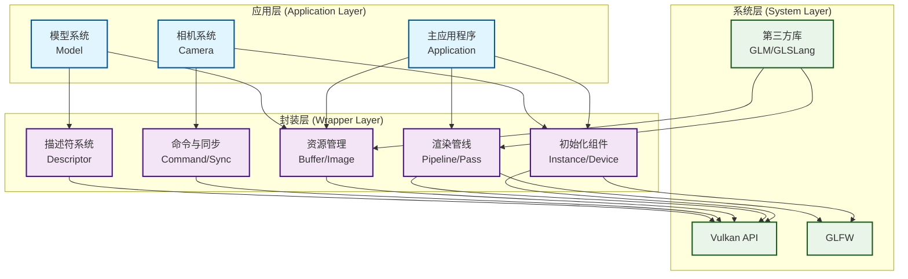
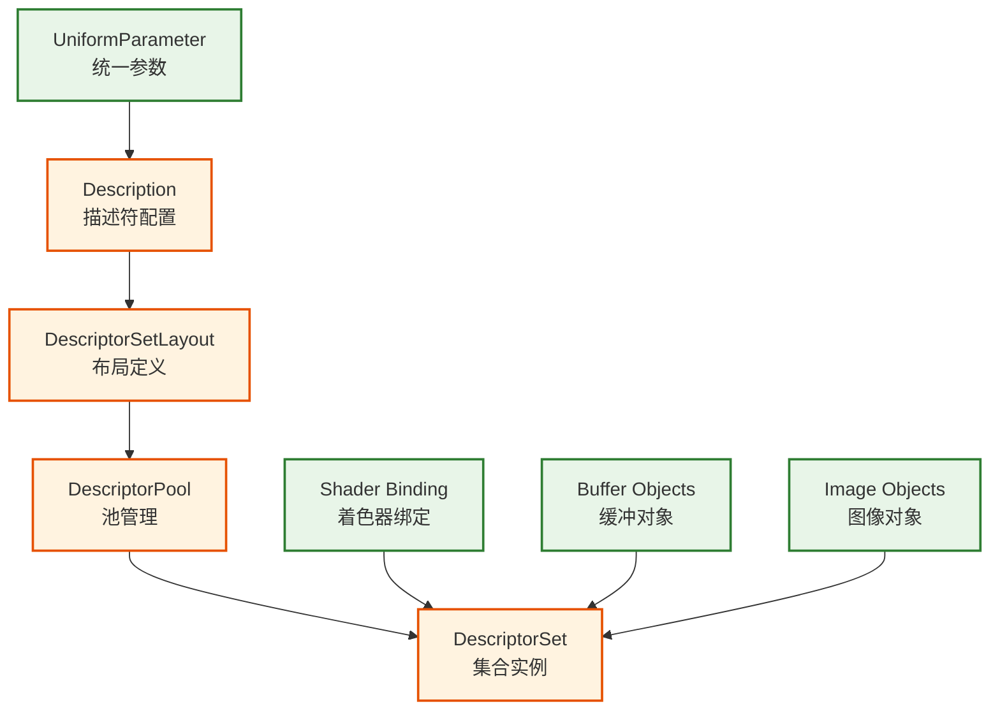
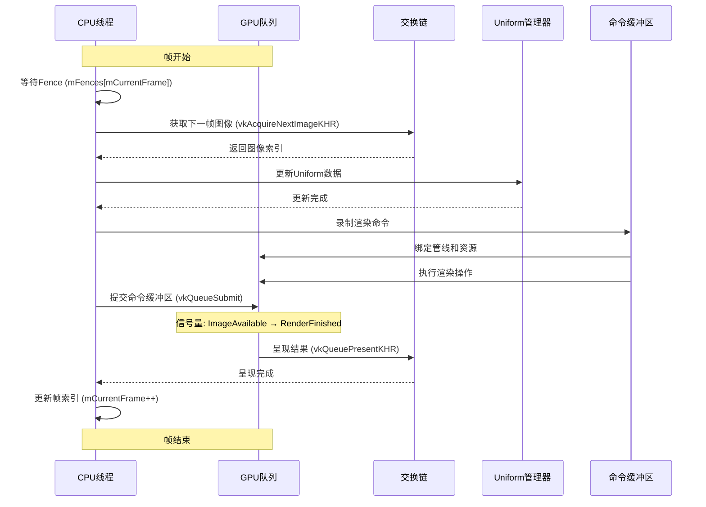
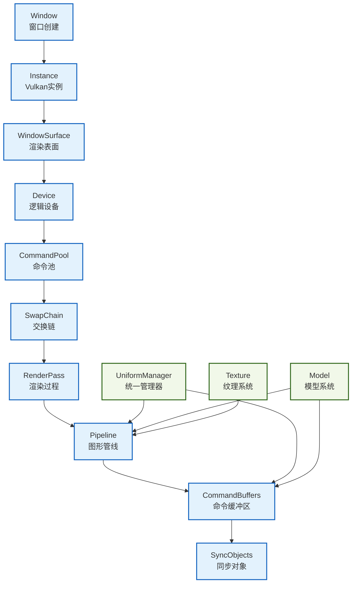
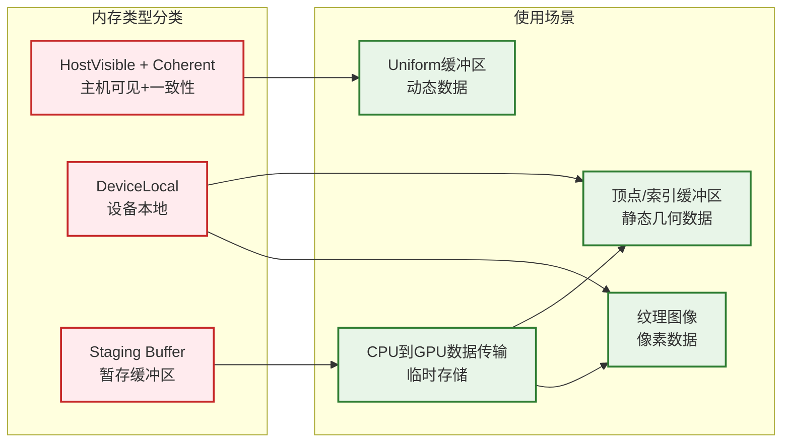

# Vulkan教程系列架构设计文档

## 概述

本文档详细说明了现代cppVulkan学习教程系列所使用的软件架构设计。该架构采用现代C++特性，结合面向对象设计模式，对复杂的Vulkan API进行了优雅的封装，提供了一个易于学习和扩展的Vulkan渲染框架。

## 设计哲学

### 核心原则

1. **分层抽象**：将Vulkan的复杂性通过多层抽象逐步简化
2. **RAII管理**：利用C++的RAII特性自动管理资源生命周期
3. **智能指针**：使用`std::shared_ptr`和`std::enable_shared_from_this`确保内存安全
4. **工厂模式**：统一的静态工厂方法创建对象，保证一致性
5. **模块化设计**：每个组件职责单一，高内聚低耦合

### 架构目标

- **可学习性**：代码结构清晰，便于理解Vulkan概念
- **可维护性**：模块化设计，易于调试和修改
- **可扩展性**：新功能可以独立添加，不影响现有代码
- **跨平台性**：支持Windows和macOS平台

## 整体架构

### 三层架构模式



## 封装层架构详解

### 1. 对象生命周期管理

#### 智能指针模式

所有封装类都采用统一的智能指针模式：

```cpp
class Example {
public:
    using Ptr = std::shared_ptr<Example>;
    static Ptr create(args...) {
        return std::make_shared<Example>(args...);
    }

    // 构造函数和析构函数自动管理资源
    Example(args...);
    ~Example();
};
```

#### RAII资源管理

每个类在构造函数中获取Vulkan资源，在析构函数中自动释放：

```cpp
Example::~Example() {
    if (mVulkanResource != VK_NULL_HANDLE) {
        vkDestroyVulkanResource(mDevice->getDevice(), mVulkanResource, nullptr);
        mVulkanResource = VK_NULL_HANDLE;
    }
}
```

### 2. 组件分类与职责

#### 2.1 初始化组件 (Initialization Components)

**Instance (实例管理)**
- **职责**：创建和管理Vulkan实例，配置验证层和扩展
- **关键特性**：
  - 自动检测并启用验证层
  - 平台特定扩展配置（如macOS的portability扩展）
  - 调试信使设置

**Device (设备管理)**
- **职责**：物理设备选择和逻辑设备创建
- **关键特性**：
  - 设备评分系统
  - 队列族发现和管理
  - 平台适配（Apple Silicon集成显卡支持）

**WindowSurface (窗口表面)**
- **职责**：创建渲染表面，连接Vulkan和窗口系统

#### 2.2 渲染管线组件 (Pipeline Components)

**SwapChain (交换链)**
- **职责**：管理图像缓冲区，处理渲染目标
- **关键特性**：
  - 自动选择最佳表面格式和呈现模式
  - 帧缓冲区管理
  - 窗口大小变化时重建

**Pipeline (图形管线)**
- **职责**：配置和管理完整的图形渲染管线
- **关键特性**：
  - 可配置的管线状态（光栅化、深度测试、混合等）
  - 着色器管理
  - 顶点输入配置

**RenderPass (渲染过程)**
- **职责**：定义渲染操作的描述和依赖关系
- **关键特性**：
  - 多子通道支持
  - 附件描述和引用
  - 子通道依赖管理

#### 2.3 命令与同步组件 (Command & Synchronization)

**CommandPool & CommandBuffer**
- **职责**：命令缓冲区的分配和录制
- **关键特性**：
  - 自动命令缓冲区管理
  - 一次性命令支持
  - 渲染命令封装

**Semaphore & Fence**
- **职责**：GPU和CPU同步
- **关键特性**：
  - 帧同步管理
  - GPU-GPU同步（信号量）
  - GPU-CPU同步（栅栏）

#### 2.4 资源管理组件 (Resource Management)

**Buffer (缓冲区管理)**
- **职责**：统一管理各种类型的缓冲区
- **关键特性**：
  - 专用工厂方法（顶点、索引、Uniform、暂存缓冲区）
  - 内存映射和暂存缓冲区更新
  - 描述符信息自动生成

```cpp
// 工厂方法示例
static Ptr createVertexBuffer(const Device::Ptr& device, VkDeviceSize size, void *pData);
static Ptr createUniformBuffer(const Device::Ptr& device, VkDeviceSize size, void* pData = nullptr);
```

**Image (图像管理)**
- **职责**：图像资源创建和管理
- **关键特性**：
  - 深度格式自动检测
  - 图像布局转换
  - 内存视图管理

**Sampler (采样器)**
- **职责**：纹理采样配置

### 3. 描述符系统架构

#### 统一的描述符管理

描述符系统采用了分层设计：



**UniformParameter (统一参数)**
- 抽象了各种类型的Uniform数据
- 支持缓冲区和图像描述符
- 自动生成描述符信息

**DescriptorSetLayout**
- 定义描述符集合的布局
- 支持多种绑定类型

**DescriptorPool & DescriptorSet**
- 高效的描述符分配
- 帧级别的描述符集合管理

## 应用层架构

### 1. 应用程序生命周期

```cpp
class Application : public std::enable_shared_from_this<Application> {
public:
    void run() {
        initWindow();      // 1. 窗口初始化
        initVulkan();      // 2. Vulkan初始化
        mainLoop();        // 3. 主循环
        cleanUp();         // 4. 资源清理
    }
};
```

### 2. 渲染循环架构

#### 帧渲染流程



```cpp
void Application::render() {
    // 1. 同步等待
    mFences[mCurrentFrame]->block();

    // 2. 获取图像
    vkAcquireNextImageKHR(...);

    // 3. 更新Uniform数据
    mUniformManager->update(...);

    // 4. 提交命令
    vkQueueSubmit(...);

    // 5. 呈现结果
    vkQueuePresentKHR(...);

    // 6. 帧索引更新
    mCurrentFrame = (mCurrentFrame + 1) % mSwapChain->getImageCount();
}
```

#### 交换链重建机制

当窗口大小改变或显示属性变化时，自动重建交换链相关资源：

```cpp
void Application::recreateSwapChain() {
    vkDeviceWaitIdle(mDevice->getDevice());
    cleanupSwapChain();

    // 重新创建所有依赖交换链的资源
    mSwapChain = Wrapper::SwapChain::create(...);
    createRenderPass();
    mSwapChain->createFrameBuffers(mRenderPass);
    createPipeline();
    createCommandBuffers();
    createSyncObjects();
}
```

### 3. 组件初始化顺序

严格的初始化顺序确保依赖关系正确：



**初始化依赖关系说明**：

*   **Window** - 窗口创建
*   **Instance** - Vulkan实例（依赖Window）
*   **WindowSurface** - 渲染表面（依赖Instance和Window）
*   **Device** - 逻辑设备（依赖Instance和WindowSurface）
*   **CommandPool** - 命令池（依赖Device）
*   **SwapChain** - 交换链（依赖Device、WindowSurface、CommandPool）
*   **RenderPass** - 渲染过程（依赖Device、SwapChain）
*   **Pipeline** - 图形管线（依赖Device、RenderPass）
*   **CommandBuffers** - 命令缓冲区（依赖Device、CommandPool、Pipeline）
*   **SyncObjects** - 同步对象（依赖Device）

**资源系统初始化**：

*   **UniformManager** - 在Pipeline之前初始化，提供描述符布局
*   **Model** - 在Pipeline之前初始化，提供顶点格式
*   **Texture** - 在Pipeline之前初始化，提供采样器配置

### 4. 资源管理系统

#### Uniform管理器

**UniformManager**统一管理所有Uniform数据：

```cpp
class UniformManager {
    // 全局VP矩阵（视图和投影）
    VPMatrices mVPMatrices;

    // 对象模型矩阵
    ObjectUniform mObjectUniform;

    // 每帧独立的描述符集合
    std::vector<Wrapper::Buffer::Ptr> mVPBuffers;
    std::vector<Wrapper::Buffer::Ptr> mObjectBuffers;
};
```

#### 模型系统

**Model**类管理3D模型资源：

```cpp
class Model {
    // 几何数据
    std::vector<Wrapper::Buffer::Ptr> mVertexBuffers;
    Wrapper::Buffer::Ptr mIndexBuffer;

    // 纹理资源
    std::vector<Texture::Ptr> mTextures;

    // 加载和解析功能
    void loadModel(const std::string& modelPath);
};
```

## 内存管理策略

### 1. 缓冲区内存类型



**HostVisible + Coherent**：
- Uniform缓冲区
- CPU频繁更新的小数据
- 动态变换矩阵

**DeviceLocal**：
- 顶点和索引缓冲区
- 纹理图像
- 大型静态数据

**暂存缓冲区模式**：
```cpp
// 对于DeviceLocal内存，使用暂存缓冲区进行更新
void Buffer::updateBufferByStage(void* data, size_t size) {
    // 1. 创建HostVisible的暂存缓冲区
    auto stageBuffer = Buffer::createStageBuffer(mDevice, size, data);

    // 2. 执行复制命令
    copyBuffer(stageBuffer->getBuffer(), mBuffer, size);
}
```

### 2. 自动内存管理

- **构造时分配**：每个资源在创建时立即分配所需内存
- **析构时释放**：利用RAII自动清理，避免内存泄漏
- **智能指针共享**：复杂资源生命周期通过shared_ptr管理

## 平台适配架构

### macOS/Apple Silicon适配

#### 扩展管理

```cpp
std::vector<const char*> Instance::getRequiredExtensions() {
    auto extensions = glfwGetRequiredInstanceExtensions(...);

    #if defined(__APPLE__)
    extensions.push_back(VK_KHR_PORTABILITY_ENUMERATION_EXTENSION_NAME);
    extensions.push_back(VK_KHR_GET_PHYSICAL_DEVICE_PROPERTIES_2_EXTENSION_NAME);
    #endif

    return extensions;
}
```

#### 设备选择策略

```cpp
int Device::rateDevice(VkPhysicalDevice device) {
    int score = 0;

    #if defined(__APPLE__)
    // macOS：接受Apple GPU
    if (std::string(deviceProp.deviceName).find("Apple") != std::string::npos) {
        score += 1000;
    }
    #elif defined(_WIN32)
    // Windows：优先独立显卡
    if (deviceProp.deviceType == VK_PHYSICAL_DEVICE_TYPE_DISCRETE_GPU) {
        score += 1000;
    }
    #endif

    return score;
}
```

## 性能优化设计

### 1. 多帧缓冲机制

```cpp
// 每帧独立的资源，避免CPU-GPU同步等待
class Application {
    std::vector<Wrapper::CommandBuffer::Ptr> mCommandBuffers;
    std::vector<Wrapper::Semaphore::Ptr> mImageAvailableSemaphores;
    std::vector<Wrapper::Semaphore::Ptr> mRenderFinishedSemaphores;
    std::vector<Wrapper::Fence::Ptr> mFences;
};
```

### 2. 批量命令提交

所有渲染操作录制到单个命令缓冲区中，减少API调用开销。

### 3. 内存池化

描述符池和命令池预先分配，避免运行时分配开销。

## 错误处理策略

### 1. 异常安全

- 构造函数失败时抛出异常
- 析构函数不抛出异常
- 使用RAII确保异常安全

### 2. 验证层集成

```cpp
// 自动配置验证层
if (mEnableValidationLayer && !checkValidationLayerSupport()) {
    throw std::runtime_error("Error: validation layer is not supported");
}
```

### 3. VK_RESULT检查

所有Vulkan API调用都检查返回值，失败时抛出描述性异常。

## 扩展性设计

### 1. 组件接口标准化

所有组件都遵循相同的接口模式：
- 统一的工厂方法
- 标准的getter方法
- 一致的资源管理

### 2. 配置驱动

管线状态通过配置结构体设置，便于运行时修改：

```cpp
mPipeline->setViewports({ viewport });
mPipeline->setScissors({ scissor });
mPipeline->pushBlendAttachment(blendAttachment);
```

### 3. 插件化着色器

着色器模块独立管理，便于热替换和多着色器方案：

```cpp
std::vector<Wrapper::Shader::Ptr> shaderGroup;
shaderGroup.push_back(Wrapper::Shader::create(mDevice, "vs.spv", ...));
shaderGroup.push_back(Wrapper::Shader::create(mDevice, "fs.spv", ...));
mPipeline->setShaderGroup(shaderGroup);
```

## 总结

Vulkan教程系列的架构设计体现了现代C++的最佳实践，通过分层抽象、智能指针管理和RAII机制，成功地简化了Vulkan的复杂性，同时保持了高性能和灵活性。该架构不仅适合学习Vulkan概念，也为实际项目开发提供了坚实的基础。

关键设计亮点：
1. **统一的封装模式**降低了学习成本
2. **自动资源管理**减少了内存错误
3. **平台适配设计**确保了跨平台兼容性
4. **模块化结构**支持渐进式学习和功能扩展
5. **性能优化机制**充分发挥了Vulkan的性能优势

这种架构设计为Vulkan学习者提供了一个从基础概念到高级特性的完整学习路径。